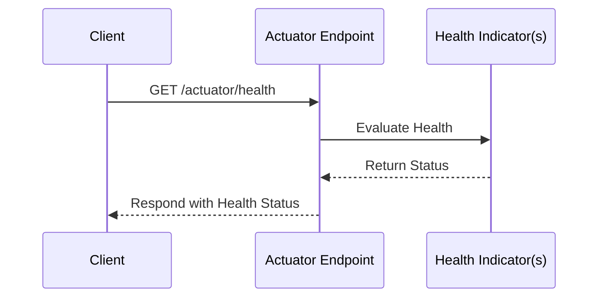

- [Introduction](#introduction)
- [Spring Actuator Basics](#spring-actuator-basics)
  - [2.1 What is Spring Actuator?](#21-what-is-spring-actuator)
  - [2.2 Key Features](#22-key-features)
  - [2.3. Architecture Overview](#23-architecture-overview)
- [Best Practices](#best-practices)
  - [3.1 Configuring Actuator Endpoints](#31-configuring-actuator-endpoints)
  - [3.2 Securing Actuator Endpoints](#32-securing-actuator-endpoints)
  - [3.3 Custom Health Indicators](#33-custom-health-indicators)
  - [3.4 Monitoring and Metrics](#34-monitoring-and-metrics)
  - [3.5 Graceful Shutdown](#35-graceful-shutdown)
- [Production Scenarios](#production-scenarios)
  - [4.1 Scenario 1: Database Health Check](#41-scenario-1-database-health-check)
  - [4.2 Scenario 2: Custom Health Indicator](#42-scenario-2-custom-health-indicator)
- [5. Architecture Diagrams](#5-architecture-diagrams)
  - [5.1 Component Diagram](#51-component-diagram)
  - [5.2 Sequence Diagram](#52-sequence-diagram)
- [6. Sample Code and Configuration](#6-sample-code-and-configuration)
  - [6.1 Dependency Configuration](#61-dependency-configuration)
  - [6.2 Actuator Configuration](#62-actuator-configuration)
  - [6.3 Custom Health Indicator Implementation](#63-custom-health-indicator-implementation)
- [7. Key Takeaways](#7-key-takeaways)
- [Conclusion](#conclusion)
- [References](#references)

<a name="introduction"></a>
## Introduction

Spring Actuator is a powerful tool for monitoring and managing Spring Boot applications. It provides production-ready features such as health checks, metrics, and tracing. Properly configuring and securing Actuator endpoints is crucial for ensuring the reliability and security of your application. 

**Key Benefits:**
- Helps detect issues before they affect users.
- Provides an easy integration with monitoring systems like Prometheus, Grafana, and ELK stack.
- Customizable to expose only the needed endpoints.

<a name="spring-actuator-basics"></a>
## Spring Actuator Basics

<a name="21-what-is-spring-actuator"></a>
### 2.1 What is Spring Actuator?

Spring Actuator is a sub-project of the Spring Boot framework that provides production-ready features for monitoring and managing applications. It exposes various endpoints that can be used to check the health of the application, gather metrics, environment and perform other administrative tasks.

<a name="22-key-features"></a>
### 2.2 Key Features
Spring Boot Actuator offers various endpoints for different purposes:
| |Endpoint | |
|-|-|-|
|**Health Checks** |**/actuator/health** |Provides information about the health status of the application. |
|**Metrics**|**/actuator/metrics** |Exposes various metrics such as memory usage, active threads, HTTP requests, and more. |
|**Info Endpoint** |**/actuator/info** |Provides general or arbitrary information about the application. |
|**Environment Endpoint** |**/actuator/env** |Shows properties from the `Environment`. |
|**Shutdown Endpoint** |**/actuator/shutdown** |Allows for graceful shutdown of the application. |

<a name="23-architecture-overview"></a>
### 2.3. Architecture Overview

The architecture of a Spring Boot application with Actuator enabled can be visualized as follows:

```
+---------------------+
|   Spring Boot App   |
|                     |
|  +---------------+  |
|  |   Actuator    |  |
|  +---------------+  |
|   Health Checks     |
|   Metrics           |
|   Info Endpoint     |
+---------------------+
         |
         v
+-----------------------------+
| Monitoring System (e.g.,    |
| Prometheus, Grafana, ELK)   |
+-----------------------------+
```



<a name="3-best-practices"></a>
## Best Practices

<a name="31-configuring-actuator-endpoints"></a>
### 3.1 Configuring Actuator Endpoints


Add the following dependency to your `pom.xml`:

```xml
<dependency>
    <groupId>org.springframework.boot</groupId>
    <artifactId>spring-boot-starter-actuator</artifactId>
</dependency>
```

Configure Actuator endpoints to expose only the necessary information. Use the `management.endpoints.web.exposure.include` property to specify which endpoints should be exposed.

Configure Actuator in `application.properties` or `application.yml`:

**application.properties**
```properties
management.endpoints.web.exposure.include=health,info,metrics
management.endpoint.health.show-details=always
```

**application.yaml**
```yaml
management:
  endpoints:
    web:
      exposure:
        include: health, metrics, info
  endpoint:
    health:
      show-details: always
```

<a name="32-securing-actuator-endpoints"></a>
### 3.2 Securing Actuator Endpoints
It is essential to secure your Actuator endpoints to prevent unauthorized access. Use Spring Security to restrict access to specific endpoints.

**application.properties**
```properties
management.endpoints.web.exposure.include=health,info
management.endpoints.web.base-path=/actuator
```

```java
import org.springframework.context.annotation.Configuration;
import org.springframework.security.config.annotation.web.builders.HttpSecurity;
import org.springframework.security.config.annotation.web.configuration.WebSecurityConfigurerAdapter;

@Configuration
public class SecurityConfig extends WebSecurityConfigurerAdapter {

    @Override
    protected void configure(HttpSecurity http) throws Exception {
        http.authorizeRequests()
            .antMatchers("/actuator/health").permitAll()
            .antMatchers("/actuator/**").hasRole("ADMIN")
            .and()
            .httpBasic();
    }
}
```

<a name="33-custom-health-indicators"></a>
### 3.3 Custom Health Indicators

Spring Boot allows you to create custom health indicators for specific checks, such as database connectivity or third-party service availability.
Implement custom health indicators to monitor specific components of your application. Custom health indicators should extend the `HealthIndicator` interface.

>CustomHealthIndicator
```java
import org.springframework.boot.actuate.health.Health;
import org.springframework.boot.actuate.health.HealthIndicator;
import org.springframework.stereotype.Component;

@Component
public class CustomHealthIndicator implements HealthIndicator {

    @Override
    public Health health() {
        // Perform custom health check
        boolean isHealthy = checkCustomComponent();
        if (isHealthy) {
            return Health.up().withDetail("Custom Service", "Available").build();
        } else {
            return Health.down().withDetail("Custom Service", "Custom component is down").build();
        }
    }

    private boolean checkCustomComponent() {
        // Custom health check logic
        return true;
    }
}
```

>Unit Test for CustomHealthIndicator
```java
import static org.assertj.core.api.Assertions.assertThat;
import org.junit.jupiter.api.Test;
import org.springframework.beans.factory.annotation.Autowired;
import org.springframework.boot.test.context.SpringBootTest;
import org.springframework.boot.actuate.health.Health;

@SpringBootTest
public class CustomHealthIndicatorTest {

    @Autowired
    private CustomHealthIndicator customHealthIndicator;

    @Test
    public void healthIndicatorStatusShouldBeUp() {
        Health health = customHealthIndicator.health();
        assertThat(health.getStatus().getCode()).isEqualTo("UP");
    }
}
```

<a name="34-monitoring-and-metrics"></a>
### 3.4 Monitoring and Metrics

Enable and configure metrics to monitor the performance and health of your application. Use the `micrometer` library to expose metrics to various monitoring systems.

```yaml
management:
  metrics:
    export:
      prometheus:
        enabled: true
```

<a name="35-graceful-shutdown"></a>
### 3.5 Graceful Shutdown

Configure graceful shutdown to ensure that your application shuts down cleanly without interrupting ongoing requests.

```yaml
server:
  shutdown: graceful
```

<a name="4-production-scenarios"></a>
## Production Scenarios

<a name="41-scenario-1-database-health-check"></a>
### 4.1 Scenario 1: Database Health Check

Implement a health check for the database to ensure that the application can connect to the database.

```java
import org.springframework.boot.actuate.health.Health;
import org.springframework.boot.actuate.health.HealthIndicator;
import org.springframework.stereotype.Component;

import javax.sql.DataSource;
import java.sql.Connection;
import java.sql.SQLException;

@Component
public class DatabaseHealthIndicator implements HealthIndicator {

    private final DataSource dataSource;

    public DatabaseHealthIndicator(DataSource dataSource) {
        this.dataSource = dataSource;
    }

    @Override
    public Health health() {
        try (Connection connection = dataSource.getConnection()) {
            if (connection.isValid(1000)) {
                return Health.up().build();
            } else {
                return Health.down().withDetail("Error", "Database connection is not valid").build();
            }
        } catch (SQLException e) {
            return Health.down(e).build();
        }
    }
}
```

<a name="42-scenario-2-custom-health-indicator"></a>
### 4.2 Scenario 2: Custom Health Indicator

Implement a custom health indicator to monitor a specific external service.

```java
import org.springframework.boot.actuate.health.Health;
import org.springframework.boot.actuate.health.HealthIndicator;
import org.springframework.stereotype.Component;
import org.springframework.web.client.RestTemplate;

@Component
public class ExternalServiceHealthIndicator implements HealthIndicator {

    private final RestTemplate restTemplate;

    public ExternalServiceHealthIndicator(RestTemplate restTemplate) {
        this.restTemplate = restTemplate;
    }

    @Override
    public Health health() {
        try {
            restTemplate.getForEntity("https://external-service.com/health", String.class);
            return Health.up().build();
        } catch (Exception e) {
            return Health.down(e).withDetail("Error", "External service is down").build();
        }
    }
}
```

<a name="5-architecture-diagrams"></a>
## 5. Architecture Diagrams

<a name="51-component-diagram"></a>
### 5.1 Component Diagram

```
+-------------------+       +-------------------+       +-------------------+
| Spring Boot App   |       | Spring Actuator   |       | Monitoring System |
+-------------------+       +-------------------+       +-------------------+
        |                            |                           |
        | (1) Health Check           |                           |
        |--------------------------->|                           |
        |                            | (2) Metrics               |
        |                            |-------------------------->|
        |                            |                           |
        | (3) Info Endpoint          |                           |
        |<---------------------------|                           |
        |                            |                           |
+-------------------+       +-------------------+       +-------------------+
| Spring Boot App   |       | Spring Actuator   |       | Monitoring System |
+-------------------+       +-------------------+       +-------------------+
```

<a name="52-sequence-diagram"></a>
### 5.2 Sequence Diagram

```
+-------------------+       +-------------------+       +-------------------+
| Client            |       | Spring Boot App   |       | Spring Actuator   |
+-------------------+       +-------------------+       +-------------------+
        |                            |                           |
        | (1) Health Check Request   |                           |
        |--------------------------->|                           |
        |                            | (2) Perform Health Check  |
        |                            |-------------------------->|
        |                            |                           |
        | (3) Health Check Response  |                           |
        |<---------------------------|                           |
        |                            |                           |
+-------------------+       +-------------------+       +-------------------+
| Client            |       | Spring Boot App   |       | Spring Actuator   |
+-------------------+       +-------------------+       +-------------------+
```

<a name="6-sample-code-and-configuration"></a>
## 6. Sample Code and Configuration

<a name="61-dependency-configuration"></a>
### 6.1 Dependency Configuration

Add the necessary dependencies to your `pom.xml` file.

```xml
<dependencies>
    <dependency>
        <groupId>org.springframework.boot</groupId>
        <artifactId>spring-boot-starter-actuator</artifactId>
    </dependency>
    <dependency>
        <groupId>org.springframework.boot</groupId>
        <artifactId>spring-boot-starter-security</artifactId>
    </dependency>
    <dependency>
        <groupId>io.micrometer</groupId>
        <artifactId>micrometer-registry-prometheus</artifactId>
    </dependency>
</dependencies>
```

<a name="62-actuator-configuration"></a>
### 6.2 Actuator Configuration

Configure Actuator endpoints in your `application.yml` file.

```yaml
management:
  endpoints:
    web:
      exposure:
        include: health, metrics, info
  metrics:
    export:
      prometheus:
        enabled: true
server:
  shutdown: graceful
```

<a name="63-custom-health-indicator-implementation"></a>
### 6.3 Custom Health Indicator Implementation

Implement a custom health indicator to monitor a specific component.

```java
import org.springframework.boot.actuate.health.Health;
import org.springframework.boot.actuate.health.HealthIndicator;
import org.springframework.stereotype.Component;

@Component
public class CustomHealthIndicator implements HealthIndicator {

    @Override
    public Health health() {
        // Perform custom health check
        boolean isHealthy = checkCustomComponent();
        if (isHealthy) {
            return Health.up().build();
        } else {
            return Health.down().withDetail("Error", "Custom component is down").build();
        }
    }

    private boolean checkCustomComponent() {
        // Custom health check logic
        return true;
    }
}
```

<a name="7-key-takeaways"></a>
## 7. Key Takeaways

- **Granular Health Checks**: Implement separate health indicators for databases, message brokers, and other critical components.
- **Monitoring Integration**: Integrate with monitoring tools like Prometheus and Grafana for visualizing metrics and health data.
- **Security Measures**: Ensure only trusted sources can access sensitive health information.
- **Detailed Health Information**: Enable detailed health information only for internal access to protect sensitive data.
- **Cluster-Aware Checks**: In distributed environments, ensure health checks are cluster-aware and provide insights into individual instance health.

<a name="conclusion"></a>
## Conclusion

Spring Actuator is a powerful tool for monitoring and managing Spring Boot applications. By following best practices such as configuring and securing Actuator endpoints, implementing custom health indicators, and enabling monitoring and metrics, you can ensure the reliability and security of your application. This article provided a comprehensive guide to best practices for Spring application health checks and Actuator, including architecture diagrams, sample code, and configuration details.

<a name="references"></a>
## References

- [Spring Boot Actuator Documentation](https://docs.spring.io/spring-boot/docs/current/reference/html/actuator.html)
- [Spring Security Documentation](https://docs.spring.io/spring-security/site/docs/current/reference/html5/)
- [Micrometer Documentation](https://micrometer.io/docs
