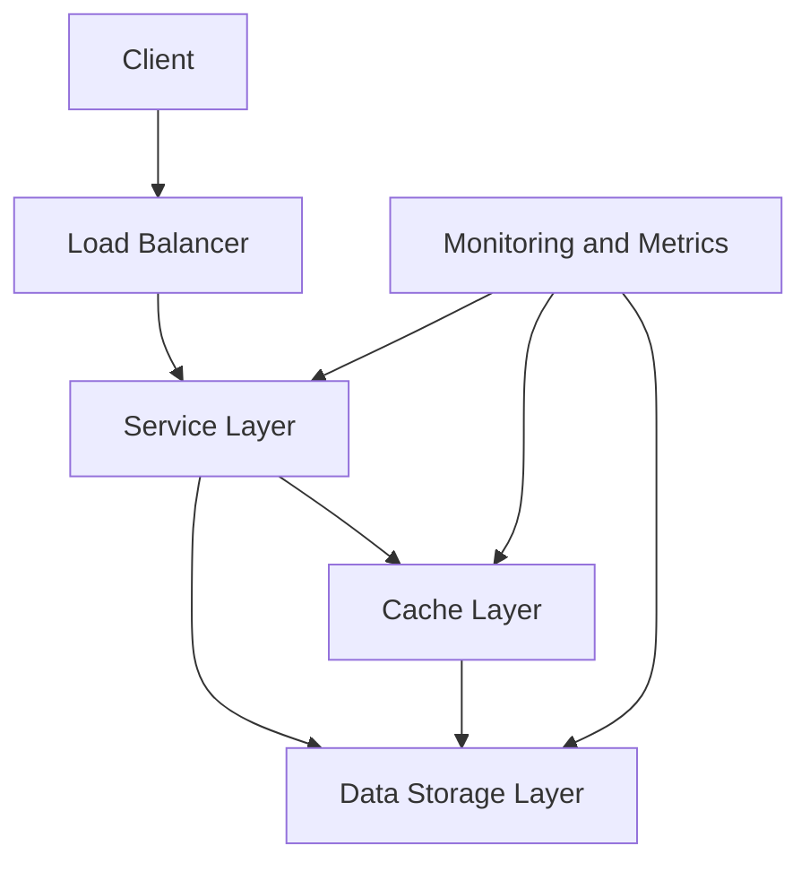
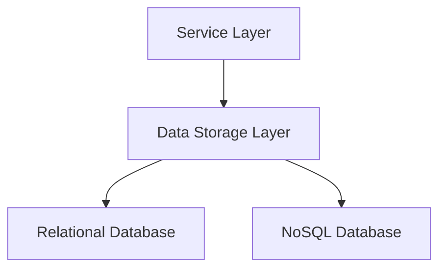
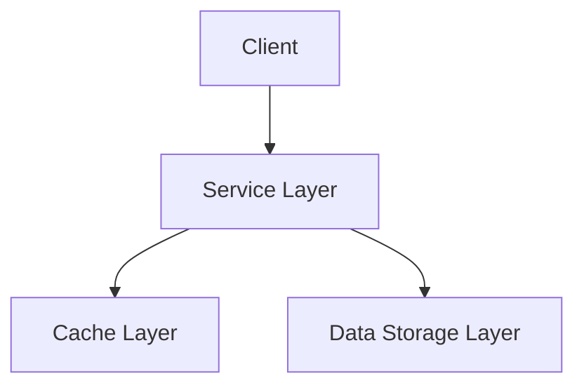
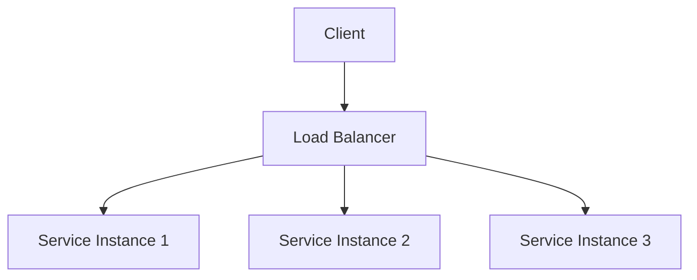
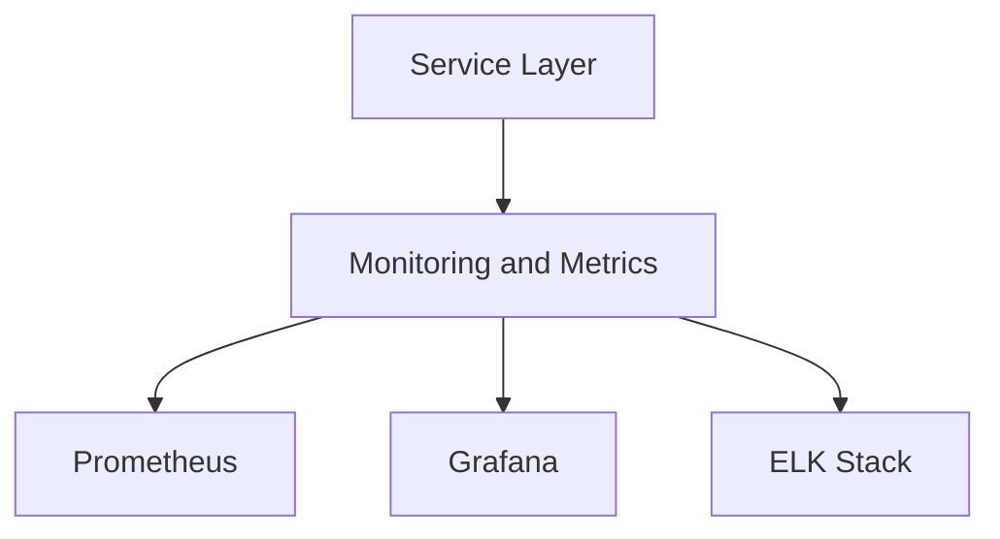
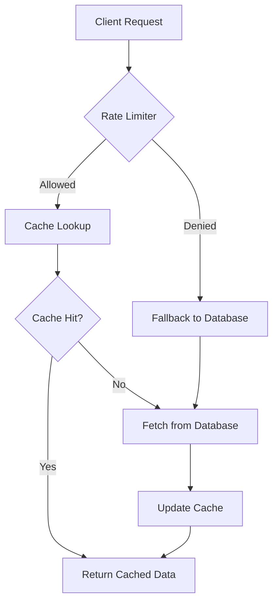
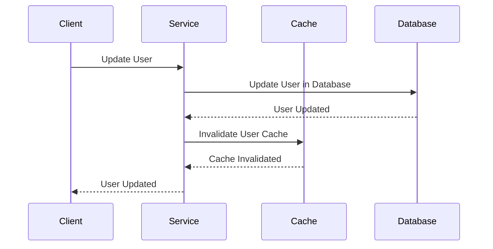
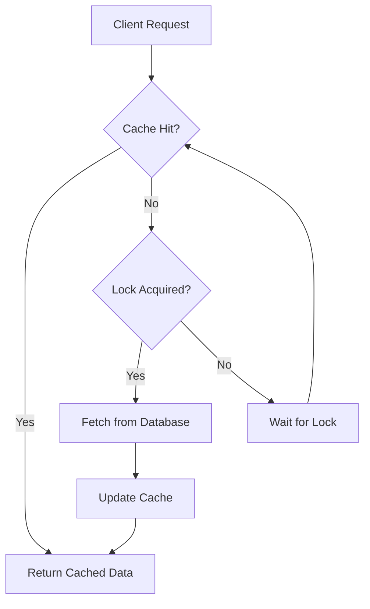

# Deep Dive into Cache Mechanisms for Distributed Systems

## Table of Contents
- [Deep Dive into Cache Mechanisms for Distributed Systems](#deep-dive-into-cache-mechanisms-for-distributed-systems)
  - [Table of Contents](#table-of-contents)
  - [Introduction](#introduction)
  - [High-Level Architecture Design](#high-level-architecture-design)
    - [Diagram](#diagram)
    - [Explanation](#explanation)
  - [Detail Designs](#detail-designs)
    - [Cache Layer](#cache-layer)
      - [Redis Setup and Integration](#redis-setup-and-integration)
        - [Step 1: Install Redis](#step-1-install-redis)
        - [Step 2: Start Redis Server](#step-2-start-redis-server)
        - [Step 3: Verify Redis Installation](#step-3-verify-redis-installation)
      - [Redis Configuration](#redis-configuration)
      - [Redis Integration with Spring Boot](#redis-integration-with-spring-boot)
        - [Step 1: Add Dependencies](#step-1-add-dependencies)
        - [Step 2: Configure Redis Connection](#step-2-configure-redis-connection)
        - [Step 3: Enable Caching](#step-3-enable-caching)
        - [Step 4: Use Redis Cache](#step-4-use-redis-cache)
      - [Best Practices for Redis in Kubernetes](#best-practices-for-redis-in-kubernetes)
        - [Step 1: Deploy Redis in Kubernetes](#step-1-deploy-redis-in-kubernetes)
        - [Step 2: Create a Headless Service](#step-2-create-a-headless-service)
        - [Step 3: Configure Redis Access in Spring Boot](#step-3-configure-redis-access-in-spring-boot)
        - [Step 4: Enable Redis Persistence](#step-4-enable-redis-persistence)
        - [Step 5: Secure Redis](#step-5-secure-redis)
        - [Step 6: Monitor Redis](#step-6-monitor-redis)
    - [Data Storage Layer](#data-storage-layer)
      - [Diagram](#diagram-1)
      - [Sample Code](#sample-code)
    - [Service Layer](#service-layer)
      - [Diagram](#diagram-2)
      - [Sample Code](#sample-code-1)
    - [Load Balancer](#load-balancer)
      - [Diagram](#diagram-3)
      - [Sample Code](#sample-code-2)
    - [Monitoring and Metrics](#monitoring-and-metrics)
      - [Diagram](#diagram-4)
      - [Sample Code](#sample-code-3)
  - [Complex Scenario 1: Flow Control and Backpressure Handling](#complex-scenario-1-flow-control-and-backpressure-handling)
    - [Problem Statement](#problem-statement)
    - [Solution Architecture](#solution-architecture)
    - [Flow Chart](#flow-chart)
    - [Sample Code](#sample-code-4)
  - [Complex Scenario 2: Cache Invalidation and Data Synchronization](#complex-scenario-2-cache-invalidation-and-data-synchronization)
    - [Problem Statement](#problem-statement-1)
    - [Solution Architecture](#solution-architecture-1)
    - [Sequence Diagram](#sequence-diagram)
    - [Sample Code](#sample-code-5)
  - [Complex Scenario 3: Cache Stampede Prevention](#complex-scenario-3-cache-stampede-prevention)
    - [Problem Statement](#problem-statement-2)
    - [Solution Architecture](#solution-architecture-2)
    - [Flow Chart](#flow-chart-1)
    - [Sample Code](#sample-code-6)
  - [Conclusion](#conclusion)

---

<a name="introduction"></a>
## Introduction

In distributed systems, caching is a critical mechanism to improve performance by reducing the load on backend services and databases. This article delves into the design and implementation of cache mechanisms for distributed systems, covering high-level architecture, detailed designs, and sample code for various scenarios.

---

<a name="high-level-architecture-design"></a>
## High-Level Architecture Design

### Diagram



### Explanation

1. **Client**: The client sends requests to the distributed system.
2. **Load Balancer**: Distributes incoming requests across multiple instances of the service layer.
3. **Service Layer**: Handles business logic and interacts with the cache and data storage layers.
4. **Cache Layer**: Stores frequently accessed data to reduce the load on the data storage layer.
5. **Data Storage Layer**: The primary data store (e.g., database) where data is persisted.
6. **Monitoring and Metrics**: Collects and monitors performance metrics for the entire system.

---

<a name="detail-designs"></a>
## Detail Designs

### <a name="cache-layer"></a>Cache Layer

The cache layer is responsible for storing frequently accessed data to reduce the load on the data storage layer. It can be implemented using distributed caching solutions like Redis or Hazelcast.

#### <a name="redis-setup-and-integration"></a>Redis Setup and Integration

Redis is an in-memory data structure store that can be used as a distributed cache. It supports various data structures like strings, hashes, lists, sets, and sorted sets.

##### Step 1: Install Redis

You can install Redis on your local machine or use a cloud-based Redis service like AWS ElastiCache or Redis Labs.

For local installation on Linux:

```bash
sudo apt-get update
sudo apt-get install redis-server
```

For local installation on macOS:

```bash
brew install redis
```

##### Step 2: Start Redis Server

Start the Redis server:

```bash
redis-server
```

##### Step 3: Verify Redis Installation

Verify that Redis is running:

```bash
redis-cli ping
```

If Redis is running correctly, you should see `PONG` as the response.

#### <a name="redis-configuration"></a>Redis Configuration

Redis configuration can be managed through the `redis.conf` file. Common configurations include setting the maximum memory limit, configuring persistence, and setting up replication.

Example `redis.conf` snippet:

```conf
maxmemory 256mb
maxmemory-policy allkeys-lru
```

#### <a name="redis-integration-with-spring-boot"></a>Redis Integration with Spring Boot

To integrate Redis with a Spring Boot application, you need to add the necessary dependencies and configure the Redis connection.

##### Step 1: Add Dependencies

Add the following dependencies to your `pom.xml`:

```xml
<dependency>
    <groupId>org.springframework.boot</groupId>
    <artifactId>spring-boot-starter-data-redis</artifactId>
</dependency>
<dependency>
    <groupId>org.springframework.boot</groupId>
    <artifactId>spring-boot-starter-cache</artifactId>
</dependency>
```

##### Step 2: Configure Redis Connection

Configure the Redis connection in your `application.yml`:

```yaml
spring:
  redis:
    host: localhost
    port: 6379
  cache:
    type: redis
```

##### Step 3: Enable Caching

Enable caching in your Spring Boot application by adding the `@EnableCaching` annotation to your main application class:

```java
import org.springframework.boot.SpringApplication;
import org.springframework.boot.autoconfigure.SpringBootApplication;
import org.springframework.cache.annotation.EnableCaching;

@SpringBootApplication
@EnableCaching
public class Application {
    public static void main(String[] args) {
        SpringApplication.run(Application.class, args);
    }
}
```

##### Step 4: Use Redis Cache

Use the `@Cacheable` annotation to cache method results in Redis:

```java
import org.springframework.cache.annotation.Cacheable;
import org.springframework.stereotype.Service;

@Service
public class CacheService {

    @Cacheable(value = "userCache", key = "#userId")
    public User getUserById(Long userId) {
        // Fetch user from data storage layer
        return fetchUserFromDatabase(userId);
    }

    private User fetchUserFromDatabase(Long userId) {
        // Database query logic
        return new User();
    }
}
```

#### <a name="best-practices-for-redis-in-kubernetes"></a>Best Practices for Redis in Kubernetes

When deploying Redis in Kubernetes, it's important to follow best practices to ensure high availability, scalability, and security.

##### Step 1: Deploy Redis in Kubernetes

You can deploy Redis in Kubernetes using a StatefulSet for stateful applications or a Deployment for stateless applications. Here's an example of deploying Redis using a StatefulSet:

```yaml
apiVersion: apps/v1
kind: StatefulSet
metadata:
  name: redis
spec:
  serviceName: redis
  replicas: 3
  selector:
    matchLabels:
      app: redis
  template:
    metadata:
      labels:
        app: redis
    spec:
      containers:
      - name: redis
        image: redis:latest
        ports:
        - containerPort: 6379
        volumeMounts:
        - name: redis-data
          mountPath: /data
  volumeClaimTemplates:
  - metadata:
      name: redis-data
    spec:
      accessModes: [ "ReadWriteOnce" ]
      resources:
        requests:
          storage: 1Gi
```

##### Step 2: Create a Headless Service

Create a headless service to manage the Redis StatefulSet:

```yaml
apiVersion: v1
kind: Service
metadata:
  name: redis
spec:
  clusterIP: None
  selector:
    app: redis
  ports:
  - port: 6379
    targetPort: 6379
```

##### Step 3: Configure Redis Access in Spring Boot

When deploying your Spring Boot application in Kubernetes, you should use the service name to access Redis. Update your `application.yml` to use the service name:

```yaml
spring:
  redis:
    host: redis
    port: 6379
  cache:
    type: redis
```

##### Step 4: Enable Redis Persistence

To enable Redis persistence, configure the `redis.conf` file to use either RDB (Redis Database Backup) or AOF (Append-Only File) persistence:

```conf
save 900 1
save 300 10
save 60 10000
appendonly yes
```

##### Step 5: Secure Redis

Secure Redis by setting a password and enabling TLS:

```conf
requirepass yourpassword
tls-port 6379
tls-cert-file /path/to/redis.crt
tls-key-file /path/to/redis.key
tls-ca-cert-file /path/to/ca.crt
```

##### Step 6: Monitor Redis

Use Prometheus and Grafana to monitor Redis performance and health. Deploy a Redis exporter to expose Redis metrics:

```yaml
apiVersion: apps/v1
kind: Deployment
metadata:
  name: redis-exporter
spec:
  replicas: 1
  selector:
    matchLabels:
      app: redis-exporter
  template:
    metadata:
      labels:
        app: redis-exporter
    spec:
      containers:
      - name: redis-exporter
        image: oliver006/redis_exporter:latest
        args:
        - --redis.addr=redis:6379
        - --redis.password=yourpassword
        ports:
        - containerPort: 9121
```

Create a service to expose the Redis exporter:

```yaml
apiVersion: v1
kind: Service
metadata:
  name: redis-exporter
spec:
  selector:
    app: redis-exporter
  ports:
  - port: 9121
    targetPort: 9121
```

### <a name="data-storage-layer"></a>Data Storage Layer

The data storage layer is the primary data store where data is persisted. It can be a relational database, NoSQL database, or any other storage solution.

#### Diagram



#### Sample Code

```java
import org.springframework.stereotype.Repository;

@Repository
public class UserRepository {

    public User findById(Long userId) {
        // Database query logic
        return new User();
    }

    public void save(User user) {
        // Database save logic
    }
}
```

### <a name="service-layer"></a>Service Layer

The service layer handles business logic and interacts with the cache and data storage layers. It is responsible for managing the flow of data between the client, cache, and data storage.

#### Diagram



#### Sample Code

```java
import org.springframework.beans.factory.annotation.Autowired;
import org.springframework.stereotype.Service;

@Service
public class UserService {

    @Autowired
    private CacheService cacheService;

    @Autowired
    private UserRepository userRepository;

    public User getUserById(Long userId) {
        User user = cacheService.getUserById(userId);
        if (user == null) {
            user = userRepository.findById(userId);
            cacheService.saveUser(user);
        }
        return user;
    }

    public void saveUser(User user) {
        userRepository.save(user);
        cacheService.saveUser(user);
    }
}
```

### <a name="load-balancer"></a>Load Balancer

The load balancer distributes incoming requests across multiple instances of the service layer to ensure high availability and scalability.

#### Diagram



#### Sample Code

Load balancers are typically implemented using infrastructure components like NGINX, HAProxy, or cloud-provided load balancers (e.g., AWS ELB, Google Cloud Load Balancer).

### <a name="monitoring-and-metrics"></a>Monitoring and Metrics

Monitoring and metrics collection are essential for tracking the performance and health of the distributed system. Tools like Prometheus, Grafana, and ELK stack can be used for this purpose.

#### Diagram



#### Sample Code

```java
import io.prometheus.client.Counter;
import io.prometheus.client.Gauge;

public class MetricsCollector {

    private static final Counter cacheHits = Counter.build()
            .name("cache_hits_total")
            .help("Total number of cache hits.")
            .register();

    private static final Counter cacheMisses = Counter.build()
            .name("cache_misses_total")
            .help("Total number of cache misses.")
            .register();

    private static final Gauge cacheSize = Gauge.build()
            .name("cache_size")
            .help("Current size of the cache.")
            .register();

    public static void recordCacheHit() {
        cacheHits.inc();
    }

    public static void recordCacheMiss() {
        cacheMisses.inc();
    }

    public static void setCacheSize(long size) {
        cacheSize.set(size);
    }
}
```

---

<a name="complex-scenario-1-flow-control-and-backpressure-handling"></a>
## Complex Scenario 1: Flow Control and Backpressure Handling

### Problem Statement

In high-traffic scenarios, the cache might become a bottleneck if not properly managed. Flow control and backpressure handling are essential to prevent the cache from being overwhelmed.

### Solution Architecture

1. **Rate Limiting**: Implement rate limiting to control the number of requests hitting the cache.
2. **Circuit Breaker**: Use a circuit breaker to handle failures gracefully and prevent cascading failures.
3. **Backpressure Handling**: Implement backpressure mechanisms to manage the flow of data between services.

### Flow Chart



### Sample Code

```java
import org.springframework.cache.annotation.Cacheable;
import org.springframework.stereotype.Service;

@Service
public class UserService {

    @Cacheable(value = "userCache", key = "#userId")
    public User getUserById(Long userId) {
        // Fetch user from database
        return fetchUserFromDatabase(userId);
    }

    private User fetchUserFromDatabase(Long userId) {
        // Database query logic
        return new User();
    }
}
```

---

<a name="complex-scenario-2-cache-invalidation-and-data-synchronization"></a>
## Complex Scenario 2: Cache Invalidation and Data Synchronization

### Problem Statement

Ensuring that the cache remains consistent with the underlying data store is challenging, especially in distributed systems.

### Solution Architecture

1. **Event-Driven Invalidation**: Use event-driven mechanisms to invalidate the cache when data changes.
2. **Distributed Locking**: Use distributed locking to ensure that only one service updates the cache at a time.
3. **TTL-Based Invalidation**: Use Time-to-Live (TTL) to automatically invalidate cache entries after a certain period.

### Sequence Diagram



### Sample Code

```java
import org.springframework.cache.annotation.CacheEvict;
import org.springframework.stereotype.Service;

@Service
public class UserService {

    @CacheEvict(value = "userCache", key = "#userId")
    public void updateUser(Long userId, User user) {
        // Update user in database
        updateUserInDatabase(userId, user);
    }

    private void updateUserInDatabase(Long userId, User user) {
        // Database update logic
    }
}
```

---

<a name="complex-scenario-3-cache-stampede-prevention"></a>
## Complex Scenario 3: Cache Stampede Prevention

### Problem Statement

A cache stampede occurs when multiple requests for the same data hit the cache simultaneously, leading to a spike in database load.

### Solution Architecture

1. **Probabilistic Early Expiration**: Use probabilistic early expiration to spread out cache expiration times.
2. **Locking Mechanism**: Implement a locking mechanism to ensure that only one request populates the cache at a time.
3. **Background Refresh**: Use background refresh to keep the cache up-to-date without impacting the user experience.

### Flow Chart



### Sample Code

```java
import org.springframework.cache.annotation.Cacheable;
import org.springframework.stereotype.Service;

import java.util.concurrent.locks.Lock;
import java.util.concurrent.locks.ReentrantLock;

@Service
public class UserService {

    private final Lock lock = new ReentrantLock();

    @Cacheable(value = "userCache", key = "#userId")
    public User getUserById(Long userId) {
        try {
            lock.lock();
            // Double-check to ensure the cache is still empty
            User cachedUser = fetchUserFromCache(userId);
            if (cachedUser != null) {
                return cachedUser;
            }
            // Fetch user from database
            User user = fetchUserFromDatabase(userId);
            // Update cache
            updateCache(userId, user);
            return user;
        } finally {
            lock.unlock();
        }
    }

    private User fetchUserFromCache(Long userId) {
        // Cache lookup logic
        return null;
    }

    private User fetchUserFromDatabase(Long userId) {
        // Database query logic
        return new User();
    }

    private void updateCache(Long userId, User user) {
        // Cache update logic
    }
}
```

---

<a name="conclusion"></a>
## Conclusion

Caching is a powerful mechanism for improving the performance and scalability of distributed systems. By understanding the high-level architecture and detailed designs, you can effectively implement cache mechanisms that handle various complex scenarios like flow control, cache invalidation, and cache stampede prevention. Use the provided sample code and diagrams to implement efficient caching in your distributed system.
