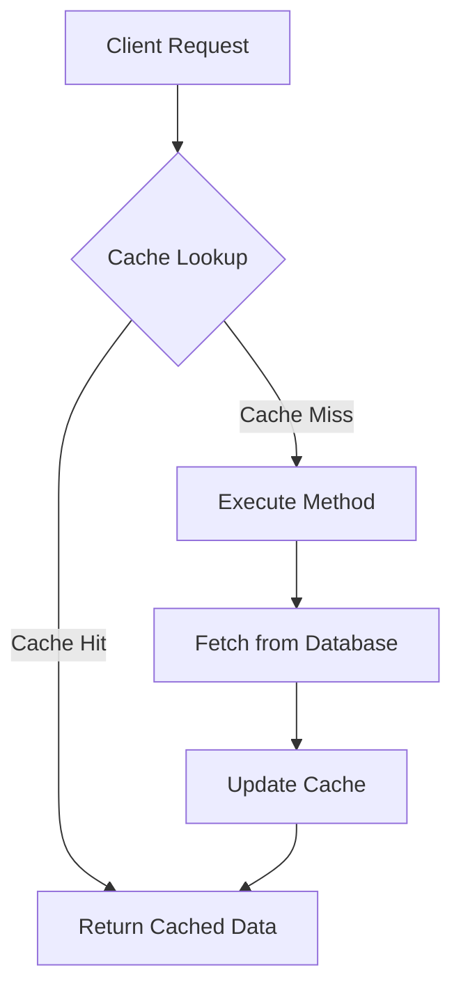

- [Introduction](#introduction)
- [Caffeine Cache Overview](#caffeine-cache-overview)
  - [Key Features](#key-features)
- [Configuring Caffeine Cache in Spring Boot](#configuring-caffeine-cache-in-spring-boot)
  - [Adding Dependencies](#adding-dependencies)
  - [Enabling Caching](#enabling-caching)
  - [Configuring Cache Manager](#configuring-cache-manager)
  - [YAML Configuration](#yaml-configuration)
  - [Explanation of Caffeine Cache Configuration](#explanation-of-caffeine-cache-configuration)
- [How Caffeine Cache Works](#how-caffeine-cache-works)
  - [Cache Population](#cache-population)
  - [Cache Eviction](#cache-eviction)
  - [Expiration](#expiration)
  - [Statistics](#statistics)
    - [Statistics Recording](#statistics-recording)
    - [Tracking Cache Hits, Misses, and Evictions](#tracking-cache-hits-misses-and-evictions)
- [Caffeine Cache Internals](#caffeine-cache-internals)
  - [Cache Interface](#cache-interface)
  - [Caffeine Class](#caffeine-class)
  - [BoundedLocalCache Class](#boundedlocalcache-class)
  - [Detailed Logic in Caffeine Cache](#detailed-logic-in-caffeine-cache)
    - [Cache Lookup](#cache-lookup)
    - [Cache Miss and Method Execution](#cache-miss-and-method-execution)
    - [Cache Update](#cache-update)
- [Real-Life Production Use Cases](#real-life-production-use-cases)
  - [1. **User Profile Caching**](#1-user-profile-caching)
  - [2. **Product Catalog Caching**](#2-product-catalog-caching)
  - [3. **API Response Caching**](#3-api-response-caching)
  - [4. **Session Data Caching**](#4-session-data-caching)
- [Sample Code](#sample-code)
  - [Caffeine Cache Configuration](#caffeine-cache-configuration)
  - [User Service with Caching](#user-service-with-caching)
  - [Flow Diagram](#flow-diagram)
  - [Explanation of the Flow Diagram](#explanation-of-the-flow-diagram)
- [Statistics Logging, Tracking and Mornitoring](#statistics-logging-tracking-and-mornitoring)
  - [1. **Logging Cache Statistics**](#1-logging-cache-statistics)
    - [Example: Logging Cache Statistics with SLF4J](#example-logging-cache-statistics-with-slf4j)
  - [2. **Integrating with GUI Tools**](#2-integrating-with-gui-tools)
    - [Step 1: Add Prometheus and Grafana Dependencies](#step-1-add-prometheus-and-grafana-dependencies)
    - [Step 2: Configure Prometheus Metrics Collector](#step-2-configure-prometheus-metrics-collector)
    - [Step 3: Configure Prometheus and Grafana](#step-3-configure-prometheus-and-grafana)
  - [Example: Prometheus Configuration](#example-prometheus-configuration)
  - [Example: Grafana Dashboard](#example-grafana-dashboard)
  - [Summary](#summary)
- [Conclusion](#conclusion)

---

<a name="introduction"></a>
## Introduction

Caffeine is a high-performance, near-optimal caching library for Java, widely used in Spring Boot applications to improve performance by reducing the load on databases and other backend services. This article delves into the details of Caffeine cache, its integration with Spring Boot, and how it works under the hood. We'll also provide real-life production use cases and sample code to illustrate its usage.

---

<a name="caffeine-cache-overview"></a>
## Caffeine Cache Overview

Caffeine is designed to be efficient and easy to use, providing advanced features like eviction policies, time-based expiration, and statistics recording. It uses a combination of data structures and algorithms to manage cache entries efficiently.

### Key Features

- **High Performance**: Optimized for fast read and write operations.
- **Eviction Policies**: Supports LRU, FIFO, and LFU eviction policies.
- **Time-Based Expiration**: Entries can be expired after a specified period of inactivity or since they were last written.
- **Statistics Recording**: Tracks cache hits, misses, and evictions for monitoring and tuning.

---

<a name="configuring-caffeine-cache-in-spring-boot"></a>
## Configuring Caffeine Cache in Spring Boot

### <a name="adding-dependencies"></a>Adding Dependencies

First, ensure you have the necessary dependencies in your `pom.xml`:

```xml
<dependency>
    <groupId>org.springframework.boot</groupId>
    <artifactId>spring-boot-starter-cache</artifactId>
</dependency>
<dependency>
    <groupId>com.github.ben-manes.caffeine</groupId>
    <artifactId>caffeine</artifactId>
</dependency>
```

### <a name="enabling-caching"></a>Enabling Caching

Enable caching in your Spring Boot application by adding the `@EnableCaching` annotation to your main application class:

```java
import org.springframework.boot.SpringApplication;
import org.springframework.boot.autoconfigure.SpringBootApplication;
import org.springframework.cache.annotation.EnableCaching;

@SpringBootApplication
@EnableCaching
public class Application {
    public static void main(String[] args) {
        SpringApplication.run(Application.class, args);
    }
}
```

### <a name="configuring-cache-manager"></a>Configuring Cache Manager

Create a configuration class to set up Caffeine cache:

```java
import com.github.benmanes.caffeine.cache.Caffeine;
import org.springframework.cache.CacheManager;
import org.springframework.cache.annotation.EnableCaching;
import org.springframework.cache.caffeine.CaffeineCacheManager;
import org.springframework.context.annotation.Bean;
import org.springframework.context.annotation.Configuration;

import java.util.concurrent.TimeUnit;

@Configuration
@EnableCaching
public class CacheConfig {

    @Bean
    public CacheManager cacheManager() {
        CaffeineCacheManager cacheManager = new CaffeineCacheManager("userCache", "productCache");
        cacheManager.setCaffeine(caffeineCacheBuilder());
        return cacheManager;
    }

    Caffeine<Object, Object> caffeineCacheBuilder() {
        return Caffeine.newBuilder()
                .maximumSize(500)
                .expireAfterAccess(600, TimeUnit.SECONDS)
                .recordStats();
    }
}
```

### <a name="yaml-configuration"></a>YAML Configuration

You can also configure Caffeine cache using YAML:

```yaml
spring:
  cache:
    type: caffeine
    cache-names:
      - userCache
      - productCache
    caffeine:
      spec: maximumSize=500,expireAfterAccess=600s
```

### Explanation of Caffeine Cache Configuration

- **`CaffeineCacheManager`**: Manages multiple caches, each identified by a name.
- **Cache Names**: `"userCache"` and `"productCache"` are used to identify different caches.
- **`maximumSize(500)`**: Sets the maximum number of entries the cache can hold.
- **`expireAfterAccess(600, TimeUnit.SECONDS)`**: Specifies that entries should be expired after 600 seconds of inactivity.
- **`recordStats()`**: Enables statistics recording for monitoring cache performance.

---

<a name="how-caffeine-cache-works"></a>
## How Caffeine Cache Works

### <a name="cache-population"></a>Cache Population

When a cache miss occurs, Caffeine fetches the data from the underlying data source (e.g., database) and stores it in the cache.

### <a name="cache-eviction"></a>Cache Eviction

Caffeine uses various eviction policies to manage the cache size:

- **Least Recently Used (LRU)**: Evicts the least recently used entries first.
- **First In, First Out (FIFO)**: Evicts the oldest entries first.
- **Least Frequently Used (LFU)**: Evicts the least frequently used entries first.

### <a name="expiration"></a>Expiration

Caffeine supports time-based expiration:

- **Expire After Access**: Entries are expired after a specified period of inactivity.
- **Expire After Write**: Entries are expired after a specified period since they were last written.

### <a name="statistics"></a>Statistics

Caffeine can record statistics such as cache hits, misses, and evictions, which can be useful for monitoring and tuning the cache.

#### Statistics Recording

Caffeine provides a `recordStats()` method that enables the collection of cache statistics. This method returns a `Caffeine` instance that will record statistics for the cache.

```java
Caffeine<Object, Object> caffeineCacheBuilder() {
    return Caffeine.newBuilder()
            .maximumSize(500)
            .expireAfterAccess(600, TimeUnit.SECONDS)
            .recordStats();
}
```

#### Tracking Cache Hits, Misses, and Evictions

Once statistics recording is enabled, you can access the statistics using the `stats()` method on the cache. This method returns a `CacheStats` object that contains various metrics:

- **`hitCount()`**: The number of successful cache hits.
- **`missCount()`**: The number of cache misses.
- **`evictionCount()`**: The number of cache evictions.
- **`loadSuccessCount()`**: The number of times a cache miss was successfully loaded.
- **`loadFailureCount()`**: The number of times a cache miss failed to load.

Here's an example of how to access and log cache statistics:

```java
import com.github.benmanes.caffeine.cache.Cache;
import com.github.benmanes.caffeine.cache.Caffeine;
import com.github.benmanes.caffeine.cache.stats.CacheStats;

public class CacheStatisticsExample {

    public static void main(String[] args) {
        Cache<String, String> cache = Caffeine.newBuilder()
                .maximumSize(100)
                .recordStats()
                .build();

        // Perform cache operations
        cache.put("key1", "value1");
        cache.getIfPresent("key1");
        cache.getIfPresent("key2");

        // Access cache statistics
        CacheStats stats = cache.stats();
        System.out.println("Cache Hits: " + stats.hitCount());
        System.out.println("Cache Misses: " + stats.missCount());
        System.out.println("Cache Evictions: " + stats.evictionCount());
    }
}
```

---

<a name="caffeine-cache-internals"></a>
## Caffeine Cache Internals

### <a name="cache-interface"></a>Cache Interface

The `Cache` interface defines the core operations for interacting with the cache:

```java
public interface Cache<K, V> {
    V getIfPresent(K key);
    V get(K key, Function<? super K, ? extends V> mappingFunction);
    void put(K key, V value);
    void invalidate(K key);
    void invalidateAll();
    long estimatedSize();
    CacheStats stats();
}
```

### <a name="caffeine-class"></a>Caffeine Class

The `Caffeine` class is the builder for creating cache instances:

```java
public final class Caffeine<K, V> {
    public static <K, V> Caffeine<K, V>newBuilder() {
        return new Caffeine<>();
    }

    public Caffeine<K, V> maximumSize(long maximumSize) {
        // Implementation
        return this;
    }

    public Caffeine<K, V> expireAfterAccess(long duration, TimeUnit unit) {
        // Implementation
        return this;
    }

    public Cache<K, V> build() {
        // Implementation
        return new BoundedLocalCache<>(this);
    }
}
```

### <a name="boundedlocalcache-class"></a>BoundedLocalCache Class

The `BoundedLocalCache` class is the core implementation of the cache, handling operations like get, put, and eviction:

```java
final class BoundedLocalCache<K, V> extends LocalCache<K, V> {
    BoundedLocalCache(Caffeine<K, V> builder) {
        // Initialization
    }

    @Override
    public V getIfPresent(Object key) {
        // Implementation
    }

    @Override
    public void put(K key, V value) {
        // Implementation
    }

    @Override
    public void invalidate(Object key) {
        // Implementation
    }

    @Override
    public long estimatedSize() {
        // Implementation
    }

    @Override
    public CacheStats stats() {
        // Implementation
    }
}
```

### Detailed Logic in Caffeine Cache

#### Cache Lookup

Caffeine uses a `ConcurrentHashMap` to store cache entries. When a lookup is performed, Caffeine checks if the key exists in the map:

```java
public V getIfPresent(Object key) {
    Node<K, V> node = data.get(key);
    if (node == null) {
        return null;
    }
    // Additional logic for expiration and eviction checks
    return node.getValue();
}
```

#### Cache Miss and Method Execution

If the key is not found in the cache, the method is executed, and the result is stored in the cache:

```java
public V get(K key, Function<? super K, ? extends V> mappingFunction) {
    V value = getIfPresent(key);
    if (value != null) {
        return value;
    }
    value = mappingFunction.apply(key);
    put(key, value);
    return value;
}
```

#### Cache Update

When the result is fetched from the database, it is stored in the cache:

```java
public void put(K key, V value) {
    Node<K, V> node = new Node<>(key, value);
    data.put(key, node);
    // Additional logic for eviction and expiration
}
```

---

<a name="real-life-production-use-cases"></a>
## Real-Life Production Use Cases

### 1. **User Profile Caching**

In a social media application, user profiles are frequently accessed. Caching user profiles can significantly reduce the load on the database and improve response times.

### 2. **Product Catalog Caching**

In an e-commerce application, product catalogs are often large and frequently accessed. Caching product data can improve performance and reduce database load.

### 3. **API Response Caching**

In microservices, caching API responses can reduce the number of calls to downstream services, improving overall system performance.

### 4. **Session Data Caching**

In applications with user sessions, caching session data can reduce the load on session storage systems and improve scalability.

---

<a name="sample-code"></a>
## Sample Code

### Caffeine Cache Configuration

```java
import com.github.benmanes.caffeine.cache.Caffeine;
import org.springframework.cache.CacheManager;
import org.springframework.cache.annotation.EnableCaching;
import org.springframework.cache.caffeine.CaffeineCacheManager;
import org.springframework.context.annotation.Bean;
import org.springframework.context.annotation.Configuration;

import java.util.concurrent.TimeUnit;

@Configuration
@EnableCaching
public class CacheConfig {

    @Bean
    public CacheManager cacheManager() {
        CaffeineCacheManager cacheManager = new CaffeineCacheManager("userCache", "productCache");
        cacheManager.setCaffeine(caffeineCacheBuilder());
        return cacheManager;
    }

    Caffeine<Object, Object> caffeineCacheBuilder() {
        return Caffeine.newBuilder()
                .maximumSize(500)
                .expireAfterAccess(600, TimeUnit.SECONDS)
                .recordStats();
    }
}
```

### User Service with Caching

```java
import org.springframework.cache.annotation.Cacheable;
import org.springframework.stereotype.Service;

@Service
public class UserService {

    @Cacheable(value = "userCache", key = "#userId")
    public User getUserById(Long userId) {
        // Fetch user from database
        return fetchUserFromDatabase(userId);
    }

    private User fetchUserFromDatabase(Long userId) {
        // Database query logic
        return new User(userId, "John Doe");
    }
}
```

### Flow Diagram

Here's a textual diagram to illustrate the flow:



### Explanation of the Flow Diagram

1. **Client Request**: The client makes a request to fetch a user by ID.
2. **Cache Lookup**: The cache manager looks up the `userId` in the `"userCache"`.
3. **Cache Hit**: If the user is found in the cache, the cached data is returned immediately.
4. **Cache Miss**: If the user is not found in the cache, the method `getUserById(Long userId)` is executed.
5. **Execute Method**: The method fetches the user from the database.
6. **Fetch from Database**: The user is retrieved from the database.
7. **Update Cache**: The fetched user is stored in the cache.
8. **Return Cached Data**: The user data is returned to the client.

---

## Statistics Logging, Tracking and Mornitoring
Caffeine's statistics can be tracked using logging tools and even integrated with GUI tools for better visualization and monitoring. 

### 1. **Logging Cache Statistics**

Log cache statistics using a logging framework like SLF4J or Log4j. This allows you to periodically log the cache metrics to a log file or console.

#### Example: Logging Cache Statistics with SLF4J

First, add the necessary dependencies in `pom.xml`:

```xml
<dependency>
    <groupId>org.slf4j</groupId>
    <artifactId>slf4j-api</artifactId>
    <version>1.7.32</version>
</dependency>
<dependency>
    <groupId>org.slf4j</groupId>
    <artifactId>slf4j-simple</artifactId>
    <version>1.7.32</version>
</dependency>
```

Next, configure cache to log statistics periodically:

```java
import com.github.benmanes.caffeine.cache.Cache;
import com.github.benmanes.caffeine.cache.Caffeine;
import com.github.benmanes.caffeine.cache.stats.CacheStats;
import org.slf4j.Logger;
import org.slf4j.LoggerFactory;

import java.util.concurrent.TimeUnit;

public class CacheStatisticsLogger {

    private static final Logger logger = LoggerFactory.getLogger(CacheStatisticsLogger.class);

    public static void main(String[] args) {
        Cache<String, String> cache = Caffeine.newBuilder()
                .maximumSize(100)
                .recordStats()
                .build();

        // Perform cache operations
        cache.put("key1", "value1");
        cache.getIfPresent("key1");
        cache.getIfPresent("key2");

        // Log cache statistics
        logCacheStats(cache);
    }

    private static void logCacheStats(Cache<?, ?> cache) {
        CacheStats stats = cache.stats();
        logger.info("Cache Hits: {}", stats.hitCount());
        logger.info("Cache Misses: {}", stats.missCount());
        logger.info("Cache Evictions: {}", stats.evictionCount());
        logger.info("Load Success Count: {}", stats.loadSuccessCount());
        logger.info("Load Failure Count: {}", stats.loadFailureCount());
    }
}
```

### 2. **Integrating with GUI Tools**

Integrate Caffeine's statistics with GUI tools like Grafana or Prometheus for better visualization and monitoring. Here's an example of how to integrate with Prometheus and Grafana.

#### Step 1: Add Prometheus and Grafana Dependencies

Add the necessary dependencies to `pom.xml`:

```xml
<dependency>
    <groupId>io.prometheus</groupId>
    <artifactId>simpleclient</artifactId>
    <version>0.15.0</version>
</dependency>
<dependency>
    <groupId>io.prometheus</groupId>
    <artifactId>simpleclient_hotspot</artifactId>
    <version>0.15.0</version>
</dependency>
<dependency>
    <groupId>io.prometheus</groupId>
    <artifactId>simpleclient_servlet</artifactId>
    <version>0.15.0</version>
</dependency>
<dependency>
    <groupId>io.prometheus</groupId>
    <artifactId>simpleclient_spring_boot</artifactId>
    <version>0.15.0</version>
</dependency>
```

#### Step 2: Configure Prometheus Metrics Collector

Create a configuration class to collect cache statistics using Prometheus:

```java
import com.github.benmanes.caffeine.cache.Cache;
import com.github.benmanes.caffeine.cache.Caffeine;
import com.github.benmanes.caffeine.cache.stats.CacheStats;
import io.prometheus.client.CollectorRegistry;
import io.prometheus.client.Counter;
import io.prometheus.client.Gauge;
import io.prometheus.client.exporter.MetricsServlet;
import io.prometheus.client.hotspot.DefaultExports;
import org.springframework.boot.web.servlet.ServletRegistrationBean;
import org.springframework.context.annotation.Bean;
import org.springframework.context.annotation.Configuration;

import javax.annotation.PostConstruct;
import java.util.concurrent.TimeUnit;

@Configuration
public class PrometheusConfig {

    private final Cache<String, String> cache = Caffeine.newBuilder()
            .maximumSize(100)
            .recordStats()
            .build();

    private final Counter cacheHits = Counter.build()
            .name("cache_hits_total")
            .help("Total number of cache hits.")
            .register();

    private final Counter cacheMisses = Counter.build()
            .name("cache_misses_total")
            .help("Total number of cache misses.")
            .register();

    private final Counter cacheEvictions = Counter.build()
            .name("cache_evictions_total")
            .help("Total number of cache evictions.")
            .register();

    private final Gauge cacheSize = Gauge.build()
            .name("cache_size")
            .help("Current size of the cache.")
            .register();

    @PostConstruct
    public void init() {
        DefaultExports.initialize();
    }

    @Bean
    public ServletRegistrationBean<MetricsServlet> metricsServlet() {
        CollectorRegistry collectorRegistry = new CollectorRegistry();
        collectorRegistry.register(cacheHits);
        collectorRegistry.register(cacheMisses);
        collectorRegistry.register(cacheEvictions);
        collectorRegistry.register(cacheSize);
        return new ServletRegistrationBean<>(new MetricsServlet(collectorRegistry), "/metrics");
    }

    @Bean
    public Cache<String, String> cache() {
        return cache;
    }

    @Bean
    public Runnable cacheStatsCollector() {
        return () -> {
            CacheStats stats = cache.stats();
            cacheHits.inc(stats.hitCount());
            cacheMisses.inc(stats.missCount());
            cacheEvictions.inc(stats.evictionCount());
            cacheSize.set(cache.estimatedSize());
        };
    }
}
```

#### Step 3: Configure Prometheus and Grafana

1. **Prometheus**: Configure Prometheus to scrape the metrics endpoint (`/metrics`) of the Spring Boot application.

2. **Grafana**: Set up Grafana to visualize the metrics collected by Prometheus. Dashboards can be created to display cache hits, misses, evictions, and other relevant metrics.

### Example: Prometheus Configuration

Create a `prometheus.yml` file:

```yaml
global:
  scrape_interval: 15s

scrape_configs:
  - job_name: 'spring-boot-app'
    metrics_path: '/metrics'
    static_configs:
      - targets: ['localhost:8080']
```

### Example: Grafana Dashboard

1. **Add Prometheus as a Data Source** in Grafana.
2. **Create a Dashboard** and add panels to visualize the cache metrics:
   - **Cache Hits**: `cache_hits_total`
   - **Cache Misses**: `cache_misses_total`
   - **Cache Evictions**: `cache_evictions_total`
   - **Cache Size**: `cache_size`

### Summary

By logging cache statistics using a logging framework like SLF4J or integrating with monitoring tools like Prometheus and Grafana, we can effectively track and visualize the performance of the Caffeine cache. This allows us to monitor cache hits, misses, evictions, and other metrics, helping us to tune and optimize the cache for better performance.

<a name="conclusion"></a>
## Conclusion

Caffeine cache is a powerful tool for improving the performance and scalability of Spring Boot applications. By understanding how Caffeine works, including its eviction policies and expiration