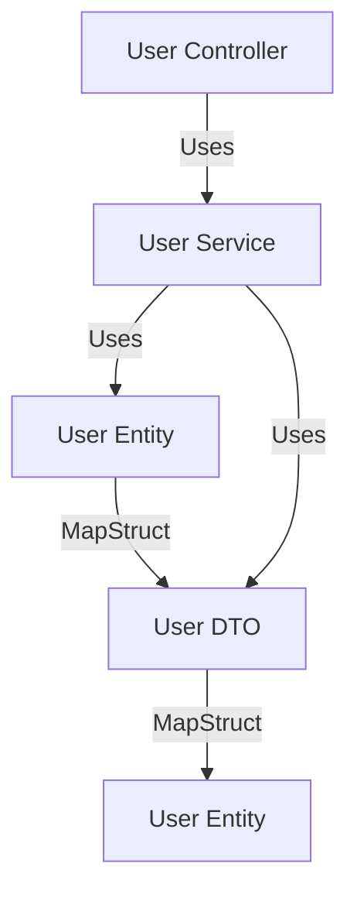

1. [Introduction](#introduction)
2. [Why Use MapStruct?](#why-use-mapstruct)
3. [How to Use MapStruct in Spring Boot](#how-to-use-mapstruct-in-spring-boot)
4. [Benefits and Advantages](#benefits-and-advantages)
5. [Textual Diagram](#textual-diagram)
6. [Sample Code](#sample-code)
7. [Generated Mapper Code](#generated-mapper-code)
8. [Excluding Certain Attributes](#excluding-certain-attributes)
9. [Conclusion](#conclusion)

---

<a name="introduction"></a>
## Introduction

MapStruct is a Java annotation processor for the generation of type-safe and performant bean mapping code. It simplifies the mapping between different Java bean types by automatically generating the necessary mapping code at compile time. This article will explore why and how to use MapStruct in a Spring Boot application, its benefits and advantages, and provide detailed sample code.

---

<a name="why-use-mapstruct"></a>
## Why Use MapStruct?

### Manual Mapping
Manual mapping between Java beans can be tedious and error-prone. It often involves writing repetitive and boilerplate code, which can lead to maintenance issues.

### Reflection-Based Mapping
Frameworks like Dozer use reflection to map beans, which can be slow and difficult to debug. Reflection-based mapping also lacks type safety and can lead to runtime errors.

### MapStruct
MapStruct generates mapping code at compile time, ensuring type safety and performance. It reduces boilerplate code and makes the mapping process more maintainable and easier to debug.

---

<a name="how-to-use-mapstruct-in-spring-boot"></a>
## How to Use MapStruct in Spring Boot

### Step 1: Add Dependencies
Add the necessary dependencies to your `pom.xml` file. Note that we are using the latest version of MapStruct.

```xml
<dependencies>
    <!-- Spring Boot Starter -->
    <dependency>
        <groupId>org.springframework.boot</groupId>
        <artifactId>spring-boot-starter</artifactId>
    </dependency>

    <!-- MapStruct -->
    <dependency>
        <groupId>org.mapstruct</groupId>
        <artifactId>mapstruct</artifactId>
        <version>1.5.3.Final</version>
    </dependency>

    <!-- MapStruct Processor -->
    <dependency>
        <groupId>org.mapstruct</groupId>
        <artifactId>mapstruct-processor</artifactId>
        <version>1.5.3.Final</version>
        <scope>provided</scope>
    </dependency>
</dependencies>
```

### Step 2: Define Mapping Interface
Create a mapping interface using the `@Mapper` annotation.

```java
import org.mapstruct.Mapper;
import org.mapstruct.Mapping;
import org.mapstruct.factory.Mappers;

import java.time.LocalDate;
import java.time.format.DateTimeFormatter;

@Mapper
public interface UserMapper {
    UserMapper INSTANCE = Mappers.getMapper(UserMapper.class);

    @Mapping(source = "emailAddress", target = "email")
    @Mapping(source = "birthDate", target = "birthDate", dateFormat = "yyyyMMdd")
    @Mapping(target = "password", ignore = true) // Exclude password attribute
    UserDTO userToUserDTO(User user);

    @Mapping(source = "email", target = "emailAddress")
    @Mapping(target = "birthDate", expression = "java(LocalDate.parse(userDTO.getBirthDate(), DateTimeFormatter.ofPattern(\"yyyyMMdd\")))")
    @Mapping(target = "password", ignore = true) // Exclude password attribute
    User userDTOToUser(UserDTO userDTO);
}
```

### Step 3: Use the Mapper
Inject the mapper into your service or controller and use it to map between beans.

```java
import org.springframework.stereotype.Service;

@Service
public class UserService {
    private final UserMapper userMapper = UserMapper.INSTANCE;

    public UserDTO getUserDTO(User user) {
        return userMapper.userToUserDTO(user);
    }

    public User getUser(UserDTO userDTO) {
        return userMapper.userDTOToUser(userDTO);
    }
}
```

---

<a name="benefits-and-advantages"></a>
## Benefits and Advantages

### Type Safety
MapStruct generates type-safe mapping code at compile time, reducing the risk of runtime errors.

### Performance
Since the mapping code is generated at compile time, it avoids the performance overhead associated with reflection-based mapping.

### Maintainability
MapStruct reduces boilerplate code, making the mapping process more maintainable and easier to understand.

### Customization
MapStruct allows for easy customization of mappings through annotations and configuration options.

---

<a name="textual-diagram"></a>
## Textual Diagram



### Explanation

1. **User Entity**: Represents the domain object.
2. **User DTO**: Represents the data transfer object.
3. **MapStruct**: Generates mapping code between User Entity and User DTO.
4. **User Service**: Uses the MapStruct-generated mapper to convert between User Entity and User DTO.
5. **User Controller**: Uses the User Service to handle requests and responses.

---

<a name="sample-code"></a>
## Sample Code

### User Entity
```java
import java.time.LocalDate;

public class User {
    private Long id;
    private String name;
    private String emailAddress;
    private LocalDate birthDate;
    private String password; // Password attribute to be excluded

    // Getters and Setters
}
```

### User DTO
```java
public class UserDTO {
    private Long id;
    private String name;
    private String email;
    private String birthDate;
    private String password; // Password attribute to be excluded

    // Getters and Setters
}
```

### User Mapper
```java
import org.mapstruct.Mapper;
import org.mapstruct.Mapping;
import org.mapstruct.factory.Mappers;

import java.time.LocalDate;
import java.time.format.DateTimeFormatter;

@Mapper
public interface UserMapper {
    UserMapper INSTANCE = Mappers.getMapper(UserMapper.class);

    @Mapping(source = "emailAddress", target = "email")
    @Mapping(source = "birthDate", target = "birthDate", dateFormat = "yyyyMMdd")
    @Mapping(target = "password", ignore = true) // Exclude password attribute
    UserDTO userToUserDTO(User user);

    @Mapping(source = "email", target = "emailAddress")
    @Mapping(target = "birthDate", expression = "java(LocalDate.parse(userDTO.getBirthDate(), DateTimeFormatter.ofPattern(\"yyyyMMdd\")))")
    @Mapping(target = "password", ignore = true) // Exclude password attribute
    User userDTOToUser(UserDTO userDTO);
}
```

### User Service
```java
import org.springframework.stereotype.Service;

@Service
public class UserService {
    private final UserMapper userMapper = UserMapper.INSTANCE;

    public UserDTO getUserDTO(User user) {
        return userMapper.userToUserDTO(user);
    }

    public User getUser(UserDTO userDTO) {
        return userMapper.userDTOToUser(userDTO);
    }
}
```

### User Controller
```java
import org.springframework.beans.factory.annotation.Autowired;
import org.springframework.web.bind.annotation.*;

@RestController
@RequestMapping("/users")
public class UserController {
    @Autowired
    private UserService userService;

    @GetMapping("/{id}")
    public UserDTO getUserDTO(@PathVariable Long id) {
        User user = new User(); // Assume this is fetched from a repository
        return userService.getUserDTO(user);
    }

    @PostMapping
    public User createUser(@RequestBody UserDTO userDTO) {
        return userService.getUser(userDTO);
    }
}
```

---

<a name="generated-mapper-code"></a>
## Generated Mapper Code

After compiling the project, MapStruct will generate the following mapper implementation:

```java
import java.time.LocalDate;
import java.time.format.DateTimeFormatter;

public class UserMapperImpl implements UserMapper {

    @Override
    public UserDTO userToUserDTO(User user) {
        if (user == null) {
            return null;
        }

        UserDTO userDTO = new UserDTO();
        userDTO.setId(user.getId());
        userDTO.setName(user.getName());
        userDTO.setEmail(user.getEmailAddress());
        userDTO.setBirthDate(user.getBirthDate().format(DateTimeFormatter.ofPattern("yyyyMMdd")));

        return userDTO;
    }

    @Override
    public User userDTOToUser(UserDTO userDTO) {
        if (userDTO == null) {
            return null;
        }

        User user = new User();
        user.setId(userDTO.getId());
        user.setName(userDTO.getName());
        user.setEmailAddress(userDTO.getEmail());
        user.setBirthDate(LocalDate.parse(userDTO.getBirthDate(), DateTimeFormatter.ofPattern("yyyyMMdd")));

        return user;
    }
}
```

---

<a name="excluding-certain-attributes"></a>
## Excluding Certain Attributes

### Exclude Attribute Example
In the `UserMapper` interface, we use the `@Mapping` annotation with `ignore = true` to exclude the `password` attribute from the mapping.

```java
@Mapper
public interface UserMapper {
    UserMapper INSTANCE = Mappers.getMapper(UserMapper.class);

    @Mapping(source = "emailAddress", target = "email")
    @Mapping(source = "birthDate", target = "birthDate", dateFormat = "yyyyMMdd")
    @Mapping(target = "password", ignore = true) // Exclude password attribute
    UserDTO userToUserDTO(User user);

    @Mapping(source = "email", target = "emailAddress")
    @Mapping(target = "birthDate", expression = "java(LocalDate.parse(userDTO.getBirthDate(), DateTimeFormatter.ofPattern(\"yyyyMMdd\")))")
    @Mapping(target = "password", ignore = true) // Exclude password attribute
    User userDTOToUser(UserDTO userDTO);
}
```

### Generated Mapper Code with Exclusion
The generated mapper code will exclude the `password` attribute from the mapping.

```java
import java.time.LocalDate;
import java.time.format.DateTimeFormatter;

public class UserMapperImpl implements UserMapper {

    @Override
    public UserDTO userToUserDTO(User user) {
        if (user == null) {
            return null;
        }

        UserDTO userDTO = new UserDTO();
        userDTO.setId(user.getId());
        userDTO.setName(user.getName());
        userDTO.setEmail(user.getEmailAddress());
        userDTO.setBirthDate(user.getBirthDate().format(DateTimeFormatter.ofPattern("yyyyMMdd")));

        return userDTO;
    }

    @Override
    public User userDTOToUser(UserDTO userDTO) {
        if (userDTO == null) {
            return null;
        }

        User user = new User();
        user.setId(userDTO.getId());
        user.setName(userDTO.getName());
        user.setEmailAddress(userDTO.getEmail());
        user.setBirthDate(LocalDate.parse(userDTO.getBirthDate(), DateTimeFormatter.ofPattern("yyyyMMdd")));

        return user;
    }
}
```

---

<a name="conclusion"></a>
## Conclusion

MapStruct is a powerful and efficient Java bean mapping framework that simplifies the process of mapping between different Java bean types. By generating type-safe and performant mapping code at compile time, MapStruct reduces boilerplate code, improves maintainability, and enhances the overall quality of your Spring Boot applications. Whether you are working on a small project or a large enterprise application, MapStruct is a valuable tool that can significantly streamline your development process.