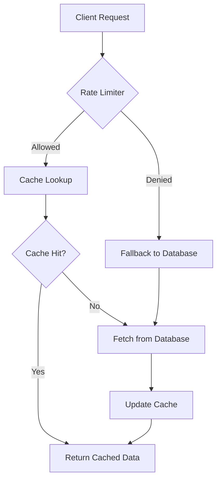
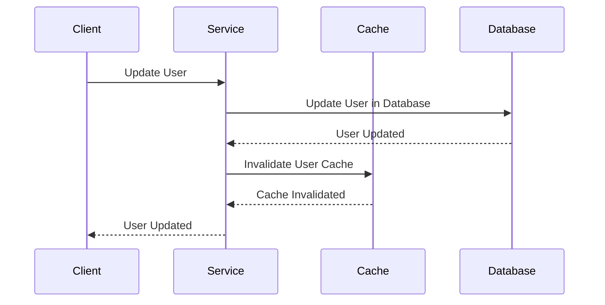
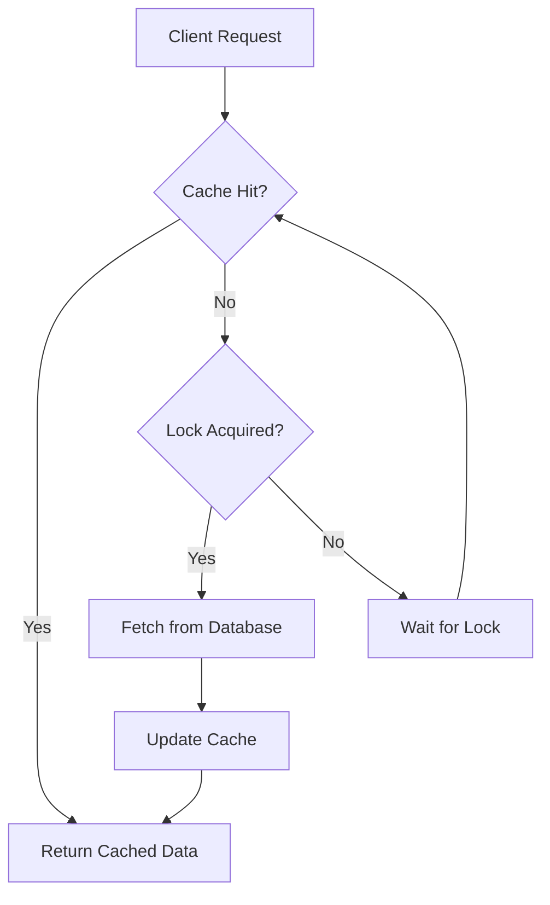

# Deep Dive into Memory Cache Design and Implementation in Spring Boot Microservice Applications

## Table of Contents
- [Deep Dive into Memory Cache Design and Implementation in Spring Boot Microservice Applications](#deep-dive-into-memory-cache-design-and-implementation-in-spring-boot-microservice-applications)
  - [Table of Contents](#table-of-contents)
  - [Introduction](#introduction)
  - [Understanding Memory Cache](#understanding-memory-cache)
    - [Key Concepts](#key-concepts)
  - [Cache Design Principles](#cache-design-principles)
    - [1. **Cache Hit and Miss**](#1-cache-hit-and-miss)
    - [2. **Cache Eviction Policies**](#2-cache-eviction-policies)
    - [3. **Cache Invalidation**](#3-cache-invalidation)
  - [Cache Implementation in Spring Boot](#cache-implementation-in-spring-boot)
    - [Spring Boot Cache Abstraction](#spring-boot-cache-abstraction)
    - [Caffeine Cache Integration](#caffeine-cache-integration)
    - [Cache Configuration](#cache-configuration)
    - [YAML Configuration](#yaml-configuration)
    - [Detailed Logic in Caffeine Cache](#detailed-logic-in-caffeine-cache)
      - [Cache Lookup](#cache-lookup)
      - [Cache Miss and Method Execution](#cache-miss-and-method-execution)
      - [Cache Update](#cache-update)
  - [Microservice Architecture and Cache](#microservice-architecture-and-cache)
    - [Cache Consistency](#cache-consistency)
    - [Cache Eviction Strategies](#cache-eviction-strategies)
  - [Complex Scenario 1: Flow Control and Backpressure Handling](#complex-scenario-1-flow-control-and-backpressure-handling)
    - [Problem Statement](#problem-statement)
    - [Solution Architecture](#solution-architecture)
    - [Flow Chart](#flow-chart)
    - [Sample Code](#sample-code)
  - [Complex Scenario 2: Cache Invalidation and Data Synchronization](#complex-scenario-2-cache-invalidation-and-data-synchronization)
    - [Problem Statement](#problem-statement-1)
    - [Solution Architecture](#solution-architecture-1)
    - [Sequence Diagram](#sequence-diagram)
    - [Sample Code](#sample-code-1)
  - [Complex Scenario 3: Cache Stampede Prevention](#complex-scenario-3-cache-stampede-prevention)
    - [Problem Statement](#problem-statement-2)
    - [Solution Architecture](#solution-architecture-2)
    - [Flow Chart](#flow-chart-1)
    - [Sample Code](#sample-code-2)
  - [Real-Life Production Use Cases](#real-life-production-use-cases)
    - [1. **User Profile Caching**](#1-user-profile-caching)
    - [2. **Product Catalog Caching**](#2-product-catalog-caching)
    - [3. **API Response Caching**](#3-api-response-caching)
    - [4. **Session Data Caching**](#4-session-data-caching)
  - [Sample Code](#sample-code-3)
    - [Caffeine Cache Configuration](#caffeine-cache-configuration)
    - [User Service with Caching](#user-service-with-caching)
  - [Rate Limiting for Cache Access](#rate-limiting-for-cache-access)
    - [Why Rate Limiting is Needed](#why-rate-limiting-is-needed)
    - [Example: Rate Limiting with Spring Boot](#example-rate-limiting-with-spring-boot)
      - [Add Dependencies](#add-dependencies)
      - [Rate Limiting Configuration](#rate-limiting-configuration)
      - [Service Implementation with Rate Limiting](#service-implementation-with-rate-limiting)
    - [Explanation](#explanation)
    - [Conclusion](#conclusion)
  - [Conclusion](#conclusion-1)

---

<a name="introduction"></a>
## Introduction

In modern microservice architectures, performance and scalability are critical. Memory caching is a powerful technique to improve application performance by reducing the load on databases and other backend services. This article delves into the design and implementation of memory caches in Spring Boot applications, focusing on real-life project scenarios and the latest technology stack.

---

<a name="understanding-memory-cache"></a>
## Understanding Memory Cache

A memory cache is a high-speed data storage layer that stores a subset of data, typically transient in nature, so that future requests for that data are served faster. Caching can significantly improve the performance and scalability of applications by reducing the need to access slower underlying storage layers.

### Key Concepts

- **Cache Hit**: When the requested data is found in the cache.
- **Cache Miss**: When the requested data is not found in the cache.
- **Cache Eviction**: The process of removing data from the cache to make room for new data.

---

<a name="cache-design-principles"></a>
## Cache Design Principles

### 1. **Cache Hit and Miss**
   - **Cache Hit**: When the requested data is found in the cache.
   - **Cache Miss**: When the requested data is not found in the cache.

### 2. **Cache Eviction Policies**
   - **Least Recently Used (LRU)**: Removes the least recently used items first.
   - **First In, First Out (FIFO)**: Removes the oldest items first.
   - **Least Frequently Used (LFU)**: Removes the least frequently used items first.

### 3. **Cache Invalidation**
   - **Time-to-Live (TTL)**: Data is automatically invalidated after a certain period.
   - **Event-Driven Invalidation**: Data is invalidated based on specific events (e.g., data updates).

---

<a name="cache-implementation-in-spring-boot"></a>
## Cache Implementation in Spring Boot

### <a name="spring-boot-cache-abstraction"></a>Spring Boot Cache Abstraction

Spring Boot provides a powerful cache abstraction that allows you to apply caching to your methods with minimal configuration. The core annotation is `@Cacheable`, which caches the result of a method invocation.

### <a name="caffeine-cache-integration"></a>Caffeine Cache Integration

Caffeine is a high-performance, near-optimal caching library for Java. It is widely used in Spring Boot applications due to its efficiency and ease of integration.

### <a name="cache-configuration"></a>Cache Configuration

To configure Caffeine cache in a Spring Boot application, you need to add the following dependencies:

```xml
<dependency>
    <groupId>org.springframework.boot</groupId>
    <artifactId>spring-boot-starter-cache</artifactId>
</dependency>
<dependency>
    <groupId>com.github.ben-manes.caffeine</groupId>
    <artifactId>caffeine</artifactId>
</dependency>
```

Next, enable caching in your Spring Boot application by adding the `@EnableCaching` annotation to your main application class:

```java
import org.springframework.boot.SpringApplication;
import org.springframework.boot.autoconfigure.SpringBootApplication;
import org.springframework.cache.annotation.EnableCaching;

@SpringBootApplication
@EnableCaching
public class Application {
    public static void main(String[] args) {
        SpringApplication.run(Application.class, args);
    }
}
```

### <a name="yaml-configuration"></a>YAML Configuration

You can also configure Caffeine cache using YAML:

```yaml
spring:
  cache:
    type: caffeine
    cache-names:
      - userCache
      - productCache
    caffeine:
      spec: maximumSize=500,expireAfterAccess=600s
```

### Detailed Logic in Caffeine Cache

When you annotate a method with `@Cacheable` in Spring Boot, the cache manager will first check if the requested data is already present in the specified cache. If the data is found, it will be returned immediately, bypassing the method's execution. If the data is not found, the method will be executed, and the result will be stored in the cache for future requests.

#### Cache Lookup

Caffeine uses a `ConcurrentHashMap` to store cache entries. When a lookup is performed, Caffeine checks if the key exists in the map:

```java
public V getIfPresent(Object key) {
    Node<K, V> node = data.get(key);
    if (node == null) {
        return null;
    }
    // Additional logic for expiration and eviction checks
    return node.getValue();
}
```

#### Cache Miss and Method Execution

If the key is not found in the cache, the method is executed, and the result is stored in the cache:

```java
public V get(K key, Function<? super K, ? extends V> mappingFunction) {
    V value = getIfPresent(key);
    if (value != null) {
        return value;
    }
    value = mappingFunction.apply(key);
    put(key, value);
    return value;
}
```

#### Cache Update

When the result is fetched from the database, it is stored in the cache:

```java
public void put(K key, V value) {
    Node<K, V> node = new Node<>(key, value);
    data.put(key, node);
    // Additional logic for eviction and expiration
}
```

---

<a name="microservice-architecture-and-cache"></a>
## Microservice Architecture and Cache

### <a name="cache-consistency"></a>Cache Consistency

Ensuring cache consistency is crucial in distributed systems. Techniques like cache invalidation, event-driven updates, and distributed locking can be used to maintain consistency.

### <a name="cache-eviction-strategies"></a>Cache Eviction Strategies

Choosing the right eviction strategy is important. LRU is commonly used, but in scenarios with frequent updates, LFU or custom eviction policies might be more appropriate.

---

<a name="complex-scenario-1-flow-control-and-backpressure-handling"></a>
## Complex Scenario 1: Flow Control and Backpressure Handling

### Problem Statement

In high-traffic scenarios, the cache might become a bottleneck if not properly managed. Flow control and backpressure handling are essential to prevent the cache from being overwhelmed.

### Solution Architecture

1. **Rate Limiting**: Implement rate limiting to control the number of requests hitting the cache.
2. **Circuit Breaker**: Use a circuit breaker to handle failures gracefully and prevent cascading failures.
3. **Backpressure Handling**: Implement backpressure mechanisms to manage the flow of data between services.

### Flow Chart



### Sample Code

```java
import org.springframework.cache.annotation.Cacheable;
import org.springframework.stereotype.Service;

@Service
public class UserService {

    @Cacheable(value = "userCache", key = "#userId")
    public User getUserById(Long userId) {
        // Fetch user from database
        return fetchUserFromDatabase(userId);
    }

    private User fetchUserFromDatabase(Long userId) {
        // Database query logic
        return new User();
    }
}
```

---

<a name="complex-scenario-2-cache-invalidation-and-data-synchronization"></a>
## Complex Scenario 2: Cache Invalidation and Data Synchronization

### Problem Statement

Ensuring that the cache remains consistent with the underlying data store is challenging, especially in distributed systems.

### Solution Architecture

1. **Event-Driven Invalidation**: Use event-driven mechanisms to invalidate the cache when data changes.
2. **Distributed Locking**: Use distributed locking to ensure that only one service updates the cache at a time.
3. **TTL-Based Invalidation**: Use Time-to-Live (TTL) to automatically invalidate cache entries after a certain period.

### Sequence Diagram



### Sample Code

```java
import org.springframework.cache.annotation.CacheEvict;
import org.springframework.stereotype.Service;

@Service
public class UserService {

    @CacheEvict(value = "userCache", key = "#userId")
    public void updateUser(Long userId, User user) {
        // Update user in database
        updateUserInDatabase(userId, user);
    }

    private void updateUserInDatabase(Long userId, User user) {
        // Database update logic
    }
}
```

---

<a name="complex-scenario-3-cache-stampede-prevention"></a>
## Complex Scenario 3: Cache Stampede Prevention

### Problem Statement

A cache stampede occurs when multiple requests for the same data hit the cache simultaneously, leading to a spike in database load.

### Solution Architecture

1. **Probabilistic Early Expiration**: Use probabilistic early expiration to spread out cache expiration times.
2. **Locking Mechanism**: Implement a locking mechanism to ensure that only one request populates the cache at a time.
3. **Background Refresh**: Use background refresh to keep the cache up-to-date without impacting the user experience.

### Flow Chart



### Sample Code

```java
import org.springframework.cache.annotation.Cacheable;
import org.springframework.stereotype.Service;

import java.util.concurrent.locks.Lock;
import java.util.concurrent.locks.ReentrantLock;

@Service
public class UserService {

    private final Lock lock = new ReentrantLock();

    @Cacheable(value = "userCache", key = "#userId")
    public User getUserById(Long userId) {
        try {
            lock.lock();
            // Double-check to ensure the cache is still empty
            User cachedUser = fetchUserFromCache(userId);
            if (cachedUser != null) {
                return cachedUser;
            }
            // Fetch user from database
            User user = fetchUserFromDatabase(userId);
            // Update cache
            updateCache(userId, user);
            return user;
        } finally {
            lock.unlock();
        }
    }

    private User fetchUserFromCache(Long userId) {
        // Cache lookup logic
        return null;
    }

    private User fetchUserFromDatabase(Long userId) {
        // Database query logic
        return new User();
    }

    private void updateCache(Long userId, User user) {
        // Cache update logic
    }
}
```

---

<a name="real-life-production-use-cases"></a>
## Real-Life Production Use Cases

### 1. **User Profile Caching**

In a social media application, user profiles are frequently accessed. Caching user profiles can significantly reduce the load on the database and improve response times.

### 2. **Product Catalog Caching**

In an e-commerce application, product catalogs are often large and frequently accessed. Caching product data can improve performance and reduce database load.

### 3. **API Response Caching**

In microservices, caching API responses can reduce the number of calls to downstream services, improving overall system performance.

### 4. **Session Data Caching**

In applications with user sessions, caching session data can reduce the load on session storage systems and improve scalability.

---

<a name="sample-code"></a>
## Sample Code

### Caffeine Cache Configuration

```java
import com.github.benmanes.caffeine.cache.Caffeine;
import org.springframework.cache.CacheManager;
import org.springframework.cache.caffeine.CaffeineCacheManager;
import org.springframework.context.annotation.Bean;
import org.springframework.context.annotation.Configuration;

import java.util.concurrent.TimeUnit;

@Configuration
public class CacheConfig {

    @Bean
    public CacheManager cacheManager() {
        CaffeineCacheManager cacheManager = new CaffeineCacheManager("userCache", "productCache");
        cacheManager.setCaffeine(caffeineCacheBuilder());
        return cacheManager;
    }

    Caffeine<Object, Object> caffeineCacheBuilder() {
        return Caffeine.newBuilder()
                .maximumSize(500)
                .expireAfterAccess(600, TimeUnit.SECONDS);
    }
}
```

### User Service with Caching

```java
import org.springframework.cache.annotation.Cacheable;
import org.springframework.stereotype.Service;

@Service
public class UserService {

    @Cacheable(value = "userCache", key = "#userId")
    public User getUserById(Long userId) {
        // Fetch user from database
        return fetchUserFromDatabase(userId);
    }

    private User fetchUserFromDatabase(Long userId) {
        // Database query logic
        return new User();
    }
}
```

---

<a name="rate-limiting-for-cache-access"></a>
## Rate Limiting for Cache Access

### Why Rate Limiting is Needed

Reading from a memory cache is generally very fast and should not be a bottleneck in terms of performance. However, there are several reasons why you might still want to implement rate limiting for cache access, even if the cache is in memory:

1. **Resource Management**: Even though reading from memory is fast, excessive concurrent requests can still consume a significant amount of CPU and memory resources. Rate limiting helps manage these resources more effectively, ensuring that the system remains responsive and does not become overwhelmed.

2. **Preventing Cache Stampede**: While reading from the cache is fast, if the cache is not populated (cache miss), all concurrent requests will end up fetching the data from the database or another slow data source. This can lead to a cache stampede, where the database or other backend services are overwhelmed with requests. Rate limiting can help mitigate this by controlling the number of concurrent requests that can hit the cache.

3. **Graceful Degradation**: In high-traffic scenarios, rate limiting ensures that the system can gracefully degrade its performance. By limiting the number of requests that can access the cache, you can prevent the system from becoming unresponsive or crashing under heavy load.

4. **Security and Denial of Service (DoS) Prevention**: Rate limiting can also be a security measure to prevent Denial of Service (DoS) attacks. By limiting the number of requests from a single client or IP address, you can protect the system from being overwhelmed by malicious requests.

5. **Ensuring Fairness**: Rate limiting ensures that all clients have fair access to the cache. Without rate limiting, a few clients with high request rates could monopolize the cache, leading to poor performance for other clients.

6. **Monitoring and Analytics**: Rate limiting provides valuable data on the usage patterns of the cache. This data can be used for monitoring, analytics, and capacity planning.

### Example: Rate Limiting with Spring Boot

Here's an example of how you might implement rate limiting for cache access in a Spring Boot application using the `Bucket4j` library:

#### Add Dependencies

```xml
<dependency>
    <groupId>com.github.vladimir-bukhtoyarov</groupId>
    <artifactId>bucket4j-core</artifactId>
    <version>7.5.0</version>
</dependency>
```

#### Rate Limiting Configuration

```java
import io.github.bucket4j.Bandwidth;
import io.github.bucket4j.Bucket;
import io.github.bucket4j.Bucket4j;
import io.github.bucket4j.Refill;
import org.springframework.context.annotation.Bean;
import org.springframework.context.annotation.Configuration;

import java.time.Duration;

@Configuration
public class RateLimitingConfig {

    @Bean
    public Bucket cacheRateLimiter() {
        Bandwidth limit = Bandwidth.classic(100, Refill.greedy(100, Duration.ofMinutes(1)));
        return Bucket4j.builder().addLimit(limit).build();
    }
}
```

#### Service Implementation with Rate Limiting

```java
import io.github.bucket4j.Bucket;
import org.springframework.beans.factory.annotation.Autowired;
import org.springframework.cache.annotation.Cacheable;
import org.springframework.stereotype.Service;

@Service
public class UserService {

    @Autowired
    private Bucket cacheRateLimiter;

    @Cacheable(value = "userCache", key = "#userId")
    public User getUserById(Long userId) {
        if (cacheRateLimiter.tryConsume(1)) {
            // Fetch user from database
            return fetchUserFromDatabase(userId);
        } else {
            throw new RuntimeException("Rate limit exceeded");
        }
    }

    private User fetchUserFromDatabase(Long userId) {
        // Database query logic
        return new User();
    }
}
```

### Explanation

1. **Bucket4j Configuration**: The `Bucket4j` library is used to configure a rate limiter with a limit of 100 requests per minute.
2. **Service Implementation**: The `getUserById` method checks if the rate limit has been exceeded before fetching the user from the database. If the limit is exceeded, it throws an exception.

### Conclusion

While reading from a memory cache is fast and should not be a bottleneck, implementing rate limiting can provide several benefits, including resource management, preventing cache stampedes, ensuring fairness, and enhancing security. By using libraries like `Bucket4j`, you can easily implement rate limiting in your Spring Boot application to manage cache access effectively.

---

<a name="conclusion"></a>
## Conclusion

Memory caching is a powerful tool for improving the performance and scalability of Spring Boot applications in a microservice architecture. By understanding the principles of cache design and implementing best practices, you can effectively manage cache performance, consistency, and reliability in real-life projects.

This article provides a comprehensive guide to memory cache design and implementation in Spring Boot, covering various scenarios and best practices. Use the provided sample code and diagrams to implement efficient caching in your microservice architecture.