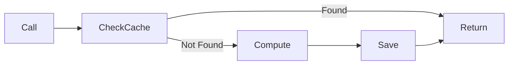
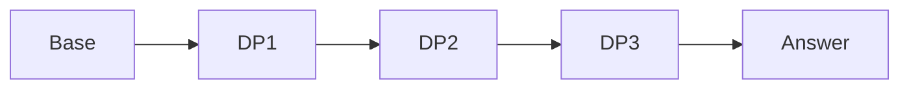
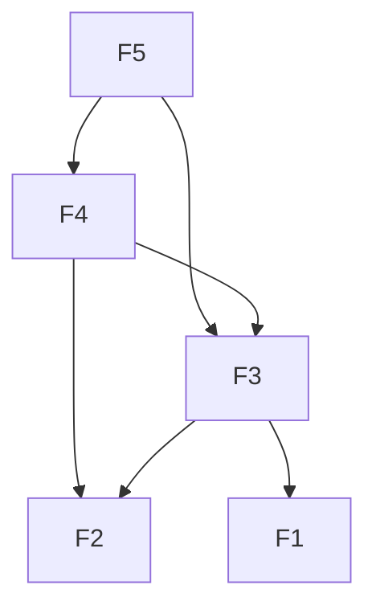
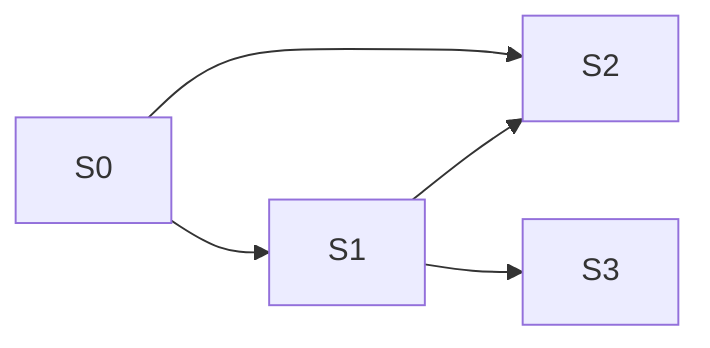
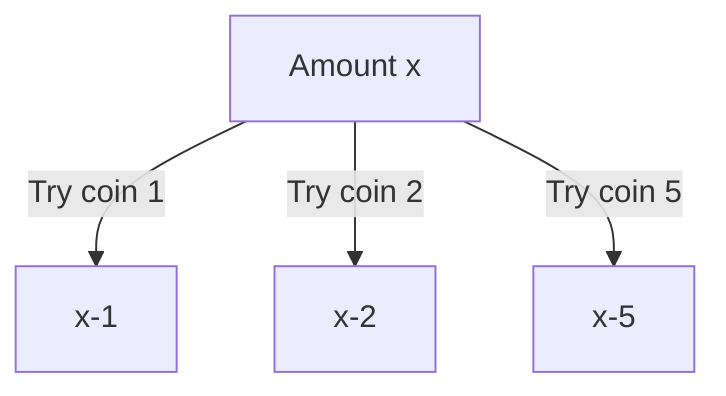
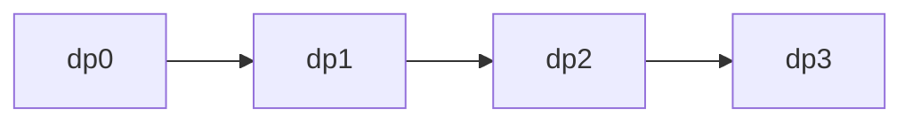
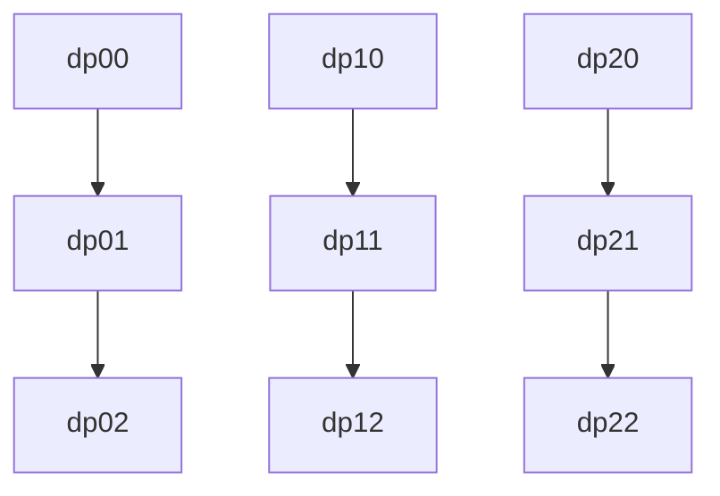
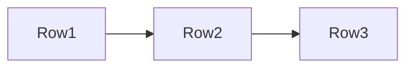
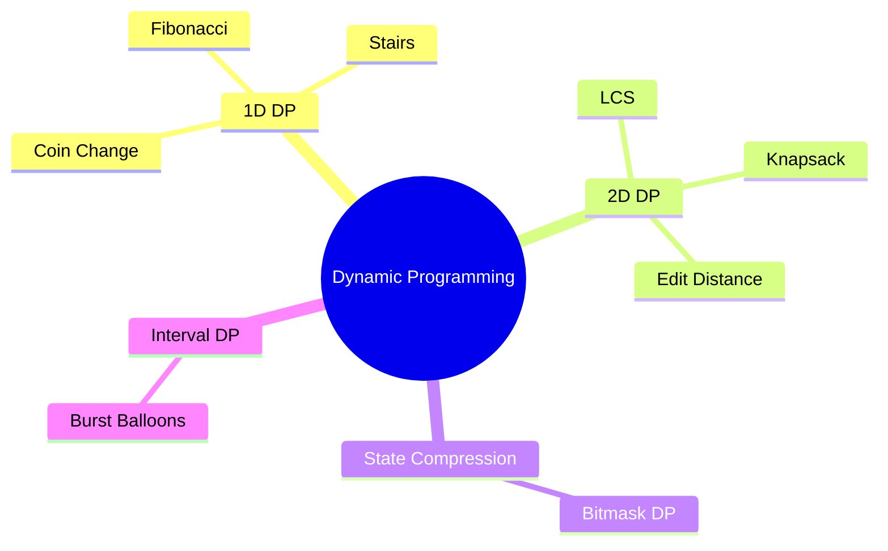

1. [🎯 What is Dynamic Programming?](#🎯-what-is-dynamic-programming)
2. [📊 The Core Idea](#📊-the-core-idea)
3. [🔄 Two Approaches to DP (Top-Down vs Bottom-Up)](#🔄-two-approaches-to-dp-top-down-vs-bottom-up)
4. [🔑 Two Key Properties of DP](#🔑-two-key-properties-of-dp)
5. [🧩 Example 1: Fibonacci Numbers](#🧩-example-1-fibonacci-numbers)
6. [🏗️ DP Framework: 5-Step Process](#🏗️-dp-framework-5-step-process)
7. [🧩 Example 2: Climbing Stairs](#🧩-example-2-climbing-stairs)
8. [📦 DP Categories & Patterns](#📦-dp-categories--patterns)
9. [🧩 Example 3: Unique Paths (2D DP)](#🧩-example-3-unique-paths-2d-dp)
10. [💰 Example 4: Coin Change (Classic DP)](#💰-example-4-coin-change-classic-dp)
11. [1D vs 2D DP (Very Important)](#1d-vs-2d-dp-very-important)
12. [🔍 How to Identify DP Problems](#🔍-how-to-identify-dp-problems)
13. [🛠️ DP Implementation Patterns](#🛠️-dp-implementation-patterns)
14. [🚨 Common Mistakes & How to Avoid Them](#🚨-common-mistakes--how-to-avoid-them)
15. [🔄 Memoization vs Tabulation](#🔄-memoization-vs-tabulation)
16. [🎓 DP Problem-Solving Checklist](#🎓-dp-problem-solving-checklist)
17. [📊 Space Optimization Techniques](#📊-space-optimization-techniques)
18. [🎯 Practice Problems by Difficulty](#🎯-practice-problems-by-difficulty)
19. [🧠 Mental Models for DP](#🧠-mental-models-for-dp)
20. [📚 Resources for Practice](#📚-resources-for-practice)
21. [💪 Final Summary](#💪-final-summary)

---

## 🎯 **What is Dynamic Programming?**

**Dynamic Programming (DP)** is a method for solving complex problems by breaking them down into simpler subproblems, solving each subproblem just once, and storing their solutions.

Three key concepts:
1. A problem can be broken into **smaller subproblems**
2. Those subproblems **repeat**
3. We can **store** their answers and reuse them

> 🔑 **One‑sentence definition**:
>
> *Dynamic Programming = Recursion + Memory*

> 💡 **Simple Analogy**: Imagine climbing stairs. To reach step 10, you need to know how to reach step 9. To reach step 9, you need step 8... DP remembers solutions to these smaller steps!

---

## 📊 **The Core Idea**

```
Solving big problem
    ↓
Break into smaller problems
    ↓
Solve & remember solutions
    ↓
Reuse solutions to solve bigger problem
```

### **Key Properties of DP Problems:**

1. **Optimal Substructure**: Optimal solution can be constructed from optimal solutions of subproblems
   - The "Optimal" solution to the big problem can be constructed from the "Optimal" solutions of its subproblems.
   - If you want the shortest path from A to C, and it goes through B, the path must include the shortest path from A to B.

2. **Overlapping Subproblems**: Same subproblems are solved multiple times
   - This means the problem can be broken down into smaller versions of itself, and those smaller versions **repeat**.

---

## 🔄 **Two Approaches to DP (Top-Down vs Bottom-Up)**

There are two ways to implement DP. Think of them as "The Lazy Way" and "The Organized Way."

### **Method 1: Top-Down (Memoization)**
You start with the big problem and break it down. If you've solved a subproblem before, you look up the answer in your "notebook" (usually a dictionary or array).

* **Vibe:** "I'll solve it when I need it, and save the answer for later."
* **Tool:** Recursion + Cache.



```python
memo = {}

def fib(n):
    if n <= 1:
        return n
    if n in memo:
        return memo[n]
    memo[n] = fib(n-1) + fib(n-2)
    return memo[n]
```

### **Method 2: Bottom-Up (Tabulation)**
You start with the smallest possible subproblems (base cases) and fill out a table until you reach the goal.

* **Vibe:** "Let's build a foundation from the ground up."
* **Tool:** Iteration (Loops) + Table (Array/Grid).



```python
def fib(n):
    dp = [0] * (n + 1)
    dp[1] = 1
    for i in range(2, n + 1):
        dp[i] = dp[i-1] + dp[i-2]
    return dp[n]
```

**✅ Pros:** No recursion, often faster

---

## 🔑 **Two Key Properties of DP (Must Memorize)**

### **1. Overlapping Subproblems**
Same subproblem appears again and again

```mermaid
graph TD
    A[fib(5)] --> B[fib(4)]
    A --> C[fib(3)]
    B --> C
```

### **2. Optimal Substructure**
The optimal solution of a problem **depends on optimal solutions of subproblems**

**Examples:**
- Shortest path
- Maximum profit
- Minimum steps

---

## 🧩 **Example 1: Fibonacci Numbers**

### **Problem:** Find the nth Fibonacci number
```
fib(0) = 0
fib(1) = 1
fib(n) = fib(n-1) + fib(n-2) for n > 1
```

### **Call Tree Explosion**



**❌ Problem:** `fib(3)` and `fib(2)` are computed *multiple times*

### **1. Brute Force (Recursive) - ❌ Inefficient**

```python
def fib_naive(n):
    if n <= 1:
        return n
    return fib_naive(n-1) + fib_naive(n-2)
# Time: O(2ⁿ) - Exponential!
```

### **2. Memoization (Top-Down DP) - ✅ Efficient**

```python
def fib_memo(n, memo={}):
    if n <= 1:
        return n
    if n not in memo:
        memo[n] = fib_memo(n-1, memo) + fib_memo(n-2, memo)
    return memo[n]
# Time: O(n), Space: O(n)
```

### **3. Tabulation (Bottom-Up DP) - ✅ Most Efficient**

```python
def fib_tab(n):
    if n <= 1:
        return n
    
    # 1. State: dp[i] is the i-th Fibonacci number
    dp = [0] * (n + 1)
    
    # 2. Base Cases
    dp[0] = 0
    dp[1] = 1
    
    # 4. Order: 2 to n
    for i in range(2, n + 1):
        # 3. Recurrence Relation
        dp[i] = dp[i-1] + dp[i-2]
    
    # 5. Final Answer
    return dp[n]
# Time: O(n), Space: O(n)
```

**Visualization:**
```
Index: 0  1  2  3  4  5
dp = [0, 1, 0, 0, 0, 0]  # Initial
i=2: dp[2] = 1 + 0 = 1
dp = [0, 1, 1, 0, 0, 0]
i=3: dp[3] = 1 + 1 = 2
dp = [0, 1, 1, 2, 0, 0]
i=4: dp[4] = 2 + 1 = 3
dp = [0, 1, 1, 2, 3, 0]
i=5: dp[5] = 3 + 2 = 5
dp = [0, 1, 1, 2, 3, 5]
```

### **4. Space Optimized - ✅ O(1) Space**

```python
def fib_optimized(n):
    if n <= 1:
        return n
    prev2, prev1 = 0, 1  # F(0), F(1)
    for i in range(2, n + 1):
        current = prev1 + prev2
        prev2, prev1 = prev1, current
    return prev1
# Time: O(n), Space: O(1)
```

---

## 🏗️ **DP Framework: 5-Step Process**

### **Step 1: Define the State**
What does `dp[i]` represent?
> Example: `dp[i]` = i-th Fibonacci number

### **Step 2: Define the Base Cases**
What are the smallest problems with known solutions?
> Example: `dp[0] = 0`, `dp[1] = 1`

### **Step 3: Define the Recurrence Relation** (What are the choices?)
How does `dp[i]` depend on smaller states?
> Example: `dp[i] = dp[i-1] + dp[i-2]`

### **Step 4: Determine Order of Computation** (What is the transition?)
Should we go bottom-up or top-down?
> Example: Compute from `dp[0]` to `dp[n]`

### **Step 5: Return the Answer**
Which state contains the final answer?
> Example: Return `dp[n]`

---

## 🧩 **Example 2: Climbing Stairs**

### **Problem:** You can climb 1 or 2 steps at a time. How many ways to reach the top?

**Observation:** This is Fibonacci! `ways(n) = ways(n-1) + ways(n-2)`

```
n = 1: [1] → 1 way
n = 2: [1,1], [2] → 2 ways
n = 3: [1,1,1], [1,2], [2,1] → 3 ways
n = 4: → 5 ways
```

### **DP Solution:**

```python
def climbStairs(n):
    if n <= 2:
        return n
    dp = [0] * (n + 1)
    dp[1] = 1  # 1 way to reach step 1
    dp[2] = 2  # 2 ways to reach step 2
    for i in range(3, n + 1):
        dp[i] = dp[i-1] + dp[i-2]
    return dp[n]

# Space optimized:
def climbStairs_opt(n):
    if n <= 2:
        return n
    prev2, prev1 = 1, 2
    for _ in range(3, n + 1):
        current = prev1 + prev2
        prev2, prev1 = prev1, current
    return prev1
```

### **State & Transition:**
- **State:** `dp[i]` = number of ways to reach step `i`
- **Transition:** `dp[i] = dp[i-1] + dp[i-2]`



**Visual Explanation:**
```
To reach step i:
1. Come from step i-1 (take 1 step)
2. Come from step i-2 (take 2 steps)
Total ways(i) = ways(i-1) + ways(i-2)
```

---

## 📦 **DP Categories & Patterns**

### **1. 1D DP (Linear Problems)**
```
┌───┬───┬───┬───┬───┐
│dp0│dp1│dp2│dp3│dp4│
└───┴───┴───┴───┴───┘
    ↓ depends on previous 1-2 elements
```
**Examples:** Fibonacci, Climbing Stairs, House Robber

### **2. 2D DP (Grid/Matrix Problems)**

**Problem:** You are at the top-left of a grid. You can only move **Right** or **Down**. How many ways can you reach the bottom-right?

To get to any cell, you must have come from either the **Top** or the **Left**. Each cell in the table above stores the number of ways to reach that specific spot. We fill it row by row, adding the values from the neighbors we already calculated.

```
    0   1   2   3
0  ┌───┬───┬───┬───┐
   │ S │ → │ → │ → │
1  ├───┼───┼───┼───┤
   │ ↓ │ ↘ │ ↘ │ ↘ │
2  ├───┼───┼───┼───┤
   │ ↓ │ ↘ │ ↘ │ E │
3  └───┴───┴───┴───┘
```
**Examples:** Unique Paths, Minimum Path Sum

### **3. Knapsack DP (Selection Problems)**
Choose items with constraints (weight, value)

### **4. Interval DP**
Problems involving intervals/ranges

### **5. Tree DP**
DP on tree structures

---

## 🧩 **Example 3: Unique Paths (2D DP)**

### **Problem:** Robot at top-left, can only move right or down. How many unique paths to bottom-right?

```
Grid: 3×3
S → → 
↓   ↘
↓ ↘ E
Answer: 6 paths
```

### **DP Solution:**

```python
def uniquePaths(m, n):
    # dp[i][j] = ways to reach cell (i,j)
    dp = [[0] * n for _ in range(m)]
    
    # Base cases
    for i in range(m):
        dp[i][0] = 1  # First column
    for j in range(n):
        dp[0][j] = 1  # First row
    
    # Fill DP table
    for i in range(1, m):
        for j in range(1, n):
            dp[i][j] = dp[i-1][j] + dp[i][j-1]
    
    return dp[m-1][n-1]
```

**Visualization (3×3 grid):**
```
Initial:
1 1 1
1 0 0
1 0 0

After filling:
1 1 1
1 2 3
1 3 6  ← Answer: 6
```

**Explanation:**
- Can only come from **above** or **left**
- `dp[i][j] = dp[i-1][j] + dp[i][j-1]`

---

## 💰 **Example 4: Coin Change (Classic DP)**

### **Problem:** Minimum coins to make amount

```
Coins: [1, 2, 5]
Amount: 11
Answer: 3 (5 + 5 + 1)
```

### **State:**
`dp[x]` = minimum coins needed to make amount `x`

### **Transition:**
`dp[x] = min(dp[x - coin] + 1)`



### **DP Solution:**

```python
def coinChange(coins, amount):
    # dp[i] = min coins to make amount i
    dp = [float('inf')] * (amount + 1)
    dp[0] = 0  # 0 coins needed for amount 0
    
    for i in range(1, amount + 1):
        for coin in coins:
            if coin <= i:
                dp[i] = min(dp[i], dp[i - coin] + 1)
    
    return dp[amount] if dp[amount] != float('inf') else -1
```

**Step-by-step (coins=[1,2,5], amount=11):**
```
dp[0] = 0
dp[1] = min(dp[0]+1) = 1
dp[2] = min(dp[1]+1, dp[0]+1) = min(2,1) = 1
dp[3] = min(dp[2]+1, dp[1]+1) = min(2,2) = 2
...
dp[11] = min(dp[10]+1, dp[9]+1, dp[6]+1) = min(2+1, 3+1, 2+1) = 3
```

---

## **1D vs 2D DP (Very Important)**

### **1D DP**

**Examples:** Fibonacci, Climbing stairs, Coin change

### **2D DP**

**Examples:** Knapsack, Longest Common Subsequence, Edit Distance

---

## **Classic 2D DP: Longest Common Subsequence (LCS)**

### **State:**
`dp[i][j]` = LCS length of `text1[:i]` and `text2[:j]`

### **Transition:**
```
if text1[i-1] == text2[j-1]:
    dp[i][j] = dp[i-1][j-1] + 1
else:
    dp[i][j] = max(dp[i-1][j], dp[i][j-1])
```

```mermaid
flowchart TD
    A[dp[i-1][j]] --> C[dp[i][j]]
    B[dp[i][j-1]] --> C
    D[dp[i-1][j-1]] --> C
```

### **Space Optimization (Advanced but Powerful)**
Many DP problems only depend on **previous row**



So you can reduce:
- `O(n²)` → `O(n)`

---

## **DP Problem Pattern Map**



---

## 🔍 **How to Identify DP Problems**

### **Ask These Questions:**
1. **Can it be broken into subproblems?**
2. **Do subproblems overlap?** (Would recursion repeat calculations?)
3. **Is there optimal substructure?** (Can we build optimal solution from optimal subproblems?)

### **Common DP Problem Patterns:**
```
1. "Count the number of ways..." → Often DP
2. "Find minimum/maximum..." → Often DP
3. "Find if possible..." → Often DP
4. Grid/matrix problems → Often 2D DP
5. String problems → Often 2D DP
```

### **How to Recognize a DP Problem (Interview Gold ⭐)**
Look for these keywords:
- "maximum / minimum"
- "number of ways"
- "longest / shortest"
- "can you reach"
- "optimal"

---

## 🛠️ **DP Implementation Patterns**

### **Pattern 1: Fibonacci Style**
```python
# dp[i] depends on dp[i-1], dp[i-2]
dp = [0] * (n+1)
dp[0], dp[1] = base_cases
for i in range(2, n+1):
    dp[i] = dp[i-1] + dp[i-2]
```

### **Pattern 2: Grid DP**
```python
# dp[i][j] depends on dp[i-1][j], dp[i][j-1]
dp = [[0]*cols for _ in range(rows)]
# Initialize first row/col
for i in range(rows):
    for j in range(cols):
        dp[i][j] = dp[i-1][j] + dp[i][j-1]
```

### **Pattern 3: Knapsack Style**
```python
# dp[i][w] = max value with first i items and weight w
dp = [[0]*(W+1) for _ in range(n+1)]
for i in range(1, n+1):
    for w in range(1, W+1):
        if weight[i-1] <= w:
            dp[i][w] = max(dp[i-1][w], 
                          dp[i-1][w-weight[i-1]] + value[i-1])
        else:
            dp[i][w] = dp[i-1][w]
```

### **Pattern 4: LCS (Longest Common Subsequence)**
```python
# dp[i][j] = LCS of first i chars of A and j chars of B
dp = [[0]*(m+1) for _ in range(n+1)]
for i in range(1, n+1):
    for j in range(1, m+1):
        if A[i-1] == B[j-1]:
            dp[i][j] = dp[i-1][j-1] + 1
        else:
            dp[i][j] = max(dp[i-1][j], dp[i][j-1])
```

---

## 🚨 **Common Mistakes & How to Avoid Them**

### **Mistake 1: Not defining state clearly**
**Fix:** Write down what `dp[i]` means before coding

### **Mistake 2: Wrong base cases**
**Fix:** Test with smallest inputs (n=0, n=1)

### **Mistake 3: Off-by-one errors**
**Fix:** Use 0-indexed or 1-indexed consistently

### **Mistake 4: Forgetting to initialize**
**Fix:** Always initialize DP array with appropriate values

### **Mistake 5: Wrong recurrence relation**
**Fix:** Draw small examples to verify logic

---

## 🔄 **Memoization vs Tabulation**

### **Memoization (Top-Down)**
```python
def solve(n, memo={}):
    if n in memo: return memo[n]
    if base_case: return value
    memo[n] = solve(n-1) + solve(n-2)
    return memo[n]
```
**Pros:**
- More intuitive (like recursion)
- Only computes needed states

**Cons:**
- Recursion depth limit
- Function call overhead

### **Tabulation (Bottom-Up)**
```python
dp = [0]*(n+1)
for i in range(1, n+1):
    dp[i] = dp[i-1] + dp[i-2]
```
**Pros:**
- No recursion limit
- Often faster
- Easier to optimize space

**Cons:**
- Might compute unnecessary states
- Less intuitive initially

---

## 🎓 **DP Problem-Solving Checklist**

### **Before Coding:**
- [ ] Identify this is a DP problem
- [ ] Define state variables clearly
- [ ] Write recurrence relation on paper
- [ ] Determine base cases
- [ ] Decide memoization vs tabulation

### **While Coding:**
- [ ] Initialize DP table properly
- [ ] Handle edge cases
- [ ] Verify recurrence with small example
- [ ] Check indices/off-by-one errors

### **After Coding:**
- [ ] Test with given examples
- [ ] Test with edge cases (empty, minimum size)
- [ ] Consider space optimization
- [ ] Analyze time/space complexity

---

## 📊 **Space Optimization Techniques**

### **1. Rolling Array (for dependencies on few previous states)**
```python
# Before: dp[i] depends on dp[i-1], dp[i-2]
# After: Keep only last 2 values
prev2, prev1 = 0, 1
for i in range(2, n+1):
    current = prev1 + prev2
    prev2, prev1 = prev1, current
```

### **2. Reuse Input Array (if allowed)**
```python
# Modify input array in place as DP table
```

### **3. Alternate Rows in 2D DP**
```python
# When dp[i][j] only depends on previous row
dp_prev = [0]*n
dp_curr = [0]*n
for i in range(1, m):
    for j in range(1, n):
        dp_curr[j] = dp_prev[j] + dp_curr[j-1]
    dp_prev, dp_curr = dp_curr, dp_prev
```

---

## 📝 **DP Template**

```python
def dp_solution(inputs):
    # Step 1: Identify state variables
    # dp[i] or dp[i][j] or dp[i][j][k]...
    
    # Step 2: Create DP table
    n = len(inputs)
    dp = [0] * (n + 1)  # or 2D array
    
    # Step 3: Base cases
    dp[0] = base_value
    # or initialize first row/col
    
    # Step 4: State transition
    for i in range(1, n + 1):
        for option in options:
            dp[i] = max/min(dp[i], dp[prev_state] + something)
            # or dp[i] = dp[i-1] + dp[i-2] etc.
    
    # Step 5: Return answer
    return dp[n]  # or dp[-1][-1] for 2D
```

---

## 🎯 **Practice Problems by Difficulty**

### **Beginner Level:**
1. **Fibonacci Number** (LeetCode 509)
2. **Climbing Stairs** (LeetCode 70)
3. **Best Time to Buy/Sell Stock** (LeetCode 121)
4. **Maximum Subarray** (LeetCode 53)

### **Intermediate Level:**
1. **House Robber** (LeetCode 198)
2. **Coin Change** (LeetCode 322)
3. **Longest Increasing Subsequence** (LeetCode 300)
4. **Unique Paths** (LeetCode 62)

### **Advanced Level:**
1. **Edit Distance** (LeetCode 72)
2. **Longest Common Subsequence** (LeetCode 1143)
3. **Word Break** (LeetCode 139)
4. **Knapsack Problems**

---

## 🧠 **Mental Models for DP**

### **Model 1: The "Building Up" Model**
Think: "If I know solutions for all smaller problems, how do I solve the current one?"

### **Model 2: The "Decision Tree" Model**
At each step, you make a choice. DP finds the optimal path through the tree.

### **Model 3: The "Caching" Model**
Remember expensive computations so you don't repeat them.

### **Model 4: The "State Machine" Model**
Your state represents where you are in the problem. Transitions represent decisions.

---

## 📚 **Resources for Practice**

### **Interactive Platforms:**
- **LeetCode**: Filter by "Dynamic Programming" tag
- **AtCoder DP Contest**: 26 classic DP problems
- **CSES Problem Set**: Excellent DP section

### **Recommended Learning Order:**
1. Fibonacci & climbing stairs
2. Grid problems (unique paths)
3. Knapsack problems
4. String DP (LCS, edit distance)
5. Advanced DP (tree DP, bitmask DP)

---

## 💪 **Final Summary: DP Mastery Path**

### **Level 1: Foundation**
- Understand recursion with overlapping subproblems
- Learn memoization pattern
- Practice Fibonacci, climbing stairs

### **Level 2: Core Patterns**
- Master 1D DP patterns
- Learn to define states and transitions
- Practice house robber, coin change

### **Level 3: Advanced Patterns**
- Master 2D DP (grid problems)
- Understand knapsack patterns
- Practice unique paths, LCS

### **Level 4: Optimization**
- Space optimization techniques
- Time complexity analysis
- Real-world DP applications

### **Level 5: Mastery**
- Recognize DP patterns quickly
- Derive recurrence relations
- Solve complex DP problems

---

**Golden Rule:** If you see overlapping subproblems and optimal substructure, think DP!

**Remember:** **Practice is key**. Start with simple problems and gradually increase difficulty. Draw diagrams, write recurrence relations, and don't get discouraged!

**You've got this!** 🚀 Every DP master started where you are now. Keep practicing!