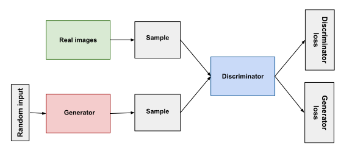

- [Introduction to 5 AI Generation Models](#introduction-to-5-ai-generation-models)
  - [1. Variational Autoencoders (VAE)](#1-variational-autoencoders-vae)
    - [How VAE Works:](#how-vae-works)
    - [Example Diagram:](#example-diagram)
    - [Python Code Example:](#python-code-example)
  - [2. Generative Adversarial Networks (GAN)](#2-generative-adversarial-networks-gan)
    - [How GAN Works:](#how-gan-works)
    - [Example Diagram:](#example-diagram-1)
    - [Python Code Example:](#python-code-example-1)
  - [3. Autoregressive Models (AR)](#3-autoregressive-models-ar)
    - [How AR Works:](#how-ar-works)
    - [Example Diagram (Transformer):](#example-diagram-transformer)
    - [Python Code Example (Using AR):](#python-code-example-using-ar)
  - [4. Flow Models](#4-flow-models)
    - [How Flow Models Work:](#how-flow-models-work)
    - [Example Diagram:](#example-diagram-2)
    - [Python Code Example:](#python-code-example-2)
  - [5. Diffusion Models](#5-diffusion-models)
    - [How Diffusion Models Work:](#how-diffusion-models-work)
    - [Example Diagram:](#example-diagram-3)
    - [Python Code Example:](#python-code-example-3)
  - [Conclusion](#conclusion)
    - [Key Takeaways:](#key-takeaways)

---

# Introduction to 5 AI Generation Models

In this article, we will explore some of the most common AI models used for generating data, images, or other types of content. These models use deep learning techniques and are called **generative models** because they create new data based on the patterns they have learned. We will cover the following models:

---

## 1. Variational Autoencoders (VAE)
<a name="1-variational-autoencoders-vae"></a>

**VAE** is a type of generative model that learns to compress data into a smaller format and then decompress it back to its original form. Unlike a normal autoencoder, VAE introduces randomness, allowing it to generate new data that looks like the original data but is slightly different.

### How VAE Works:
1. **Encoder**: Compresses the input data into a smaller "latent space."
2. **Decoder**: Reconstructs the data from the latent space.
3. **Variational**: Adds randomness (a probability distribution) to the latent space, allowing the model to generate new data.

### Example Diagram:


```
+-------------------+
|    Input Data     |
|        x          |
+-------------------+
         |
         v
+-------------------+
|    Encoder        |
| (Neural Network)  |
|                   |
|  Outputs:         |
|  - μ (Mean)       |
|  - log σ² (Log    |
|    Variance)      |
+-------------------+
         |
         v
+-------------------+
| Reparameterization|
| Trick:            |
| z = μ + σ * ε     |
| (ε ~ N(0, I))     |
+-------------------+
         |
         v
+-------------------+
|    Decoder        |
| (Neural Network)  |
|                   |
|  Outputs:         |
|  - Reconstructed  |
|    Data x'        |
+-------------------+
         |
         v
+-------------------+
|    Loss Function  |
|                   |
|  - Reconstruction |
|    Loss           |
|  - KL Divergence  |
+-------------------+
```

### Python Code Example:
```python
import tensorflow as tf
from tensorflow.keras import layers

# Encoder
input_img = tf.keras.Input(shape=(28, 28, 1))
x = layers.Flatten()(input_img)
x = layers.Dense(256, activation='relu')(x)
z_mean = layers.Dense(2)(x)
z_log_var = layers.Dense(2)(x)

# Sampling layer
def sampling(args):
    z_mean, z_log_var = args
    batch = tf.shape(z_mean)[0]
    dim = tf.shape(z_mean)[1]
    epsilon = tf.keras.backend.random_normal(shape=(batch, dim))
    return z_mean + tf.exp(0.5 * z_log_var) * epsilon

z = layers.Lambda(sampling)([z_mean, z_log_var])

# Decoder
decoder_input = layers.Input(shape=(2,))
x = layers.Dense(256, activation='relu')(decoder_input)
x = layers.Dense(28 * 28, activation='sigmoid')(x)
output_img = layers.Reshape((28, 28, 1))(x)

# Create VAE model
vae = tf.keras.Model(input_img, output_img)
```

---

## 2. Generative Adversarial Networks (GAN)
<a name="2-generative-adversarial-networks-gan"></a>

**GAN** is a generative model consisting of two parts: a **generator** and a **discriminator**. The generator tries to create fake data, and the discriminator tries to detect whether the data is real or fake. Over time, the generator gets better at fooling the discriminator.

### How GAN Works:
1. **Generator**: Creates fake data.
2. **Discriminator**: Tries to differentiate between real and fake data.
3. **Adversarial Training**: The two networks compete, helping the generator improve.

### Example Diagram:


```
+-------------------+
|   Random Noise    |
|        z          |
+-------------------+
         |
         v
+-------------------+
|    Generator      |
| (Neural Network)  |
|                   |
|  Outputs:         |
|  - Generated Data |
|    G(z)           |
+-------------------+
         |
         v
+-------------------+
|    Discriminator  |
| (Neural Network)  |
|                   |
|  Inputs:          |
|  - Real Data x    |
|  - Generated Data |
|    G(z)           |
|                   |
|  Outputs:         |
|  - Probability    |
|    Score (0 to 1) |
+-------------------+
         |
         v
+-------------------+
|    Loss Function  |
|                   |
|  - Generator Loss |
|  - Discriminator  |
|    Loss           |
+-------------------+
```

### Python Code Example:
```python
import tensorflow as tf
from tensorflow.keras import layers

# Generator
def build_generator():
    model = tf.keras.Sequential([
        layers.Dense(256, activation='relu', input_dim=100),
        layers.Dense(512, activation='relu'),
        layers.Dense(1024, activation='relu'),
        layers.Dense(28 * 28, activation='sigmoid'),
        layers.Reshape((28, 28, 1))
    ])
    return model

# Discriminator
def build_discriminator():
    model = tf.keras.Sequential([
        layers.Flatten(input_shape=(28, 28, 1)),
        layers.Dense(512, activation='relu'),
        layers.Dense(256, activation='relu'),
        layers.Dense(1, activation='sigmoid')
    ])
    return model

# Instantiate models
generator = build_generator()
discriminator = build_discriminator()

# Create GAN model
gan_input = tf.keras.Input(shape=(100,))
generated_img = generator(gan_input)
discriminator.trainable = False
validity = discriminator(generated_img)
gan = tf.keras.Model(gan_input, validity)
```

---

## 3. Autoregressive Models (AR)
<a name="3-autoregressive-models-ar"></a>

**Autoregressive Models** predict the next data point based on previous data points. For example, in language models like **Transformers**, the model predicts the next word in a sentence based on the words that came before it.

### How AR Works:
- It uses past information to predict future information.
- Often used in natural language processing (NLP) and time series data.

### Example Diagram (Transformer):


```
+-------------------+
|   Input Sequence  |
|        x          |
+-------------------+
         |
         v
+-------------------+
|   Positional      |
|   Encoding        |
+-------------------+
         |
         v
+-------------------+
|   Transformer     |
|   Encoder         |
|                   |
|  - Multi-Head     |
|    Attention      |
|  - Feed-Forward   |
|    Layers         |
+-------------------+
         |
         v
+-------------------+
|   Output Layer    |
|                   |
|  - Softmax        |
+-------------------+
         |
         v
+-------------------+
|   Predicted Token |
|        y          |
+-------------------+
```

### Python Code Example (Using AR):
```python
import tensorflow as tf

# Example of a simple autoregressive model for time series data
model = tf.keras.Sequential([
    layers.Input(shape=(10, 1)),
    layers.SimpleRNN(50, return_sequences=True),
    layers.Dense(1)
])

model.compile(optimizer='adam', loss='mean_squared_error')

# Dummy data
import numpy as np
X = np.random.rand(1000, 10, 1)
y = np.random.rand(1000, 10, 1)

# Train the AR model
model.fit(X, y, epochs=10)
```

---

## 4. Flow Models
<a name="4-flow-models"></a>

**Flow Models** are generative models that work by learning how to reverse a complex transformation back to a simple distribution, like a Gaussian distribution. They are designed to model complex data distributions.

### How Flow Models Work:
- They transform simple data distributions (e.g., Gaussian) into complex ones.
- They are invertible, meaning the process can be reversed easily.

### Example Diagram:


```
+-------------------+
|   Simple          |
|   Distribution    |
|        z          |
+-------------------+
         |
         v
+-------------------+
|   Flow Model      |
|                   |
|  - Coupling Layers|
|  - Invertible     |
|    Transformations|
+-------------------+
         |
         v
+-------------------+
|   Complex         |
|   Distribution    |
|        x          |
+-------------------+
```

### Python Code Example:
```python
import tensorflow as tf
import tensorflow_probability as tfp

# Simple Normalizing Flow example
tfd = tfp.distributions

base_dist = tfd.MultivariateNormalDiag(loc=[0., 0.])
flow = tfp.bijectors.RealNVP(num_masked=1)

# Transformed distribution
transformed_dist = tfd.TransformedDistribution(distribution=base_dist, bijector=flow)

# Sample from the flow model
samples = transformed_dist.sample(1000)
print(samples)
```

---

## 5. Diffusion Models
<a name="5-diffusion-models"></a>

**Diffusion Models** generate data by slowly adding random noise to a dataset and then learning to reverse the process. These models are great for creating realistic images from noise.

### How Diffusion Models Work:
1. Noise is added to the data step by step.
2. The model learns to reverse this process, removing the noise and recovering the original data.

### Example Diagram:


```
+-------------------+
|   Real Data       |
|        x          |
+-------------------+
         |
         v
+-------------------+
|   Forward         |
|   Diffusion       |
|   Process         |
|                   |
|  - Add Noise      |
|  - Gaussian Noise |
+-------------------+
         |
         v
+-------------------+
|   Noisy Data      |
|        x_t        |
+-------------------+
         |
         v
+-------------------+
|   Reverse         |
|   Diffusion       |
|   Process         |
|                   |
|  - Denoise        |
|  - Neural Network |
+-------------------+
         |
         v
+-------------------+
|   Generated Data  |
|        x_0        |
+-------------------+
```

### Python Code Example:
```python
import torch
import torch.nn as nn

class DiffusionModel(nn.Module):
    def __init__(self):
        super(DiffusionModel, self).__init__()
        self.fc = nn.Linear(28*28, 28*28)
    
    def forward(self, x):
        noise = torch.randn_like(x)
        return x + noise

# Dummy diffusion process
model = DiffusionModel()

# Example data (images flattened)
X = torch.randn(64, 28*28)

# Adding noise through the model
noisy_X = model(X)
print(noisy_X)
```

---

## Conclusion
<a name="conclusion"></a>

Each of these models serves a different purpose in the field of AI. **VAE** and **GAN** are great for image generation, while **AR** models excel in sequential data like language or time series. **Flow** and **Diffusion** models are newer but powerful tools for generating complex, realistic data. Learning about these models can help you understand how machines can create art, music, text, and more!

### Key Takeaways:
- **VAE**: Generates new data by introducing randomness in the latent space.
- **GAN**: Uses adversarial training to improve the quality of generated data.
- **AR**: Predicts future data points based on past information.
- **Flow Models**: Transform simple distributions into complex ones using invertible transformations.
- **Diffusion Models**: Generate data by reversing a diffusion process that adds noise.

By mastering these techniques, you can build robust and creative AI systems that generate high-quality content.