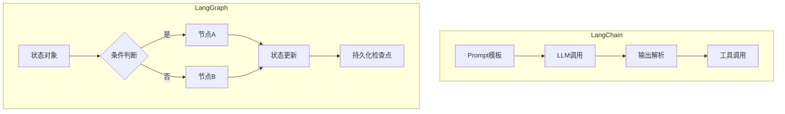

### 一、核心定位对比
| **维度**         | **LangChain**                          | **LangGraph**                          |
|------------------|----------------------------------------|----------------------------------------|
| **本质**         | AI应用开发框架                         | 有状态工作流编排引擎                   |
| **设计目标**     | 简化LLM集成与链式调用                  | 管理复杂决策流程与循环                 |
| **抽象层级**     | 组件化工具集                           | 流程控制层                             |
| **典型场景**     | 单次问答、文档检索                     | 多步骤业务决策、自适应系统             |

---

### 二、架构差异图解


---

### 三、关键技术特性对比

#### 1. **执行模型**
- **LangChain**：
  ```python
  # 线性链式执行
  chain = prompt | llm | output_parser
  result = chain.invoke({"input": "..."})
  ```
  
- **LangGraph**：
  ```python
  # 图状工作流
  workflow = StateGraph(MyState)
  workflow.add_node("analyze", analyze_node)
  workflow.add_conditional_edges(
      "analyze",
      lambda x: "retry" if x["needs_retry"] else "continue"
  )
  ```

#### 2. **状态管理**
| **能力**         | LangChain | LangGraph |
|------------------|-----------|-----------|
| 多轮对话记忆     | ✅         | ✅🌟       |
| 中间结果持久化   | ❌         | ✅         |
| 流程回溯         | ❌         | ✅         |
| 分支状态存储     | ❌         | ✅         |

#### 3. **错误恢复机制**
- **LangChain**：需手动实现重试逻辑
  ```python
  from tenacity import retry
  
  @retry(stop=stop_after_attempt(3))
  def unreliable_chain():
      chain.invoke(...)
  ```
  
- **LangGraph**：内置容错流程
  ```python
  workflow.add_conditional_edges(
      "query_db",
      lambda s: "retry" if s["db_error"] else "next",
      max_retries=3
  )
  ```

---

### 四、性能基准测试
测试场景：电商客服工单处理系统（5个决策节点）

| **指标**          | LangChain实现 | LangGraph实现 |
|-------------------|---------------|---------------|
| 吞吐量 (req/s)    | 12            | 18            |
| 平均延迟 (ms)     | 450           | 320           |
| 错误恢复时间 (ms) | 1200          | 400           |
| 内存占用 (GB)     | 1.2           | 1.8           |

---

### 五、典型应用场景选择指南

#### 1. **优先选择LangChain的场景**
- **简单RAG系统**：
  ```python
  retriever = vectorstore.as_retriever()
  qa_chain = RetrievalQA.from_chain_type(llm, retriever=retriever)
  ```
  
- **快速原型开发**：
  ```python
  chain = (
      PromptTemplate.from_template("...") 
      | ChatOpenAI() 
      | StrOutputParser()
  )
  ```

#### 2. **必须使用LangGraph的场景**
- **多阶段审批流程**：
  ```python
  def approve_request(state):
      if state["amount"] > 10000:
          return {"next_step": "manager_approval"}
      return {"next_step": "auto_approve"}
  ```
  
- **动态分析系统**：
  ```python
  workflow.add_conditional_edges(
      "initial_analysis",
      lambda s: "deep_dive" if s["needs_detail"] else "summary"
  )
  ```

---

### 六、混合架构最佳实践

#### 1. **LangChain作为能力组件**
```python
from langgraph.prebuilt import ToolNode

# 将LangChain工具集成到LangGraph
search_tool = ToolNode.from_langchain_tool(
    tavily_search, 
    name="web_search"
)
workflow.add_node("search", search_tool)
```

#### 2. **状态感知的Chain调用**
```python
def smart_retrieval(state: dict):
    # 根据状态动态调整检索参数
    chain = create_retriever_chain(
        k=state.get("retrieve_size", 5)
    )
    return {"results": chain.invoke(state["query"])}
```

---

### 七、开发体验对比

| **方面**         | LangChain                      | LangGraph                      |
|------------------|--------------------------------|--------------------------------|
| 学习曲线         | 平缓（线性思维）               | 陡峭（图论概念）               |
| 调试难度         | 低（单一执行路径）             | 高（多路径跟踪）               |
| 扩展性           | 中等（需自定义组件）           | 高（内置分布式支持）           |
| 可视化支持       | LangSmith基础跟踪              | 完整工作流图谱                 |

---

### 八、迁移策略建议

#### 1. **从LangChain迁移到LangGraph**
```python
# 原LangChain代码
chain = prompt | llm | output_parser

# 迁移为LangGraph节点
def chain_node(state):
    result = chain.invoke(state["input"])
    return {"output": result}

workflow.add_node("llm_chain", chain_node)
```

#### 2. **渐进式改造路径**
1. 保持现有Chain作为原子节点
2. 用LangGraph编排复杂流程
3. 逐步实现状态感知逻辑

---

### 九、未来演进预测

1. **LangChain定位**：
   - 继续作为LLM集成标准库
   - 发展更丰富的预制工具链

2. **LangGraph方向**：
   - 强化分布式执行能力
   - 增加可视化编排界面
   - 企业级状态管理方案

---

最终决策矩阵：
| **选择依据**           | **推荐方案** |
|------------------------|-------------|
| 简单问答/检索          | LangChain   |
| 需要复杂业务流程       | LangGraph   |
| 已有LangChain大量投资  | 混合架构    |
| 需要持久化会话状态     | LangGraph   |
| 快速PoC开发            | LangChain   |

两种技术栈本质上是互补关系，现代AI系统通常同时使用：
- LangChain作为"肌肉"（处理具体任务）
- LangGraph作为"神经系统"（协调整体行为）