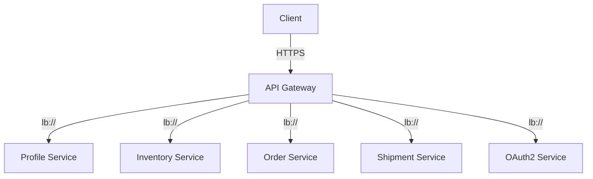
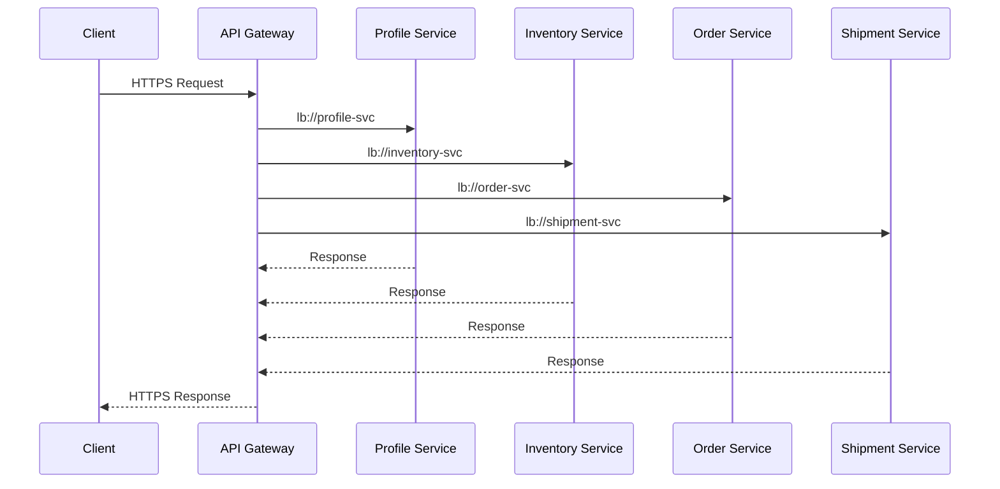
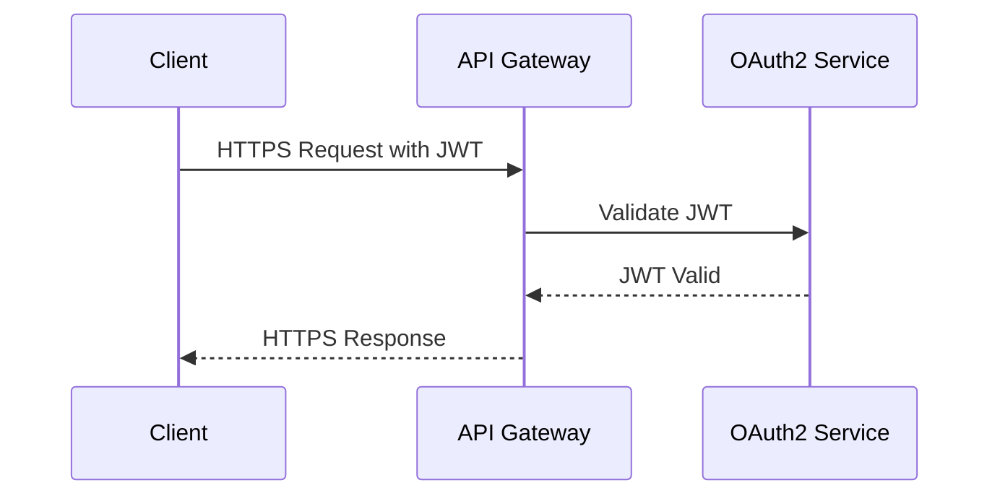

1. [Introduction](#introduction)
2. [Why We Need API Gateway](#why-we-need-api-gateway)
3. [Build API Gateway](#build-api-gateway)
3. [Setting Up API Gateway](#setting-up-api-gateway)
4. [Route Configuration](#route-configuration)
5. [Security and JWT Authentication](#security-and-jwt-authentication)
6. [Dockerfile Configuration](#dockerfile-configuration)
7. [Helm Chart Configuration](#helm-chart-configuration)
8. [Project Structure](#project-structure)
9. [API Gateway Architecture](#api-gateway-architecture)
10. [Sequence Diagrams](#sequence-diagrams)
11. [HTTPS Configuration for API Gateway](#https-configuration-for-api-gateway)
12. [Difference Between `lb://` and `http://` Protocols](#difference-between-lb-and-http-protocols)
13. [Conclusion](#conclusion)

<a name="introduction"></a>
## Introduction

In a microservices architecture, an API Gateway acts as a single entry point for client requests, routing them to the appropriate microservices within the Kubernetes cluster. This article will delve into the setup and configuration of a Spring Cloud API Gateway, focusing on JWT authentication validation, route management, and deployment using Docker and Helm.

---

<a name="why-we-need-api-gateway"></a>
## Why We Need API Gateway

### Single Entry Point
An API Gateway provides a single entry point for all client requests, simplifying client-side code and reducing the number of endpoints clients need to interact with.

### Routing and Load Balancing
The gateway routes requests to the appropriate microservices and handles load balancing across multiple instances of each service.

### Security
It centralizes security concerns such as authentication and authorization, reducing the need for each microservice to implement these features independently.

### Protocol Translation
The gateway can handle protocol translation, allowing clients to use a single protocol (e.g., HTTP/2) while communicating with microservices using different protocols.

---

<a name="build-api-gateway"></a>
## Build API Gateway

**Is there an official API Gateway image?**
- Currently, **Spring Cloud Gateway** does not offer an official pre-built Docker image, developers build a Spring Boot application with `spring-cloud-starter-gateway` and custom configurations (routes, JWT filter, etc.). 

- As gateway services are often customized for specific routing, load balancing, security and potentially other cross-cutting concerns and needs. It acts as the main entry point for all external requests to your microservices. The gateway can either pull routing configurations from a service discovery mechanism(like Spring Cloud Kubernetes Discovery) or have the configurations set explicitly.

**Steps to Build a Production-Ready API Gateway**
1. **Route Configuration**: Define routing rules either in `application.yml` or using Java annotations.
2. **Security Setup**: Add JWT validation (e.g., `JwtAuthenticationFilter`) and configure security policies in the gateway.
3. **Service Discovery**: Use Spring Cloud Kubernetes for service discovery, allowing the gateway to dynamically discover services.
4. **Containerization and Deployment**: Build a Docker image and deploy it to Kubernetes with a Helm chart for scalability and configuration management.

<a name="setting-up-api-gateway"></a>
## Setting Up API Gateway

### Step 1: Add Dependencies
Add the necessary dependencies to your `pom.xml` file.

```xml
<dependencies>
    <!-- Spring Boot Starter -->
    <dependency>
        <groupId>org.springframework.boot</groupId>
        <artifactId>spring-boot-starter</artifactId>
    </dependency>

    <!-- Spring Cloud Gateway -->
    <dependency>
        <groupId>org.springframework.cloud</groupId>
        <artifactId>spring-cloud-starter-gateway</artifactId>
    </dependency>

    <!-- Spring Security -->
    <dependency>
        <groupId>org.springframework.boot</groupId>
        <artifactId>spring-boot-starter-security</artifactId>
    </dependency>

    <!-- JWT -->
    <dependency>
        <groupId>io.jsonwebtoken</groupId>
        <artifactId>jjwt</artifactId>
        <version>0.9.1</version>
    </dependency>
</dependencies>
```

### Step 2: Create the Main Application Class
Create the main application class for the Spring Cloud Gateway.

```java
import org.springframework.boot.SpringApplication;
import org.springframework.boot.autoconfigure.SpringBootApplication;

@SpringBootApplication
public class ApiGatewayApplication {
    public static void main(String[] args) {
        SpringApplication.run(ApiGatewayApplication.class, args);
    }
}
```
---

<a name="service-discovery-and-routing-configuration"></a>
## Service Discovery and Routing Configuration

### YAML-based Configuration
Configure routes in the `application.yml` file.

```yaml
spring:
  cloud:
    gateway:
      discovery:
        locator:
          enabled: true
          lower-case-service-id: true  # Ensures lowercase naming for services
      routes:
        - id: profile_service
          uri: lb://profile-svc
          predicates:
            - Path=/profile/**
        - id: inventory_service
          uri: lb://inventory-svc
          predicates:
            - Path=/inventory/**
        - id: order_service
          uri: lb://order-svc
          predicates:
            - Path=/order/**
        - id: shipment_service
          uri: lb://shipment-svc
          predicates:
            - Path=/shipment/**

      kubernetes:
        discovery:
          all-namespaces: true  # Discover services across all namespaces
          service-labels:       # Optional: filter based on labels
            environment: production
```

- **lb://** */ scheme: Enables load balancing across multiple instances of each microservice.
- **Service Discovery**: The gateway will detect microservices like `inventory-service` or `shipment-service` using Kubernetes service discovery, eliminating the need for hardcoding service addresses.

### Annotation-based Configuration
Alternatively, configure routes programmatically using annotations.

```java
import org.springframework.cloud.gateway.route.RouteLocator;
import org.springframework.cloud.gateway.route.builder.RouteLocatorBuilder;
import org.springframework.context.annotation.Bean;
import org.springframework.context.annotation.Configuration;

@Configuration
public class GatewayRoutesConfig {

    @Bean
    public RouteLocator gatewayRoutes(RouteLocatorBuilder builder) {
        return builder.routes()
            .route("profile_service_route", r -> r.path("/profile/**")
                .uri("lb://profile-svc"))
            .route("inventory_service_route", r -> r.path("/inventory/**")
                .uri("lb://inventory-svc"))
            .route("order_service_route", r -> r.path("/order/**")
                .uri("lb://order-svc"))
            .route("shipment_service_route", r -> r.path("/shipment/**")
                .uri("lb://shipment-svc"))
            .build();
    }
}
```

>**Enable Service Discovery**
To enable service discovery, you can use the `@EnableDiscoveryClient` annotation. This annotation is typically placed in a configuration class.

```java
import org.springframework.cloud.client.discovery.EnableDiscoveryClient;
import org.springframework.context.annotation.Configuration;

@Configuration
@EnableDiscoveryClient
public class DiscoveryConfig {
    // Additional configuration for service discovery can be added here if needed
}
```
### `application.yml` Configuration for Service Discovery

Ensure that the following configuration is present in your `application.yml` or `application.properties` file to enable service discovery and other settings:

```yaml
spring:
  cloud:
    gateway:
      discovery:
        locator:
          enabled: true
          lower-case-service-id: true
    kubernetes:
      discovery:
        all-namespaces: true
        service-labels:
          environment: production
```

### Summary

- **Annotation-based Configuration**: The `GatewayRoutesConfig` class defines the routes using the `RouteLocatorBuilder`.
- **Service Discovery**: The `DiscoveryConfig` class enables service discovery using the `@EnableDiscoveryClient` annotation.
- **YAML Configuration**: The `application.yml` file contains the necessary settings for service discovery and gateway configuration.
 
>**Note**: The discovery settings, such as enabling discovery locator and configuring Kubernetes discovery, cannot be directly configured using annotations in the configuration class. These settings are typically configured in the `application.yml` or `application.properties` file.

---

<a name="security-and-jwt-authentication"></a>
## Security and JWT Authentication

>**Add Dependencies** Include `spring-boot-starter-oauth2-resource-server` and `spring-cloud-starter-gateway` in your `pom.xml`:
```xml
<dependencies>
    <dependency>
        <groupId>org.springframework.boot</groupId>
        <artifactId>spring-boot-starter-oauth2-resource-server</artifactId>
    </dependency>
    <dependency>
        <groupId>org.springframework.cloud</groupId>
        <artifactId>spring-cloud-starter-gateway</artifactId>
    </dependency>
</dependencies>
```

>**Gateway Application Properties Configuration**: Configure `application.yml` for JWT validation. This includes specifying the JWT issuer URI and enabling authorization.

   ```yaml
   spring:
     cloud:
       gateway:
         discovery:
           locator:
             enabled: true
         routes:
           - id: inventory-service
             uri: lb://inventory-service
             predicates:
               - Path=/inventory/**
             filters:
               - TokenRelay  # Forward the token to the downstream services
     security:
       oauth2:
         resourceserver:
           jwt:
             issuer-uri: https://<your-auth-provider>/realms/your-realm
   ```

   - **TokenRelay Filter**: Passes the JWT token along with requests to the backend services.
   - **Issuer URI**: This points to your authentication provider, e.g., an OpenID Connect provider like Keycloak or Auth0.

>**Enable JWT Authentication**: Set up `SecurityConfig` to enable JWT authentication and configure routes for authorized access.

   ```java
   @Configuration
   @EnableWebFluxSecurity
   public class SecurityConfig {

       @Bean
       public SecurityWebFilterChain securityWebFilterChain(ServerHttpSecurity http) {
           http
               .authorizeExchange()
               .pathMatchers("/inventory/**", "/shipment/**").authenticated()  // Require auth for specified paths
               .anyExchange().permitAll()
               .and()
               .oauth2ResourceServer()
               .jwt();  // Enable JWT authentication

           return http.build();
       }
   }
   ```

   - This configuration restricts access to `/inventory/**` and `/shipment/**` endpoints to authenticated users, while allowing others as specified.

>**Annotation-based Configuration for Routes and Filters**

```java
import org.springframework.cloud.gateway.route.RouteLocator;
import org.springframework.cloud.gateway.route.builder.RouteLocatorBuilder;
import org.springframework.context.annotation.Bean;
import org.springframework.context.annotation.Configuration;
import org.springframework.security.config.web.server.ServerHttpSecurity;
import org.springframework.security.web.server.SecurityWebFilterChain;

@Configuration
public class GatewayRoutesConfig {

    @Bean
    public RouteLocator gatewayRoutes(RouteLocatorBuilder builder) {
        return builder.routes()
            .route("inventory-service", r -> r.path("/inventory/**")
                .filters(f -> f.filter(new JwtAuthenticationFilter("ROLE_USER,ROLE_ADMIN")))
                .uri("lb://inventory-service"))
            .build();
    }

    @Bean
    public SecurityWebFilterChain springSecurityFilterChain(ServerHttpSecurity http) {
        http
            .authorizeExchange()
            .anyExchange().authenticated()
            .and()
            .oauth2ResourceServer()
            .jwt()
            .jwkSetUri("https://example-issuer.com/.well-known/jwks.json")
            .and()
            .and()
            .csrf().disable();
        return http.build();
    }
}

>**Note**: **Annotation-based Configuration**: The `GatewayRoutesConfig` class defines the routes and filters using the `RouteLocatorBuilder`. It also configures security settings using Spring Security annotations.
```

### JWT Authentication Filter
Create a JWT authentication filter to verify incoming requests.

```java
import org.springframework.security.authentication.AuthenticationManager;
import org.springframework.security.web.server.authentication.AuthenticationWebFilter;
import org.springframework.security.oauth2.jwt.JwtDecoder;
import org.springframework.security.oauth2.jwt.ReactiveJwtDecoder;

@Configuration
public class SecurityConfig {

    @Autowired
    private JwtDecoder jwtDecoder;

    @Bean
    public SecurityWebFilterChain springSecurityFilterChain(ServerHttpSecurity http) {
        AuthenticationWebFilter jwtAuthFilter = new AuthenticationWebFilter(authenticationManager());
        http
            .authorizeExchange()
            .pathMatchers("/oauth2/**").permitAll()
            .pathMatchers("/inventory/**", "/shipment/**").authenticated().permitAll()
            .anyExchange().authenticated()
            .and().addFilterAt(jwtAuthFilter, SecurityWebFiltersOrder.AUTHENTICATION);

        return http.build();
    }

    @Bean
    public AuthenticationManager authenticationManager() {
        return new JwtAuthenticationManager(jwtDecoder);
    }
}
```

### JWT Decoder Configuration
Configure the JWT decoder to validate tokens.

```java
import org.springframework.context.annotation.Bean;
import org.springframework.context.annotation.Configuration;
import org.springframework.security.oauth2.jwt.JwtDecoder;
import org.springframework.security.oauth2.jwt.NimbusJwtDecoder;

@Configuration
public class JwtConfig {

    @Bean
    public JwtDecoder jwtDecoder() {
        return NimbusJwtDecoder.withPublicKey(publicKey).build();
    }
}
```

<a name="service-to-service-communication-via-gateway"></a>
## Service-to-Service Communication via Gateway

To communicate between services, such as **shipment-service** needing to communicate with **inventory-service**, microservices can send requests through the **API Gateway**. 

This method simplifies routing, as services only need to know the **gateway address** and the **service paths** (e.g., `/inventory/**`). This approach enhances security and centralizes cross-cutting concerns like authentication, logging, and rate limiting.

#### Benefits of Gateway-based Communication
1. **Centralized Security**: JWT and other auth mechanisms can be handled at the gateway.
2. **Simplified Routing**: Each service interacts with others via a single entry point.
3. **Enhanced Scalability**: Kubernetes manages load balancing for each service, and the gateway balances requests across pods.

---

### Service Discovery and Routing Workflow

```plaintext
[External Client] --> [API Gateway]
                          |
                          | (Discovers routes from Kubernetes Discovery)
                          |
                   [inventory-service] <--+-- "lb://inventory-service"
                   [shipment-service]   <--+-- "lb://shipment-service"
                   [other-service]      <--+-- Discovered automatically
```

>Sequence Diagram: Inventory and Shipment Communication via Gateway

1. **Shipment Service** sends a request to **API Gateway** at `/inventory/items`.
2. **API Gateway** validates the JWT token, looks up **inventory-service** route, and forwards the request.
3. **Inventory Service** responds with the requested data.
4. **API Gateway** relays the response to **Shipment Service**.

```plaintext
Shipment Service --> API Gateway: Request /inventory/items with JWT
API Gateway --> inventory-service: Validate JWT and route to inventory
inventory-service --> API Gateway: Return data
API Gateway --> Shipment Service: Relay data response
```

---

>**Example**: Sending an Authenticated Request to Another Microservice via the Gateway

In **shipment-service**, use Spring's **WebClient** to call the **inventory-service** through the API Gateway.

1. **Define WebClient Bean** for Consistency Across Calls

   ```java
   @Bean
   public WebClient.Builder webClientBuilder() {
       return WebClient.builder();
   }
   ```

2. **Send Authenticated Request through Gateway**

   ```java
   @Autowired
   private WebClient.Builder webClientBuilder;

   public InventoryResponse fetchInventoryItems(String token) {
       return webClientBuilder
           .build()
           .get()
           .uri("http://api-gateway/inventory/items")
           .header(HttpHeaders.AUTHORIZATION, "Bearer " + token)
           .retrieve()
           .bodyToMono(InventoryResponse.class)
           .block();
   }
   ```

   - **Token Forwarding**: The token is forwarded with the request, allowing the gateway to validate it before routing to the target service.
   - **Gateway URI**: Requests go through `http://api-gateway/inventory/items`, routing based on service discovery.

>In this example:
- The **gateway is deployed separately** in Kubernetes and handles dynamic service discovery and routing via `lb://` URIs.
- Service-to-service calls leverage the **API Gateway** for ease of scaling, simplified routing, and centralized security. Each service only needs to know the **API Gateway’s address and service paths**.
---

### Comparison: Gateway vs. Direct Service-to-Service Calls

| Aspect                | API Gateway Routing                     | Direct Service-to-Service Calls               |
|-----------------------|-----------------------------------------|-----------------------------------------------|
| **Routing**           | Centralized, via API Gateway           | Direct, each service must know other services |
| **JWT Validation**    | Centralized in Gateway                 | Each service needs to validate tokens         |
| **Scaling**           | Gateway handles scaling and balancing  | Each service scales independently             |
| **Security**          | JWT validated once at the gateway      | JWT validation needed in each service         |
| **Use Case**          | Best for external and internal calls   | Ideal for internal-only, tightly integrated   |


---

<a name="dockerfile-configuration"></a>
## Dockerfile Configuration

Create a `Dockerfile` for building the API Gateway image.

```Dockerfile
# Start with the base image for Java
FROM openjdk:17-jdk-slim

# Set working directory
WORKDIR /app

# Copy the API Gateway JAR to the image
COPY target/api-gateway.jar api-gateway.jar

# Expose port 8443 for the API Gateway
EXPOSE 8443

# Run the API Gateway application
ENTRYPOINT ["java", "-jar", "api-gateway.jar"]
```

### Build and Push the Docker Image

```bash
docker build -t myregistry/api-gateway:latest .
docker push myregistry/api-gateway:latest
```

---

<a name="helm-chart-configuration"></a>
## Helm Chart Configuration

### Helm Chart Structure

```plaintext
api-gateway/
├── Chart.yaml
├── values.yaml
└── templates/
    ├── deployment.yaml
    ├── service.yaml
    └── ingress.yaml
```

### Chart.yaml

```yaml
apiVersion: v2
name: api-gateway
version: 0.1.0
description: API Gateway for Microservices
```

### values.yaml

```yaml
image:
  repository: myregistry/api-gateway
  tag: latest
  pullPolicy: IfNotPresent

replicaCount: 2

service:
  type: ClusterIP
  port: 8443

ingress:
  enabled: true
  annotations:
    nginx.ingress.kubernetes.io/ssl-redirect: "true"
  hosts:
    - host: api.example.com
      paths:
        - path: /
          pathType: Prefix
  tls:
    - secretName: api-gateway-tls
      hosts:
        - api.example.com
```

### templates/deployment.yaml

```yaml
apiVersion: apps/v1
kind: Deployment
metadata:
  name: api-gateway
spec:
  replicas: {{ .Values.replicaCount }}
  selector:
    matchLabels:
      app: api-gateway
  template:
    metadata:
      labels:
        app: api-gateway
    spec:
      containers:
      - name: api-gateway
        image: "{{ .Values.image.repository }}:{{ .Values.image.tag }}"
        ports:
        - containerPort: 8443
```

### templates/service.yaml

```yaml
apiVersion: v1
kind: Service
metadata:
  name: api-gateway
spec:
  type: {{ .Values.service.type }}
  ports:
  - port: {{ .Values.service.port }}
    targetPort: 8443
  selector:
    app: api-gateway
```

### templates/ingress.yaml

```yaml
apiVersion: networking.k8s.io/v1
kind: Ingress
metadata:
  name: api-gateway-ingress
  annotations:
    nginx.ingress.kubernetes.io/ssl-redirect: "true"
spec:
  tls:
  - hosts:
    - api.example.com
    secretName: api-gateway-tls
  rules:
  - host: api.example.com
    http:
      paths:
      - path: /
        pathType: Prefix
        backend:
          service:
            name: api-gateway
            port:
              number: 8443
```

---

<a name="project-structure"></a>
## Project Structure

```plaintext
api-gateway/
├── src/
│   ├── main/
│   │   ├── java/
│   │   │   └── com/
│   │   │       └── example/
│   │   │           └── apigateway/
│   │   │               ├── ApiGatewayApplication.java
│   │   │               ├── config/
│   │   │               │   ├── GatewayRoutesConfig.java
│   │   │               │   ├── SecurityConfig.java
│   │   │               │   └── JwtConfig.java
│   │   └── resources/
│   │       └── application.yml
├── Dockerfile
├── pom.xml
└── helm/
    └── api-gateway/
        ├── Chart.yaml
        ├── values.yaml
        └── templates/
            ├── deployment.yaml
            ├── service.yaml
            └── ingress.yaml
```

---

<a name="api-gateway-architecture"></a>
## API Gateway Architecture



### Explanation

1. **Client**: Sends requests to the API Gateway over HTTPS.
2. **API Gateway**: Routes requests to the appropriate microservice using `lb://` protocol.
3. **Microservices**: Each service handles requests and returns responses to the API Gateway.

---

<a name="sequence-diagrams"></a>
## Sequence Diagrams

### Sequence Diagram for Client Request



### Sequence Diagram for JWT Authentication



---

<a name="https-configuration-for-api-gateway"></a>
## HTTPS Configuration for API Gateway

### Step 1: Generate SSL Certificate

Generate a self-signed SSL certificate or obtain one from a Certificate Authority (CA).

```bash
# Generate a self-signed certificate (for testing purposes)
keytool -genkeypair -alias api-gateway -keyalg RSA -keysize 2048 -storetype PKCS12 -keystore api-gateway-keystore.p12 -validity 365
```

### Step 2: Configure HTTPS in `application.yml`

Add the keystore settings to `application.yml`.

```yaml
server:
  port: 8443
  ssl:
    enabled: true
    key-store: classpath:api-gateway-keystore.p12
    key-store-password: your_password_here
    key-store-type: PKCS12
```

### Step 3: Update Routes to Use `lb://`

Ensure that the routes use `lb://` to leverage service discovery and load balancing.

```yaml
spring:
  cloud:
    gateway:
      routes:
        - id: profile_service
          uri: lb://profile-svc
          predicates:
            - Path=/profile/**
        - id: inventory_service
          uri: lb://inventory-svc
          predicates:
            - Path=/inventory/**
        - id: order_service
          uri: lb://order-svc
          predicates:
            - Path=/order/**
        - id: shipment_service
          uri: lb://shipment-svc
          predicates:
            - Path=/shipment/**
```

### Step 4: Update Kubernetes Ingress for HTTPS

Configure the Kubernetes Ingress to redirect traffic to the API Gateway’s HTTPS endpoint.

```yaml
apiVersion: networking.k8s.io/v1
kind: Ingress
metadata:
  name: api-gateway-ingress
  annotations:
    nginx.ingress.kubernetes.io/ssl-redirect: "true"
spec:
  tls:
  - hosts:
    - api.example.com
    secretName: api-gateway-tls
  rules:
  - host: api.example.com
    http:
      paths:
      - path: /
        pathType: Prefix
        backend:
          service:
            name: api-gateway
            port:
              number: 8443
```

---

<a name="difference-between-lb-and-http-protocols"></a>
## Difference Between `lb://` and `http://` Protocols

### `lb://` Protocol

- **Service Discovery**: Uses Kubernetes service discovery to find the appropriate service instance.
- **Load Balancing**: Automatically load balances requests across multiple instances of the service.
- **Dynamic Routing**: Routes can be dynamically updated based on service availability.

Example:

```yaml
spring:
  cloud:
    gateway:
      routes:
        - id: profile_service
          uri: lb://profile-svc
          predicates:
            - Path=/profile/**
```

### `http://` Protocol

- **Direct Routing**: Routes requests directly to a specific URL.
- **No Load Balancing**: Does not provide load balancing or service discovery.
- **Static Routing**: Routes are static and do not change based on service availability.

Example:

```yaml
spring:
  cloud:
    gateway:
      routes:
        - id: profile_service
          uri: http://profile-svc:8080
          predicates:
            - Path=/profile/**
```

### When to Use Each Protocol

- **Use `lb://`** for routes within Kubernetes service discovery, allowing the gateway to leverage load balancing.
- **Use `http://`** for direct routes to a specific URL or when no service discovery is available.


<a name="the-other-option"></a>
# The other option

Here’s a step-by-step setup for building the API Gateway with JWT authentication and routing configurations:

### Step 1: Configure API Gateway with JWT Authentication and Routing

```yaml
# application.yml
spring:
  cloud:
    gateway:
      routes:
        - id: inventory-service
          uri: lb://inventory-service
          predicates:
            - Path=/inventory/**
          filters:
            - name: JwtAuthenticationFilter
              args:
                roles: "ROLE_USER,ROLE_ADMIN"  # Add roles if role-based access is needed
      discovery:
        locator:
          enabled: true  # Enables dynamic route lookup from discovery service
      default-filters:
        - StripPrefix=1  # Adjusts the path for downstream services

  security:
    oauth2:
      resourceserver:
        jwt:
          issuer-uri: https://example-issuer.com  # Point to the JWT issuer
          jwk-set-uri: https://example-issuer.com/.well-known/jwks.json  # Set up for validation
```

### Step 2: Implement JWT Authentication Filter for Gateway

The custom JWT filter ensures each request includes a valid JWT token.

```java
// JwtAuthenticationFilter.java
@Component
public class JwtAuthenticationFilter implements GatewayFilter {

    private final JwtDecoder jwtDecoder;

    public JwtAuthenticationFilter(JwtDecoder jwtDecoder) {
        this.jwtDecoder = jwtDecoder;
    }

    @Override
    public Mono<Void> filter(ServerWebExchange exchange, GatewayFilterChain chain) {
        String authHeader = exchange.getRequest().getHeaders().getFirst(HttpHeaders.AUTHORIZATION);
        if (authHeader != null && authHeader.startsWith("Bearer ")) {
            String token = authHeader.substring(7);
            try {
                Jwt jwt = jwtDecoder.decode(token);  // Validates the JWT
                return chain.filter(exchange);       // If valid, proceed with the request
            } catch (JwtException e) {
                exchange.getResponse().setStatusCode(HttpStatus.UNAUTHORIZED);
                return exchange.getResponse().setComplete();
            }
        }
        exchange.getResponse().setStatusCode(HttpStatus.UNAUTHORIZED);
        return exchange.getResponse().setComplete();
    }
}
```

Add the filter in `application.yml` for it to be applied to specific routes (like `inventory-service` in this case).

### Step 3: Building and Deploying the API Gateway as a Docker Image

1. **Dockerfile** for the API Gateway:

   ```dockerfile
   # Dockerfile for api-gateway
   FROM openjdk:17-jdk-slim
   ARG JAR_FILE=target/api-gateway.jar
   COPY ${JAR_FILE} api-gateway.jar
   ENTRYPOINT ["java", "-jar", "/api-gateway.jar"]
   ```

2. **Build the Docker Image**:

   ```bash
   docker build -t myregistry/api-gateway:latest .
   docker push myregistry/api-gateway:latest  # Push to your registry
   ```

3. **Kubernetes Deployment Configuration**:

   ```yaml
   # api-gateway-deployment.yaml
   apiVersion: apps/v1
   kind: Deployment
   metadata:
     name: api-gateway
     labels:
       app: api-gateway
   spec:
     replicas: 2
     selector:
       matchLabels:
         app: api-gateway
     template:
       metadata:
         labels:
           app: api-gateway
       spec:
         containers:
           - name: api-gateway
             image: myregistry/api-gateway:latest
             ports:
               - containerPort: 8080
             env:
               - name: SPRING_PROFILES_ACTIVE
                 value: k8s
   ```

### Step 4: Service-to-Service Communication via Gateway

Now, other services can call the gateway (using `api-gateway` service DNS) and append the target service’s route (`/inventory/*`) to the request path.

#### Sample Code for a Downstream Service Request Using WebClient with JWT

```java
// ShipmentService.java
@Service
public class ShipmentService {

    private final WebClient webClient;

    public ShipmentService(WebClient.Builder webClientBuilder) {
        this.webClient = webClientBuilder
                .baseUrl("http://api-gateway")  // Gateway URL in Kubernetes DNS
                .defaultHeader(HttpHeaders.AUTHORIZATION, "Bearer " + jwtToken)
                .build();
    }

    public Inventory getInventory(String id) {
        return webClient.get()
                .uri("/inventory/" + id)
                .retrieve()
                .bodyToMono(Inventory.class)
                .block();
    }
}
```

### Comparison: Gateway vs. Interceptor-Based JWT Validation

| Aspect                         | Gateway with JWT Filter                        | Service-Level JWT Interceptors                     |
|--------------------------------|------------------------------------------------|----------------------------------------------------|
| **Centralized Control**        | All JWT validation centralized at gateway      | Each service has independent JWT validation        |
| **Configuration Complexity**   | Easier for microservices, managed in gateway   | More complex across multiple services              |
| **Performance Overhead**       | Can cause bottleneck at gateway if overloaded  | Distributed load, but duplicate processing         |
| **Resilience**                 | Single point of failure without redundancy     | More resilient, distributed across services        |
| **Authorization Flexibility**  | Offers consistent authentication policy        | Each service can implement role-based restrictions |


