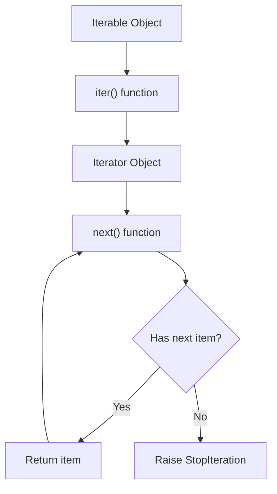
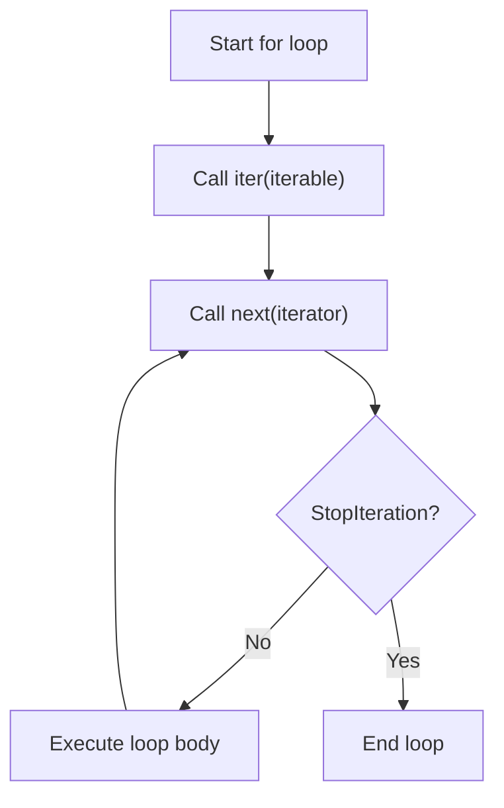
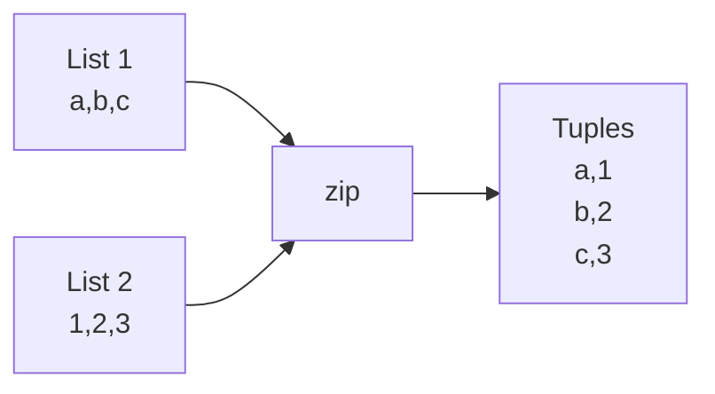
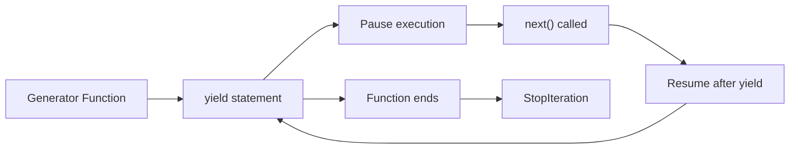
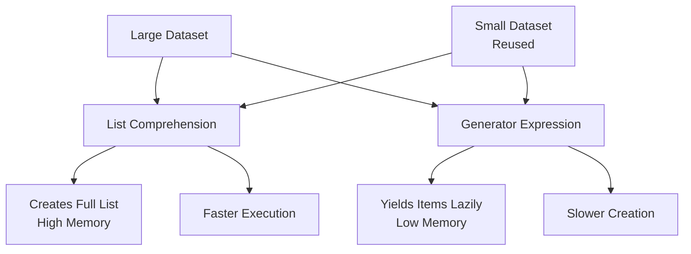
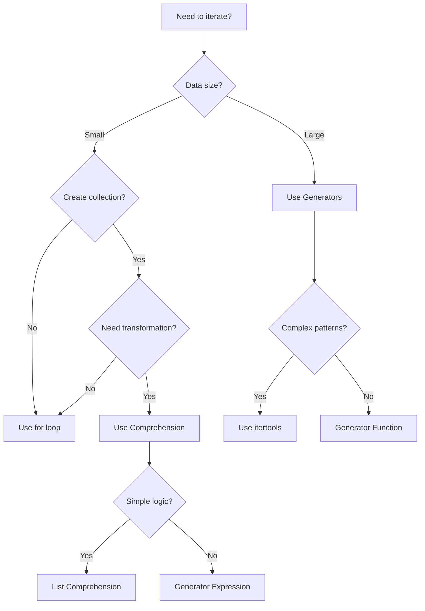

## 🎯 Table of Contents
1. [Fundamental Concepts](#fundamental-concepts)
2. [Basic Loops](#basic-loops)
3. [Iterator Protocol](#iterator-protocol)
4. [Generator Functions & Expressions](#generator-functions--expressions)
5. [Built-in Iterators & Tools](#built-in-iterators--tools)
6. [Async Iteration](#async-iteration)
7. [Performance & Best Practices](#performance--best-practices)

---

## 1️⃣ Fundamental Concepts

### The Iteration Protocol



### **Iterable** vs **Iterator**

```python
# 🎯 Key Distinctions
from collections.abc import Iterable, Iterator

data = [1, 2, 3]

print(isinstance(data, Iterable))  # True - Can be looped over
print(isinstance(data, Iterator))  # False - Not an iterator yet!

# Convert iterable to iterator
iterator = iter(data)
print(isinstance(iterator, Iterator))  # True - Now it's an iterator
```

| Aspect | Iterable | Iterator |
|--------|----------|----------|
| **Definition** | Object that can return an iterator | Object that produces items |
| **Methods** | `__iter__()` (returns iterator) | `__iter__()` + `__next__()` |
| **State** | Stateless | Maintains state (position) |
| **Reusability** | Can create multiple iterators | Exhausted after one pass |

---

## 2️⃣ Basic Loops

### **For Loop Internals**



```python
# Traditional for loop
for item in collection:
    process(item)

# What Python actually does:
iterator = iter(collection)
while True:
    try:
        item = next(iterator)
        process(item)
    except StopIteration:
        break
```

### **Loop Control Statements**

```python
# 🛑 break - Exit loop completely
for i in range(10):
    if i == 5:
        break  # Exits at 5
    print(i)  # 0,1,2,3,4

# 🔄 continue - Skip to next iteration
for i in range(5):
    if i == 2:
        continue  # Skips 2
    print(i)  # 0,1,3,4

# 🏷️ else clause - Executes if loop completes without break
for i in range(3):
    if i == 5:  # Never true
        break
else:
    print("Loop completed normally!")

# 📍 Loop variables persist!
for i in range(3):
    pass
print(f"Final i: {i}")  # i = 2
```

### **Enumerate - Index + Value**

```python
fruits = ['apple', 'banana', 'cherry']

# Basic usage
for index, fruit in enumerate(fruits):
    print(f"{index}: {fruit}")
# Output: 0: apple, 1: banana, 2: cherry

# Start from custom index
for index, fruit in enumerate(fruits, start=1):
    print(f"{index}: {fruit}")
# Output: 1: apple, 2: banana, 3: cherry

# Modern pattern with match (Python 3.10+)
for i, fruit in enumerate(fruits):
    match fruit:
        case 'apple':
            print(f"Apple at position {i}")
        case 'banana':
            print(f"Banana at position {i}")
```

### **Zip - Parallel Iteration**



```python
names = ['Alice', 'Bob', 'Charlie']
scores = [85, 92, 78]

# Basic zip
for name, score in zip(names, scores):
    print(f"{name}: {score}")

# Zip with strict mode (Python 3.10+)
try:
    for item in zip(names, scores, strict=True):
        print(item)
except ValueError as e:
    print(f"Length mismatch: {e}")

# Zip with multiple iterables
ages = [25, 30, 35]
for name, score, age in zip(names, scores, ages):
    print(f"{name} ({age}): {score}")

# Unzipping
pairs = [('a', 1), ('b', 2), ('c', 3)]
letters, numbers = zip(*pairs)  # Unzips into two tuples
```

---

## 3️⃣ Iterator Protocol

### **Custom Iterator Implementation**

```python
class Countdown:
    """Countdown from n to 1"""
    def __init__(self, start):
        self.current = start
    
    def __iter__(self):
        return self  # Returns itself as iterator
    
    def __next__(self):
        if self.current <= 0:
            raise StopIteration
        value = self.current
        self.current -= 1
        return value

# Usage
for num in Countdown(5):
    print(num)  # 5, 4, 3, 2, 1

# Manual iteration
counter = Countdown(3)
print(next(counter))  # 3
print(next(counter))  # 2
print(next(counter))  # 1
try:
    print(next(counter))  # StopIteration
except StopIteration:
    print("Countdown complete!")
```

### **Separate Iterable & Iterator Classes**

```python
class TreeNode:
    def __init__(self, value, left=None, right=None):
        self.value = value
        self.left = left
        self.right = right
    
    def __iter__(self):
        return TreeIterator(self)

class TreeIterator:
    """In-order tree traversal iterator"""
    def __init__(self, root):
        self.stack = []
        self._push_left(root)
    
    def _push_left(self, node):
        while node:
            self.stack.append(node)
            node = node.left
    
    def __iter__(self):
        return self
    
    def __next__(self):
        if not self.stack:
            raise StopIteration
        
        node = self.stack.pop()
        self._push_left(node.right)
        return node.value

# Usage
tree = TreeNode(4,
    TreeNode(2, TreeNode(1), TreeNode(3)),
    TreeNode(6, TreeNode(5), TreeNode(7))
)

for value in tree:
    print(value)  # 1, 2, 3, 4, 5, 6, 7 (in-order)
```

---

## 4️⃣ Generator Functions & Expressions

### **Generator Functions**



```python
def fibonacci_generator(limit):
    """Generate Fibonacci numbers up to limit"""
    a, b = 0, 1
    while a < limit:
        yield a  # Pauses here, returns value
        a, b = b, a + b
    # Implicit return raises StopIteration

# Usage
gen = fibonacci_generator(100)
print(list(gen))  # [0, 1, 1, 2, 3, 5, 8, 13, 21, 34, 55, 89]

# Generator state
gen = fibonacci_generator(20)
print(next(gen))  # 0
print(next(gen))  # 1
print(next(gen))  # 1

# Generator expression
squares = (x**2 for x in range(10))
print(sum(squares))  # 285
```

### **Advanced Generator Patterns**

```python
# Generator with send()
def accumulator():
    total = 0
    while True:
        value = yield total
        if value is None:
            break
        total += value

acc = accumulator()
next(acc)  # Prime the generator
print(acc.send(10))  # 10
print(acc.send(20))  # 30
print(acc.send(5))   # 35
acc.close()

# yield from (delegation)
def chain_generators(*iterables):
    for it in iterables:
        yield from it  # Delegates to sub-generator

result = list(chain_generators(range(3), 'abc', [True, False]))
# [0, 1, 2, 'a', 'b', 'c', True, False]

# Asynchronous generators (Python 3.6+)
async def async_counter(n):
    for i in range(n):
        yield i
        await asyncio.sleep(0.1)
```

---

## 5️⃣ Built-in Iterators & Tools

### **itertools Module - The Iterator Powerhouse**

```python
import itertools as it

# 🔄 Infinite iterators
counter = it.count(start=10, step=2)  # 10, 12, 14, 16...
cycler = it.cycle('AB')              # A, B, A, B, A, B...
repeater = it.repeat(7, times=3)     # 7, 7, 7

# 🔗 Combinatoric iterators
# Permutations (order matters)
perms = it.permutations('ABC', 2)    # AB, AC, BA, BC, CA, CB

# Combinations (order doesn't matter)
combs = it.combinations('ABC', 2)    # AB, AC, BC

# Cartesian product
product = it.product('AB', '12')     # A1, A2, B1, B2

# 🔍 Terminating iterators
# Accumulate (like reduce but yields intermediate results)
accum = it.accumulate([1, 2, 3, 4])  # 1, 3, 6, 10

# Chain - combine iterables
chained = it.chain('ABC', 'DEF')     # A, B, C, D, E, F

# Compress - filter with boolean mask
compressed = it.compress('ABCD', [1, 0, 1, 0])  # A, C

# Groupby - group consecutive equal elements
data = sorted(['cat', 'dog', 'cow', 'duck'], key=len)
for length, group in it.groupby(data, key=len):
    print(f"{length}: {list(group)}")

# Pairwise (Python 3.10+)
pairs = it.pairwise([1, 2, 3, 4])    # (1,2), (2,3), (3,4)

# Sliding window
window = it.islice(it.count(), 5)    # 0, 1, 2, 3, 4
```

### **Built-in Functions for Iteration**

```python
# 📊 Aggregation
data = [1, 2, 3, 4, 5]
print(sum(data))           # 15
print(min(data))           # 1
print(max(data))           # 5
print(all([True, 1, 'a'])) # True
print(any([False, 0, ''])) # False

# 🔄 Transformation
print(list(map(str.upper, ['a', 'b', 'c'])))  # ['A', 'B', 'C']
print(list(filter(lambda x: x > 0, [-2, -1, 0, 1, 2])))  # [1, 2]

# 🎯 Advanced
from functools import reduce
result = reduce(lambda x, y: x * y, [1, 2, 3, 4])  # 24

# Sorted returns new list
sorted_nums = sorted([3, 1, 4, 1, 5], reverse=True)

# Reversed returns iterator
rev_iter = reversed([1, 2, 3])
print(list(rev_iter))  # [3, 2, 1]
```

### **Comprehensions with Conditions**

```python
# List comprehension
squares = [x**2 for x in range(10) if x % 2 == 0]  # [0, 4, 16, 36, 64]

# Dictionary comprehension
square_dict = {x: x**2 for x in range(5)}  # {0:0, 1:1, 2:4, 3:9, 4:16}

# Set comprehension
unique_lengths = {len(name) for name in ['Alice', 'Bob', 'Charlie']}  # {3, 5, 7}

# Nested comprehensions
matrix = [[i*j for j in range(3)] for i in range(3)]
# [[0,0,0], [0,1,2], [0,2,4]]

# Walrus operator in comprehension (Python 3.8+)
import re
text = "Hello 123 World 456"
numbers = [match.group() for line in text.split() 
           if (match := re.search(r'\d+', line))]
# ['123', '456']
```

---

## 6️⃣ Async Iteration

### **Async Iterators & Generators**

```python
import asyncio

class AsyncCounter:
    """Async iterator"""
    def __init__(self, n):
        self.n = n
        self.current = 0
    
    def __aiter__(self):
        return self
    
    async def __anext__(self):
        if self.current >= self.n:
            raise StopAsyncIteration
        await asyncio.sleep(0.1)  # Simulate async work
        value = self.current
        self.current += 1
        return value

async def main():
    async for number in AsyncCounter(5):
        print(f"Async number: {number}")

# Async generator
async def async_gen(n):
    for i in range(n):
        yield i
        await asyncio.sleep(0.1)

# Using aiter() and anext() (Python 3.10+)
async def manual_async_iter():
    ag = async_gen(3)
    async_iterator = aiter(ag)
    try:
        while True:
            value = await anext(async_iterator)
            print(value)
    except StopAsyncIteration:
        print("Done!")

# Run async code
asyncio.run(main())
```

### **Asynchronous Comprehensions**

```python
import aiohttp
import asyncio

async def fetch_urls(urls):
    async with aiohttp.ClientSession() as session:
        # Async list comprehension
        responses = [
            await session.get(url)
            async for url in urls
            if url.startswith('http')
        ]
        
        # Async dict comprehension
        data = {
            url: await resp.text()
            async for resp in responses
        }
        return data
```

---

## 7️⃣ Performance & Best Practices

### **Performance Comparison**

```python
import timeit
import itertools

# Test data
large_list = list(range(1000000))

# Method 1: Traditional for loop
def method1():
    result = []
    for x in large_list:
        if x % 2 == 0:
            result.append(x * 2)
    return result

# Method 2: List comprehension
def method2():
    return [x * 2 for x in large_list if x % 2 == 0]

# Method 3: Generator expression
def method3():
    return list(x * 2 for x in large_list if x % 2 == 0)

# Method 4: map + filter
def method4():
    return list(map(lambda x: x * 2, filter(lambda x: x % 2 == 0, large_list)))

# Timing results (relative):
# List comprehension > Generator expression > Traditional loop > map+filter
```

### **Memory Efficiency Diagram**



### **Best Practices Checklist**

```python
# ✅ DO
# Use list comprehensions for simple transformations
squares = [x**2 for x in range(10)]

# Use generator expressions for large datasets
large_sum = sum(x**2 for x in range(1000000))

# Use enumerate for index-value pairs
for i, value in enumerate(collection):
    pass

# Use zip for parallel iteration
for a, b in zip(list1, list2):
    pass

# Use itertools for complex iterations
import itertools

# Consider walrus operator in comprehensions (Python 3.8+)
filtered = [y for x in data if (y := process(x)) is not None]

# ❌ DON'T
# Don't modify collections while iterating
# for item in list_data:
#     list_data.remove(item)  # ❌ Dangerous!

# Don't create unnecessary lists
# result = list(map(func, data))  # ❌ If you only need to iterate once
# result = (func(x) for x in data)  # ✅ Generator expression

# Don't ignore iterator exhaustion
iterator = iter([1, 2, 3])
list(iterator)  # [1, 2, 3]
list(iterator)  # [] - exhausted!

# Use context managers for resource cleanup
with open('file.txt') as f:
    for line in f:  # File is iterator
        process(line)
```

### **Common Patterns & Idioms**

```python
# 1. Flattening nested lists
nested = [[1, 2], [3, 4], [5, 6]]
flat = [item for sublist in nested for item in sublist]  # [1,2,3,4,5,6]
# Or using itertools
flat = list(itertools.chain.from_iterable(nested))

# 2. Grouping with defaultdict
from collections import defaultdict
data = ['apple', 'banana', 'cherry', 'avocado']
grouped = defaultdict(list)
for word in data:
    grouped[word[0]].append(word)  # {'a': ['apple', 'avocado'], ...}

# 3. Sliding window
def sliding_window(iterable, n=2):
    """Return sliding window of width n"""
    it = iter(iterable)
    window = list(itertools.islice(it, n))
    if len(window) == n:
        yield tuple(window)
    for elem in it:
        window = window[1:] + [elem]
        yield tuple(window)

# 4. Batch processing
def batched(iterable, n):
    """Batch data into lists of size n"""
    it = iter(iterable)
    while batch := list(itertools.islice(it, n)):
        yield batch

# 5. Sentinel-based iteration
# Read until empty line
import itertools
lines = []
for line in iter(input, ''):  # Sentinel is empty string
    lines.append(line)

# 6. Two-pointer iteration
def find_pair(nums, target):
    """Find pair that sums to target in sorted list"""
    left, right = 0, len(nums) - 1
    while left < right:
        current = nums[left] + nums[right]
        if current == target:
            return (nums[left], nums[right])
        elif current < target:
            left += 1
        else:
            right -= 1
    return None
```

### **Debugging Iterators**

```python
# Using tee to debug without consuming
import itertools

def debug_iterator(iterator, label=""):
    """Debug an iterator without consuming it"""
    it1, it2 = itertools.tee(iterator, 2)
    
    print(f"{label}: First 5 items:")
    for i, item in enumerate(it1):
        print(f"  [{i}] = {item}")
        if i >= 4:
            break
    
    return it2  # Return the unconsumed iterator

# Example
data = range(10)
debugged = debug_iterator(data, "Range iterator")
sum(debugged)  # Still works because we returned unconsumed iterator
```

---

## 🎓 Summary Cheat Sheet

### **Quick Reference**

| Pattern | Syntax | Use Case |
|---------|--------|----------|
| **For Loop** | `for item in iterable:` | Basic iteration |
| **Enumerate** | `for i, item in enumerate(iterable):` | Need index |
| **Zip** | `for a, b in zip(iter1, iter2):` | Parallel iteration |
| **Comprehension** | `[x**2 for x in range(10)]` | Create collections |
| **Generator** | `(x**2 for x in range(10))` | Lazy evaluation |
| **Map** | `map(func, iterable)` | Apply function |
| **Filter** | `filter(pred, iterable)` | Filter items |
| **Async For** | `async for item in async_iterable:` | Async iteration |

### **When to Use What**



### **Key Takeaways**

1. **Iterables** are objects you can loop over, **iterators** are objects that produce items
2. **Generators** are memory-efficient for large datasets
3. **Comprehensions** are faster than equivalent loops for creating collections
4. **itertools** provides powerful iterator building blocks
5. **Async iteration** is essential for concurrent programming
6. **Never modify** a collection while iterating over it
7. **Use context managers** for resource cleanup during iteration
8. **Consider lazy evaluation** (generators) for memory-intensive operations

---

## 📚 Further Reading

- [Python Documentation: Iterators](https://docs.python.org/3/tutorial/classes.html#iterators)
- [PEP 255 – Simple Generators](https://peps.python.org/pep-0255/)
- [PEP 492 – Async/Await](https://peps.python.org/pep-0492/)
- [itertools Recipes](https://docs.python.org/3/library/itertools.html#itertools-recipes)
- [More Itertools](https://more-itertools.readthedocs.io/) (Third-party library)

---