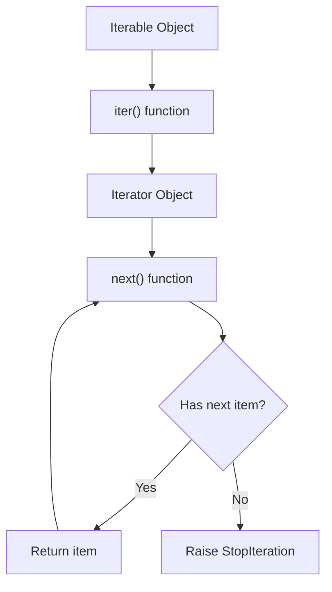
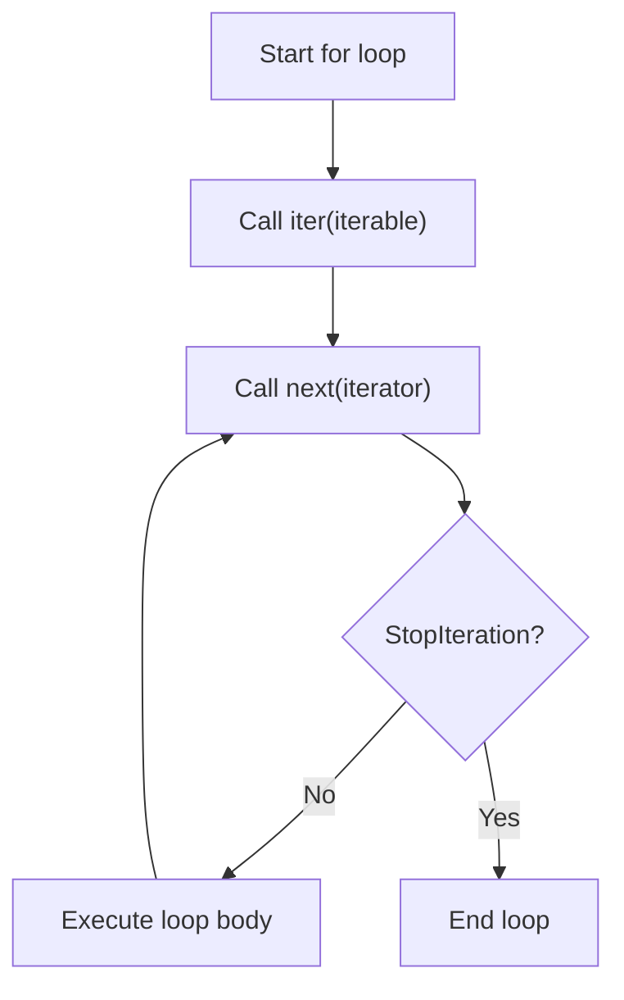
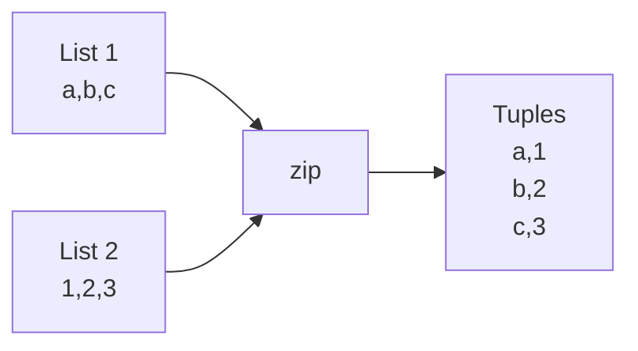
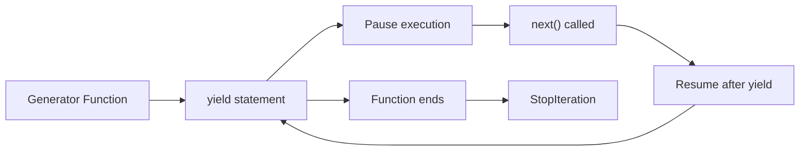
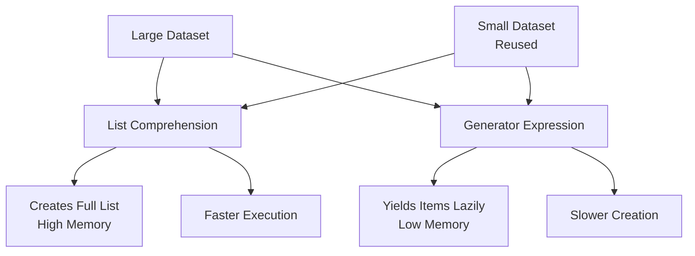
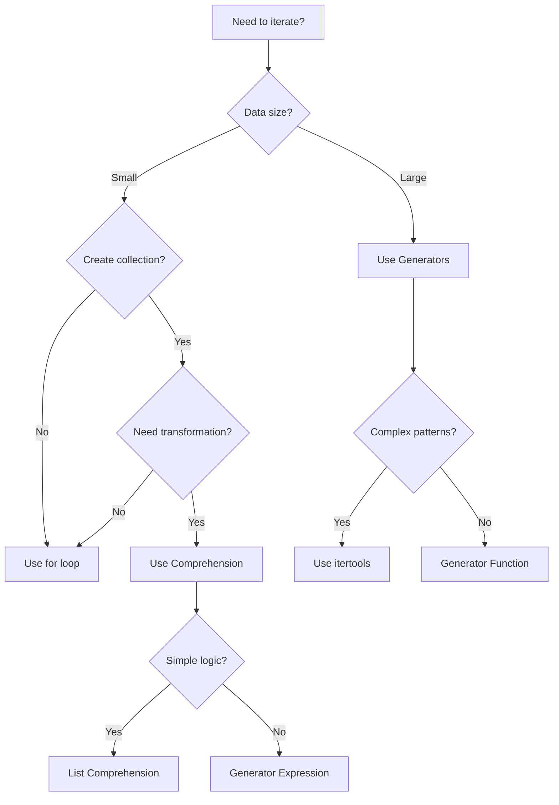

## 🎯 Table of Contents
1. [Fundamental Concepts](#fundamental-concepts)
2. [Basic Loops](#basic-loops)
3. [Iterator Protocol](#iterator-protocol)
4. [Generator Functions & Expressions](#generator-functions--expressions)
5. [Built-in Iterators & Tools](#built-in-iterators--tools)
6. [Async Iteration](#async-iteration)
7. [Performance & Best Practices](#performance--best-practices)
8. [Complete Range & Index Patterns](#complete-range--index-patterns)
9. [Advanced Loop Techniques](#advanced-loop-techniques)
10. [While Loop Mastery](#while-loop-mastery)
11. [Complete List Iteration Patterns](#complete-list-iteration-patterns)
12. [Dictionary & Set Iteration](#dictionary--set-iteration)
13. [Advanced Patterns & Optimization](#advanced-patterns--optimization)
14. [Real-World Complete Examples](#real-world-complete-examples)
15. [Performance Comparison & Benchmarks](#performance-comparison--benchmarks)

---

## 1️⃣ Fundamental Concepts

### The Iteration Protocol



### **Iterable** vs **Iterator**

```python
# 🎯 Key Distinctions
from collections.abc import Iterable, Iterator

data = [1, 2, 3]

print(isinstance(data, Iterable))  # True - Can be looped over
print(isinstance(data, Iterator))  # False - Not an iterator yet!

# Convert iterable to iterator
iterator = iter(data)
print(isinstance(iterator, Iterator))  # True - Now it's an iterator
```

| Aspect | Iterable | Iterator |
|--------|----------|----------|
| **Definition** | Object that can return an iterator | Object that produces items |
| **Methods** | `__iter__()` (returns iterator) | `__iter__()` + `__next__()` |
| **State** | Stateless | Maintains state (position) |
| **Reusability** | Can create multiple iterators | Exhausted after one pass |

---

## 2️⃣ Basic Loops

### **For Loop Internals**



```python
# Traditional for loop
for item in collection:
    process(item)

# What Python actually does:
iterator = iter(collection)
while True:
    try:
        item = next(iterator)
        process(item)
    except StopIteration:
        break
```

### **Loop Control Statements**

```python
# 🛑 break - Exit loop completely
for i in range(10):
    if i == 5:
        break  # Exits at 5
    print(i)  # 0,1,2,3,4

# 🔄 continue - Skip to next iteration
for i in range(5):
    if i == 2:
        continue  # Skips 2
    print(i)  # 0,1,3,4

# 🏷️ else clause - Executes if loop completes without break
for i in range(3):
    if i == 5:  # Never true
        break
else:
    print("Loop completed normally!")

# 📍 Loop variables persist!
for i in range(3):
    pass
print(f"Final i: {i}")  # i = 2
```

### **Enumerate - Index + Value**

```python
fruits = ['apple', 'banana', 'cherry']

# Basic usage
for index, fruit in enumerate(fruits):
    print(f"{index}: {fruit}")
# Output: 0: apple, 1: banana, 2: cherry

# Start from custom index
for index, fruit in enumerate(fruits, start=1):
    print(f"{index}: {fruit}")
# Output: 1: apple, 2: banana, 3: cherry

# Modern pattern with match (Python 3.10+)
for i, fruit in enumerate(fruits):
    match fruit:
        case 'apple':
            print(f"Apple at position {i}")
        case 'banana':
            print(f"Banana at position {i}")
```

### **Zip - Parallel Iteration**



```python
names = ['Alice', 'Bob', 'Charlie']
scores = [85, 92, 78]

# Basic zip
for name, score in zip(names, scores):
    print(f"{name}: {score}")

# Zip with strict mode (Python 3.10+)
try:
    for item in zip(names, scores, strict=True):
        print(item)
except ValueError as e:
    print(f"Length mismatch: {e}")

# Zip with multiple iterables
ages = [25, 30, 35]
for name, score, age in zip(names, scores, ages):
    print(f"{name} ({age}): {score}")

# Unzipping
pairs = [('a', 1), ('b', 2), ('c', 3)]
letters, numbers = zip(*pairs)  # Unzips into two tuples
```

---

## 3️⃣ Iterator Protocol

### **Custom Iterator Implementation**

```python
class Countdown:
    """Countdown from n to 1"""
    def __init__(self, start):
        self.current = start
    
    def __iter__(self):
        return self  # Returns itself as iterator
    
    def __next__(self):
        if self.current <= 0:
            raise StopIteration
        value = self.current
        self.current -= 1
        return value

# Usage
for num in Countdown(5):
    print(num)  # 5, 4, 3, 2, 1

# Manual iteration
counter = Countdown(3)
print(next(counter))  # 3
print(next(counter))  # 2
print(next(counter))  # 1
try:
    print(next(counter))  # StopIteration
except StopIteration:
    print("Countdown complete!")
```

### **Separate Iterable & Iterator Classes**

```python
class TreeNode:
    def __init__(self, value, left=None, right=None):
        self.value = value
        self.left = left
        self.right = right
    
    def __iter__(self):
        return TreeIterator(self)

class TreeIterator:
    """In-order tree traversal iterator"""
    def __init__(self, root):
        self.stack = []
        self._push_left(root)
    
    def _push_left(self, node):
        while node:
            self.stack.append(node)
            node = node.left
    
    def __iter__(self):
        return self
    
    def __next__(self):
        if not self.stack:
            raise StopIteration
        
        node = self.stack.pop()
        self._push_left(node.right)
        return node.value

# Usage
tree = TreeNode(4,
    TreeNode(2, TreeNode(1), TreeNode(3)),
    TreeNode(6, TreeNode(5), TreeNode(7))
)

for value in tree:
    print(value)  # 1, 2, 3, 4, 5, 6, 7 (in-order)
```

---

## 4️⃣ Generator Functions & Expressions

### **Generator Functions**



```python
def fibonacci_generator(limit):
    """Generate Fibonacci numbers up to limit"""
    a, b = 0, 1
    while a < limit:
        yield a  # Pauses here, returns value
        a, b = b, a + b
    # Implicit return raises StopIteration

# Usage
gen = fibonacci_generator(100)
print(list(gen))  # [0, 1, 1, 2, 3, 5, 8, 13, 21, 34, 55, 89]

# Generator state
gen = fibonacci_generator(20)
print(next(gen))  # 0
print(next(gen))  # 1
print(next(gen))  # 1

# Generator expression
squares = (x**2 for x in range(10))
print(sum(squares))  # 285
```

### **Advanced Generator Patterns**

```python
# Generator with send()
def accumulator():
    total = 0
    while True:
        value = yield total
        if value is None:
            break
        total += value

acc = accumulator()
next(acc)  # Prime the generator
print(acc.send(10))  # 10
print(acc.send(20))  # 30
print(acc.send(5))   # 35
acc.close()

# yield from (delegation)
def chain_generators(*iterables):
    for it in iterables:
        yield from it  # Delegates to sub-generator

result = list(chain_generators(range(3), 'abc', [True, False]))
# [0, 1, 2, 'a', 'b', 'c', True, False]

# Asynchronous generators (Python 3.6+)
async def async_counter(n):
    for i in range(n):
        yield i
        await asyncio.sleep(0.1)
```

---

## 5️⃣ Built-in Iterators & Tools

### **itertools Module - The Iterator Powerhouse**

```python
import itertools as it

# 🔄 Infinite iterators
counter = it.count(start=10, step=2)  # 10, 12, 14, 16...
cycler = it.cycle('AB')              # A, B, A, B, A, B...
repeater = it.repeat(7, times=3)     # 7, 7, 7

# 🔗 Combinatoric iterators
# Permutations (order matters)
perms = it.permutations('ABC', 2)    # AB, AC, BA, BC, CA, CB

# Combinations (order doesn't matter)
combs = it.combinations('ABC', 2)    # AB, AC, BC

# Cartesian product
product = it.product('AB', '12')     # A1, A2, B1, B2

# 🔍 Terminating iterators
# Accumulate (like reduce but yields intermediate results)
accum = it.accumulate([1, 2, 3, 4])  # 1, 3, 6, 10

# Chain - combine iterables
chained = it.chain('ABC', 'DEF')     # A, B, C, D, E, F

# Compress - filter with boolean mask
compressed = it.compress('ABCD', [1, 0, 1, 0])  # A, C

# Groupby - group consecutive equal elements
data = sorted(['cat', 'dog', 'cow', 'duck'], key=len)
for length, group in it.groupby(data, key=len):
    print(f"{length}: {list(group)}")

# Pairwise (Python 3.10+)
pairs = it.pairwise([1, 2, 3, 4])    # (1,2), (2,3), (3,4)

# Sliding window
window = it.islice(it.count(), 5)    # 0, 1, 2, 3, 4
```

### **Built-in Functions for Iteration**

```python
# 📊 Aggregation
data = [1, 2, 3, 4, 5]
print(sum(data))           # 15
print(min(data))           # 1
print(max(data))           # 5
print(all([True, 1, 'a'])) # True
print(any([False, 0, ''])) # False

# 🔄 Transformation
print(list(map(str.upper, ['a', 'b', 'c'])))  # ['A', 'B', 'C']
print(list(filter(lambda x: x > 0, [-2, -1, 0, 1, 2])))  # [1, 2]

# 🎯 Advanced
from functools import reduce
result = reduce(lambda x, y: x * y, [1, 2, 3, 4])  # 24

# Sorted returns new list
sorted_nums = sorted([3, 1, 4, 1, 5], reverse=True)

# Reversed returns iterator
rev_iter = reversed([1, 2, 3])
print(list(rev_iter))  # [3, 2, 1]
```

### **Comprehensions with Conditions**

```python
# List comprehension
squares = [x**2 for x in range(10) if x % 2 == 0]  # [0, 4, 16, 36, 64]

# Dictionary comprehension
square_dict = {x: x**2 for x in range(5)}  # {0:0, 1:1, 2:4, 3:9, 4:16}

# Set comprehension
unique_lengths = {len(name) for name in ['Alice', 'Bob', 'Charlie']}  # {3, 5, 7}

# Nested comprehensions
matrix = [[i*j for j in range(3)] for i in range(3)]
# [[0,0,0], [0,1,2], [0,2,4]]

# Walrus operator in comprehension (Python 3.8+)
import re
text = "Hello 123 World 456"
numbers = [match.group() for line in text.split() 
           if (match := re.search(r'\d+', line))]
# ['123', '456']
```

---

## 6️⃣ Async Iteration

### **Async Iterators & Generators**

```python
import asyncio

class AsyncCounter:
    """Async iterator"""
    def __init__(self, n):
        self.n = n
        self.current = 0
    
    def __aiter__(self):
        return self
    
    async def __anext__(self):
        if self.current >= self.n:
            raise StopAsyncIteration
        await asyncio.sleep(0.1)  # Simulate async work
        value = self.current
        self.current += 1
        return value

async def main():
    async for number in AsyncCounter(5):
        print(f"Async number: {number}")

# Async generator
async def async_gen(n):
    for i in range(n):
        yield i
        await asyncio.sleep(0.1)

# Using aiter() and anext() (Python 3.10+)
async def manual_async_iter():
    ag = async_gen(3)
    async_iterator = aiter(ag)
    try:
        while True:
            value = await anext(async_iterator)
            print(value)
    except StopAsyncIteration:
        print("Done!")

# Run async code
asyncio.run(main())
```

### **Asynchronous Comprehensions**

```python
import aiohttp
import asyncio

async def fetch_urls(urls):
    async with aiohttp.ClientSession() as session:
        # Async list comprehension
        responses = [
            await session.get(url)
            async for url in urls
            if url.startswith('http')
        ]
        
        # Async dict comprehension
        data = {
            url: await resp.text()
            async for resp in responses
        }
        return data
```

---

## 7️⃣ Performance & Best Practices

### **Performance Comparison**

```python
import timeit
import itertools

# Test data
large_list = list(range(1000000))

# Method 1: Traditional for loop
def method1():
    result = []
    for x in large_list:
        if x % 2 == 0:
            result.append(x * 2)
    return result

# Method 2: List comprehension
def method2():
    return [x * 2 for x in large_list if x % 2 == 0]

# Method 3: Generator expression
def method3():
    return list(x * 2 for x in large_list if x % 2 == 0)

# Method 4: map + filter
def method4():
    return list(map(lambda x: x * 2, filter(lambda x: x % 2 == 0, large_list)))

# Timing results (relative):
# List comprehension > Generator expression > Traditional loop > map+filter
```

### **Memory Efficiency Diagram**



### **Best Practices Checklist**

```python
# ✅ DO
# Use list comprehensions for simple transformations
squares = [x**2 for x in range(10)]

# Use generator expressions for large datasets
large_sum = sum(x**2 for x in range(1000000))

# Use enumerate for index-value pairs
for i, value in enumerate(collection):
    pass

# Use zip for parallel iteration
for a, b in zip(list1, list2):
    pass

# Use itertools for complex iterations
import itertools

# Consider walrus operator in comprehensions (Python 3.8+)
filtered = [y for x in data if (y := process(x)) is not None]

# ❌ DON'T
# Don't modify collections while iterating
# for item in list_data:
#     list_data.remove(item)  # ❌ Dangerous!

# Don't create unnecessary lists
# result = list(map(func, data))  # ❌ If you only need to iterate once
# result = (func(x) for x in data)  # ✅ Generator expression

# Don't ignore iterator exhaustion
iterator = iter([1, 2, 3])
list(iterator)  # [1, 2, 3]
list(iterator)  # [] - exhausted!

# Use context managers for resource cleanup
with open('file.txt') as f:
    for line in f:  # File is iterator
        process(line)
```

### **Common Patterns & Idioms**

```python
# 1. Flattening nested lists
nested = [[1, 2], [3, 4], [5, 6]]
flat = [item for sublist in nested for item in sublist]  # [1,2,3,4,5,6]
# Or using itertools
flat = list(itertools.chain.from_iterable(nested))

# 2. Grouping with defaultdict
from collections import defaultdict
data = ['apple', 'banana', 'cherry', 'avocado']
grouped = defaultdict(list)
for word in data:
    grouped[word[0]].append(word)  # {'a': ['apple', 'avocado'], ...}

# 3. Sliding window
def sliding_window(iterable, n=2):
    """Return sliding window of width n"""
    it = iter(iterable)
    window = list(itertools.islice(it, n))
    if len(window) == n:
        yield tuple(window)
    for elem in it:
        window = window[1:] + [elem]
        yield tuple(window)

# 4. Batch processing
def batched(iterable, n):
    """Batch data into lists of size n"""
    it = iter(iterable)
    while batch := list(itertools.islice(it, n)):
        yield batch

# 5. Sentinel-based iteration
# Read until empty line
import itertools
lines = []
for line in iter(input, ''):  # Sentinel is empty string
    lines.append(line)

# 6. Two-pointer iteration
def find_pair(nums, target):
    """Find pair that sums to target in sorted list"""
    left, right = 0, len(nums) - 1
    while left < right:
        current = nums[left] + nums[right]
        if current == target:
            return (nums[left], nums[right])
        elif current < target:
            left += 1
        else:
            right -= 1
    return None
```

### **Debugging Iterators**

```python
# Using tee to debug without consuming
import itertools

def debug_iterator(iterator, label=""):
    """Debug an iterator without consuming it"""
    it1, it2 = itertools.tee(iterator, 2)
    
    print(f"{label}: First 5 items:")
    for i, item in enumerate(it1):
        print(f"  [{i}] = {item}")
        if i >= 4:
            break
    
    return it2  # Return the unconsumed iterator

# Example
data = range(10)
debugged = debug_iterator(data, "Range iterator")
sum(debugged)  # Still works because we returned unconsumed iterator
```

---

## 🎓 Summary Cheat Sheet

### **Quick Reference**

| Pattern | Syntax | Use Case |
|---------|--------|----------|
| **For Loop** | `for item in iterable:` | Basic iteration |
| **Enumerate** | `for i, item in enumerate(iterable):` | Need index |
| **Zip** | `for a, b in zip(iter1, iter2):` | Parallel iteration |
| **Comprehension** | `[x**2 for x in range(10)]` | Create collections |
| **Generator** | `(x**2 for x in range(10))` | Lazy evaluation |
| **Map** | `map(func, iterable)` | Apply function |
| **Filter** | `filter(pred, iterable)` | Filter items |
| **Async For** | `async for item in async_iterable:` | Async iteration |

### **When to Use What**



## 🎯 **Part 8: Complete Range & Index Patterns**

### **Range Patterns - The Complete Set**

```python
# 🎯 Basic range patterns
for i in range(10):          # 0 to 9
    pass

for i in range(5, 10):       # 5 to 9
    pass

for i in range(2, len(nums)):  # 2 to len(nums)-1
    pass

for i in range(10, 0, -1):   # 10 to 1 (descending)
    pass

for i in range(0, 10, 2):    # 0, 2, 4, 6, 8 (step 2)
    pass

# ⚠️ Common pitfall: range(len(nums)-1)
nums = [1, 2, 3, 4]
for i in range(len(nums)-1):  # i = 0, 1, 2 (not 3)
    # Useful for comparing adjacent elements
    if nums[i] < nums[i+1]:
        print(f"{nums[i]} < {nums[i+1]}")

# Last index patterns
nums = [10, 20, 30, 40]
for i in range(len(nums)):       # i = 0, 1, 2, 3
    print(nums[i])

for i in range(1, len(nums)):    # i = 1, 2, 3 (skip first)
    print(nums[i])

for i in range(len(nums)-1):     # i = 0, 1, 2 (skip last)
    print(nums[i])

for i in range(len(nums)-1, -1, -1):  # i = 3, 2, 1, 0 (reverse)
    print(nums[i])
```

### **Complex Range Patterns**

```python
# 1. Skip first and last
nums = [1, 2, 3, 4, 5]
for i in range(1, len(nums)-1):  # i = 1, 2, 3
    print(f"Middle: {nums[i]}")

# 2. Every other element
for i in range(0, len(nums), 2):  # i = 0, 2, 4
    print(f"Even index: {nums[i]}")

# 3. Reverse every other
for i in range(len(nums)-1, -1, -2):  # i = 4, 2, 0
    print(f"Reverse even: {nums[i]}")

# 4. Sliding windows
def sliding_window(nums, k):
    """Print all windows of size k"""
    for i in range(len(nums) - k + 1):
        window = nums[i:i+k]
        print(f"Window starting at {i}: {window}")

# Example
sliding_window([1, 2, 3, 4, 5], 3)
# Window starting at 0: [1, 2, 3]
# Window starting at 1: [2, 3, 4]
# Window starting at 2: [3, 4, 5]
```

---

## 🎯 **Part 9: Advanced Loop Techniques**

### **Nested Loops - Complete Patterns**

```python
# 1. Matrix traversal
matrix = [
    [1, 2, 3],
    [4, 5, 6],
    [7, 8, 9]
]

# Row-major order
for i in range(len(matrix)):           # Rows
    for j in range(len(matrix[i])):    # Columns
        print(f"matrix[{i}][{j}] = {matrix[i][j]}")

# 2. Triangular patterns
# Upper triangle (excluding diagonal)
for i in range(len(matrix)):
    for j in range(i+1, len(matrix[i])):
        print(f"Upper: matrix[{i}][{j}] = {matrix[i][j]}")

# Lower triangle (excluding diagonal)
for i in range(len(matrix)):
    for j in range(i):
        print(f"Lower: matrix[{i}][{j}] = {matrix[i][j]}")

# 3. All pairs without duplicates
items = ['A', 'B', 'C', 'D']
for i in range(len(items)):
    for j in range(i+1, len(items)):
        print(f"Pair: {items[i]} - {items[j]}")

# 4. Multiple loop variables
for i in range(3):
    for j in range(3):
        for k in range(3):
            print(f"({i}, {j}, {k})")
```

### **Loop with Conditions & Accumulators**

```python
# 1. Find with early exit
def find_index(nums, target):
    """Return index of target, or -1 if not found"""
    for i in range(len(nums)):
        if nums[i] == target:
            return i  # Early exit
    return -1

# 2. Multiple accumulators
def analyze_list(nums):
    """Return multiple statistics"""
    total = 0
    positive_count = 0
    max_val = float('-inf')
    min_val = float('inf')
    
    for i in range(len(nums)):
        total += nums[i]
        if nums[i] > 0:
            positive_count += 1
        if nums[i] > max_val:
            max_val = nums[i]
        if nums[i] < min_val:
            min_val = nums[i]
    
    return {
        'total': total,
        'positive_count': positive_count,
        'max': max_val,
        'min': min_val,
        'average': total / len(nums) if nums else 0
    }

# 3. Conditional accumulation
def collect_matches(nums, condition_func):
    """Collect indices where condition is True"""
    matches = []
    for i in range(len(nums)):
        if condition_func(nums[i]):
            matches.append((i, nums[i]))
    return matches

# Usage
result = collect_matches([1, -2, 3, -4, 5], lambda x: x > 0)
# [(0, 1), (2, 3), (4, 5)]
```

---

## 🎯 **Part 10: While Loop Mastery**

### **Complete While Loop Patterns**

```python
# 1. Basic while with index
i = 0
while i < len(nums):
    print(nums[i])
    i += 1

# 2. While with complex condition
def find_consecutive_sum(nums, target):
    """Find consecutive elements that sum to target"""
    i = 0
    while i < len(nums):
        j = i
        current_sum = 0
        while j < len(nums) and current_sum < target:
            current_sum += nums[j]
            if current_sum == target:
                return nums[i:j+1]
            j += 1
        i += 1
    return None

# 3. Infinite while with break
while True:
    user_input = input("Enter a number (or 'quit'): ")
    if user_input.lower() == 'quit':
        break
    try:
        number = float(user_input)
        print(f"Square: {number**2}")
    except ValueError:
        print("Invalid input")

# 4. Do-while pattern (Python doesn't have do-while)
# Simulate with while True and break
def get_positive_number():
    """Keep asking until positive number is entered"""
    while True:
        try:
            num = float(input("Enter positive number: "))
            if num > 0:
                return num
            print("Number must be positive!")
        except ValueError:
            print("Invalid input!")

# 5. While with else
def find_divisor(n, limit):
    """Find first divisor of n less than limit"""
    i = 2
    while i < limit:
        if n % i == 0:
            print(f"Found divisor: {i}")
            break
        i += 1
    else:
        print(f"No divisor found below {limit}")
```

### **While vs For: When to Use Each**

```python
# 🔄 Use FOR when:
# 1. You know the exact number of iterations
for i in range(10):          # Exactly 10 times
    pass

# 2. Iterating over a collection
for item in collection:      # Once per item
    pass

# 3. You need the index
for i in range(len(data)):   # Need index
    process(data[i])

# 🔄 Use WHILE when:
# 1. Unknown number of iterations
while condition:            # Until condition is False
    pass

# 2. Waiting for external event
while not data_ready():     # Wait for event
    time.sleep(0.1)

# 3. Complex termination condition
while (index < len(data) and 
       data[index] != target and
       attempts < max_attempts):
    index += 1
    attempts += 1
```

---

## 🎯 **Part 11: Complete List Iteration Patterns**

### **Every Possible Way to Iterate Lists**

```python
nums = [10, 20, 30, 40, 50]

# Pattern 1: Direct iteration (values only)
for value in nums:
    print(value)

# Pattern 2: Index iteration
for i in range(len(nums)):
    print(f"nums[{i}] = {nums[i]}")

# Pattern 3: Index skipping first
for i in range(1, len(nums)):
    print(f"Skip first: nums[{i}] = {nums[i]}")

# Pattern 4: Index skipping last
for i in range(len(nums) - 1):
    print(f"Skip last: nums[{i}] = {nums[i]}")

# Pattern 5: Index & value (enumerate)
for i, value in enumerate(nums):
    print(f"nums[{i}] = {value}")

# Pattern 6: Reverse iteration (by value)
for value in reversed(nums):
    print(f"Reverse value: {value}")

# Pattern 7: Reverse iteration (by index)
for i in range(len(nums)-1, -1, -1):
    print(f"Reverse index: nums[{i}] = {nums[i]}")

# Pattern 8: Every other element
for i in range(0, len(nums), 2):
    print(f"Even indices: nums[{i}] = {nums[i]}")

# Pattern 9: From middle outward
mid = len(nums) // 2
for offset in range(mid):
    left = mid - offset - 1
    right = mid + offset
    if left >= 0:
        print(f"Left: nums[{left}] = {nums[left]}")
    if right < len(nums):
        print(f"Right: nums[{right}] = {nums[right]}")

# Pattern 10: Sliding window pairs
for i in range(len(nums) - 1):
    current, next_val = nums[i], nums[i+1]
    print(f"Pair: {current}, {next_val}")
```

### **String Iteration Patterns**

```python
text = "Python"

# Character iteration
for char in text:
    print(char)

# Character with index
for i, char in enumerate(text):
    print(f"text[{i}] = '{char}'")

# Substring patterns
for i in range(len(text)):
    for j in range(i+1, len(text)+1):
        substring = text[i:j]
        print(f"Substring [{i}:{j}]: '{substring}'")

# Character pairs
for i in range(len(text)-1):
    pair = text[i:i+2]
    print(f"Character pair: {pair}")

# Reverse string iteration
for char in reversed(text):
    print(f"Reversed: {char}")

for i in range(len(text)-1, -1, -1):
    print(f"text[{i}] = '{text[i]}'")
```

---

## 🎯 **Part 12: Dictionary & Set Iteration**

### **Complete Dictionary Patterns**

```python
person = {
    'name': 'Alice',
    'age': 30,
    'city': 'New York',
    'job': 'Engineer'
}

# Pattern 1: Keys only
for key in person:
    print(f"Key: {key}")

for key in person.keys():
    print(f"Key: {key}")

# Pattern 2: Values only
for value in person.values():
    print(f"Value: {value}")

# Pattern 3: Key-Value pairs
for key, value in person.items():
    print(f"{key}: {value}")

# Pattern 4: Keys with index
for i, key in enumerate(person):
    print(f"Key {i}: {key} = {person[key]}")

# Pattern 5: Filtered iteration
for key, value in person.items():
    if isinstance(value, str):
        print(f"String value: {key} = {value}")

# Pattern 6: Sorted iteration
for key in sorted(person.keys()):
    print(f"Sorted key: {key} = {person[key]}")

for key, value in sorted(person.items()):
    print(f"Sorted item: {key} = {value}")

# Pattern 7: Reverse sorted
for key in sorted(person.keys(), reverse=True):
    print(f"Reverse sorted: {key} = {person[key]}")

# Pattern 8: Dictionary of lists
scores = {
    'Alice': [85, 90, 88],
    'Bob': [78, 82, 80],
    'Charlie': [92, 95, 91]
}

for name, score_list in scores.items():
    total = sum(score_list)
    average = total / len(score_list)
    print(f"{name}: average = {average:.2f}")
    
    # Nested iteration
    for i, score in enumerate(score_list):
        print(f"  Test {i+1}: {score}")
```

### **Set Iteration Patterns**

```python
unique_numbers = {1, 3, 5, 7, 9}
colors = {'red', 'green', 'blue'}

# Pattern 1: Direct iteration
for color in colors:
    print(color)

# Pattern 2: With enumeration (sets are unordered!)
for i, color in enumerate(colors):
    print(f"Color {i}: {color}")

# Pattern 3: Sorted iteration
for color in sorted(colors):
    print(f"Sorted: {color}")

# Pattern 4: Set operations in loops
set_a = {1, 2, 3, 4, 5}
set_b = {4, 5, 6, 7, 8}

# Union iteration
for item in set_a.union(set_b):
    print(f"Union: {item}")

# Intersection iteration
for item in set_a.intersection(set_b):
    print(f"Intersection: {item}")

# Difference iteration
for item in set_a.difference(set_b):
    print(f"In A but not B: {item}")
```

---

## 🎯 **Part 13: Advanced Patterns & Optimization**

### **Optimized Loop Patterns**

```python
# 1. Local variable optimization
def sum_squares(nums):
    """Optimized sum of squares"""
    total = 0
    n = len(nums)  # Cache length
    for i in range(n):
        val = nums[i]  # Cache value
        total += val * val
    return total

# 2. Pre-compute values outside loop
def process_with_constants(data, multiplier, offset):
    """Avoid recomputing constants in loop"""
    adjusted_mult = multiplier * 2
    for item in data:
        result = (item + offset) * adjusted_mult
        process(result)

# 3. Loop unrolling (manual)
def sum_array_unrolled(nums):
    """Manual loop unrolling for speed"""
    total = 0
    n = len(nums)
    i = 0
    
    # Process 4 elements at a time
    while i + 3 < n:
        total += nums[i] + nums[i+1] + nums[i+2] + nums[i+3]
        i += 4
    
    # Handle remaining elements
    while i < n:
        total += nums[i]
        i += 1
    
    return total

# 4. Avoid function calls in loops
def process_list_slow(items):
    """Slow - calls len() each iteration"""
    for i in range(len(items)):
        process(items[i])

def process_list_fast(items):
    """Fast - caches length"""
    n = len(items)
    for i in range(n):
        process(items[i])
```

### **Memory-Efficient Patterns**

```python
# 1. Generator expressions for large data
large_data = range(1000000)

# ❌ Memory intensive
squares_list = [x**2 for x in large_data]

# ✅ Memory efficient
squares_gen = (x**2 for x in large_data)
total = sum(squares_gen)  # Processes one at a time

# 2. Using islice for partial processing
from itertools import islice

def process_in_chunks(data, chunk_size=1000):
    """Process data in chunks to limit memory"""
    iterator = iter(data)
    while True:
        chunk = list(islice(iterator, chunk_size))
        if not chunk:
            break
        process_chunk(chunk)

# 3. In-place modification when possible
def double_values_inplace(nums):
    """Modify list in place to save memory"""
    for i in range(len(nums)):
        nums[i] *= 2

# vs creating new list
def double_values_copy(nums):
    """Create new list (uses more memory)"""
    return [x * 2 for x in nums]
```

### **Error Handling in Loops**

```python
# 1. Continue on error
def process_with_errors(data):
    """Skip items that cause errors"""
    results = []
    for item in data:
        try:
            result = risky_operation(item)
            results.append(result)
        except (ValueError, TypeError) as e:
            print(f"Skipping {item}: {e}")
            continue  # Skip to next item
    return results

# 2. Break on critical error
def process_until_failure(data, max_errors=3):
    """Stop processing after too many errors"""
    error_count = 0
    results = []
    
    for item in data:
        try:
            result = process_item(item)
            results.append(result)
        except Exception as e:
            error_count += 1
            print(f"Error {error_count}: {e}")
            if error_count >= max_errors:
                print("Too many errors, stopping!")
                break
    return results

# 3. Retry logic
def process_with_retry(data, max_retries=3):
    """Retry failed operations"""
    results = []
    
    for item in data:
        for attempt in range(max_retries):
            try:
                result = unreliable_operation(item)
                results.append(result)
                break  # Success, exit retry loop
            except Exception as e:
                if attempt == max_retries - 1:
                    print(f"Failed after {max_retries} attempts: {item}")
                    results.append(None)
                else:
                    print(f"Attempt {attempt+1} failed, retrying...")
    
    return results
```

---

## 🎯 **Part 14: Real-World Complete Examples**

### **Example 1: Stock Price Analysis**

```python
def analyze_stock_prices(prices):
    """
    Complete stock analysis with multiple loop patterns
    """
    if not prices:
        return {}
    
    results = {
        'max_profit': 0,
        'buy_day': 0,
        'sell_day': 0,
        'max_drawdown': 0,
        'volatility': 0,
        'trends': []
    }
    
    # 1. Calculate basic statistics
    min_price = prices[0]
    max_price = prices[0]
    total = 0
    
    for i in range(len(prices)):
        price = prices[i]
        total += price
        
        # Update min/max
        if price < min_price:
            min_price = price
        if price > max_price:
            max_price = price
        
        # Calculate max profit (buy low, sell high)
        for j in range(i+1, len(prices)):
            profit = prices[j] - price
            if profit > results['max_profit']:
                results['max_profit'] = profit
                results['buy_day'] = i
                results['sell_day'] = j
    
    # 2. Calculate max drawdown (largest peak-to-trough decline)
    peak = prices[0]
    for i in range(1, len(prices)):
        if prices[i] > peak:
            peak = prices[i]
        drawdown = (peak - prices[i]) / peak * 100
        if drawdown > results['max_drawdown']:
            results['max_drawdown'] = drawdown
    
    # 3. Identify trends (consecutive increasing/decreasing days)
    current_trend = []
    for i in range(len(prices)-1):
        if prices[i+1] > prices[i]:
            if not current_trend or current_trend[-1] != 'up':
                if current_trend:
                    results['trends'].append(current_trend)
                current_trend = ['up', i]
            current_trend.append(prices[i+1])
        elif prices[i+1] < prices[i]:
            if not current_trend or current_trend[-1] != 'down':
                if current_trend:
                    results['trends'].append(current_trend)
                current_trend = ['down', i]
            current_trend.append(prices[i+1])
    
    if current_trend:
        results['trends'].append(current_trend)
    
    # 4. Calculate volatility (standard deviation)
    mean = total / len(prices)
    sum_sq_diff = 0
    for price in prices:
        sum_sq_diff += (price - mean) ** 2
    results['volatility'] = (sum_sq_diff / len(prices)) ** 0.5
    
    return results
```

### **Example 2: Text Processing Pipeline**

```python
def text_processing_pipeline(text, operations):
    """
    Apply multiple text operations using different loop patterns
    """
    results = {
        'original': text,
        'processed': text,
        'stats': {},
        'errors': []
    }
    
    # Operation 1: Character statistics
    char_count = {}
    word_count = 0
    sentence_count = 0
    
    # Count characters
    for char in text.lower():
        if char.isalpha():
            char_count[char] = char_count.get(char, 0) + 1
    
    # Count words (split by whitespace)
    words = text.split()
    word_count = len(words)
    
    # Count sentences (simplified)
    for char in text:
        if char in '.!?':
            sentence_count += 1
    
    results['stats'] = {
        'characters': len(text),
        'letters': sum(char_count.values()),
        'words': word_count,
        'sentences': sentence_count,
        'unique_letters': len(char_count),
        'most_common': max(char_count.items(), key=lambda x: x[1]) if char_count else None
    }
    
    # Operation 2: Apply transformation operations
    processed = text
    
    for i, operation in enumerate(operations):
        try:
            if operation['type'] == 'replace':
                # Replace all occurrences
                old = operation['old']
                new = operation['new']
                temp = ''
                j = 0
                while j < len(processed):
                    if processed[j:j+len(old)] == old:
                        temp += new
                        j += len(old)
                    else:
                        temp += processed[j]
                        j += 1
                processed = temp
                
            elif operation['type'] == 'remove':
                # Remove specific characters
                chars_to_remove = operation['chars']
                temp = ''
                for char in processed:
                    if char not in chars_to_remove:
                        temp += char
                processed = temp
                
            elif operation['type'] == 'reverse_words':
                # Reverse each word
                words = processed.split()
                reversed_words = []
                for word in words:
                    reversed_words.append(word[::-1])
                processed = ' '.join(reversed_words)
                
        except Exception as e:
            results['errors'].append({
                'operation': i,
                'type': operation.get('type', 'unknown'),
                'error': str(e)
            })
    
    results['processed'] = processed
    
    # Operation 3: Pattern matching
    patterns = operations[-1].get('patterns', []) if operations else []
    matches = []
    
    for pattern in patterns:
        for i in range(len(processed) - len(pattern) + 1):
            if processed[i:i+len(pattern)] == pattern:
                matches.append({
                    'pattern': pattern,
                    'position': i,
                    'context': processed[max(0, i-10):min(len(processed), i+len(pattern)+10)]
                })
    
    results['pattern_matches'] = matches
    
    return results
```

---

## 🎯 **Part 15: Performance Comparison & Benchmarks**

```python
import timeit
import random

def benchmark_loop_patterns():
    """Benchmark different loop patterns"""
    data = [random.randint(1, 1000) for _ in range(100000)]
    
    patterns = {
        'direct_iteration': '''
total = 0
for x in data:
    total += x
''',
        'range_len': '''
total = 0
for i in range(len(data)):
    total += data[i]
''',
        'enumerate': '''
total = 0
for i, x in enumerate(data):
    total += x
''',
        'while_loop': '''
total = 0
i = 0
while i < len(data):
    total += data[i]
    i += 1
''',
        'list_comprehension': '''
total = sum([x for x in data])
''',
        'generator_expression': '''
total = sum(x for x in data)
''',
        'builtin_sum': '''
total = sum(data)
'''
    }
    
    print("Performance Comparison (100,000 elements):")
    print("-" * 50)
    
    for name, code in patterns.items():
        time_taken = timeit.timeit(
            code,
            globals={'data': data},
            number=100
        )
        print(f"{name:25} {time_taken:8.4f} seconds")
    
    # Memory usage comparison
    print("\nMemory Usage Patterns:")
    print("-" * 50)
    
    large_data = range(1000000)
    
    # Memory intensive
    mem_list = [x**2 for x in large_data]  # Creates full list
    
    # Memory efficient
    mem_gen = (x**2 for x in large_data)  # Generates on demand
    
    print("List comprehension creates list with 1,000,000 elements")
    print("Generator expression creates iterator, processes one at a time")
```

### **When to Use Each Pattern - Decision Tree**

```
Start Loop
    |
    v
Need index? -------- Yes ------> Use range(len(data))
    |                              |
    No                             |
    |                              v
    v                       Need both index and value?
Need to modify original?          |
    |                       Yes --+-- No
    |                       |           |
Yes --+-- No                v           v
|           |        enumerate(data)   for i in range(len(data))
v           v               |                   |
for i in        Direct iteration?       Only need index
range(len(data))       |
    |           Yes --+-- No
    |           |           |
    v           v           v
Modify     for item     while loop or
in place   in data      other pattern
```

---

## 📊 **Quick Reference Cheat Sheet**

### **Basic Patterns**
```python
# Value iteration
for item in collection:

# Index iteration  
for i in range(len(collection)):

# Index starting from 1
for i in range(1, len(collection)):

# Index excluding last
for i in range(len(collection)-1):

# Reverse iteration
for i in range(len(collection)-1, -1, -1):

# Every other element
for i in range(0, len(collection), 2):
```

### **Advanced Patterns**
```python
# With index and value
for i, value in enumerate(collection, start=1):

# Dictionary iteration
for key, value in dict.items():

# Parallel iteration
for a, b in zip(list1, list2, strict=True):

# Nested iteration
for i in range(rows):
    for j in range(cols):

# While with complex condition
while i < n and condition:

# Infinite loop with break
while True:
    if condition:
        break
```

### **Performance Patterns**
```python
# Fastest for summing
total = sum(collection)

# Memory efficient
result = (process(x) for x in large_data)

# Pre-cache length
n = len(data)
for i in range(n):

# Local variables
local_func = some_function
for item in data:
    result = local_func(item)
```

---

### **Key Takeaways**

1. **Iterables** are objects you can loop over, **iterators** are objects that produce items
2. **Generators** are memory-efficient for large datasets
3. **Comprehensions** are faster than equivalent loops for creating collections
4. **itertools** provides powerful iterator building blocks
5. **Async iteration** is essential for concurrent programming
6. **Never modify** a collection while iterating over it
7. **Use context managers** for resource cleanup during iteration
8. **Consider lazy evaluation** (generators) for memory-intensive operations

---

## 📚 Further Reading

- [Python Documentation: Iterators](https://docs.python.org/3/tutorial/classes.html#iterators)
- [PEP 255 – Simple Generators](https://peps.python.org/pep-0255/)
- [PEP 492 – Async/Await](https://peps.python.org/pep-0492/)
- [itertools Recipes](https://docs.python.org/3/library/itertools.html#itertools-recipes)
- [More Itertools](https://more-itertools.readthedocs.io/) (Third-party library)

---
