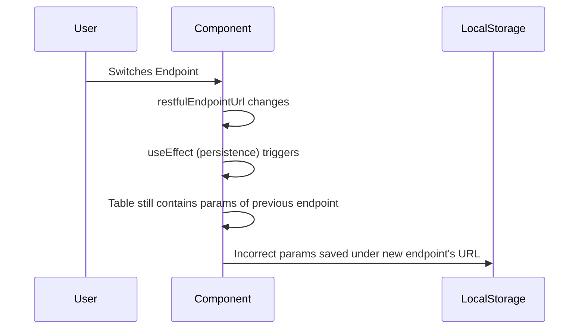
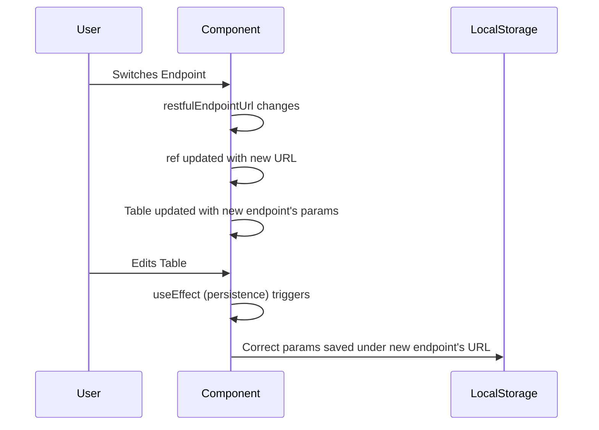

Last week, I was tasked with building a Parameters.tsx component, and let me tell you, the struggle was real! I got completely entangled in a web of useEffect dependencies. It was like trying to untangle a Christmas tree of wires! 🎄 But hey, I finally emerged victorious (mostly) and learned some valuable lessons along the way. Here's the story...

## **The Product Requirement**

1. Initializes a table with passed-in parameters (`Record<string, string>`).  
2. Allows in-place editing of table rows.  
3. Automatically persists updated parameters to local storage, using a passed-in URL as the key.

---

## **Implementation**

The implementation involves two `useEffect` hooks:

1. **First `useEffect`**: Loads the passed-in parameters into the table.
2. **Second `useEffect`**: Saves the updated parameters to local storage whenever the user makes changes to the table rows.

---

## **The Problem**

The **key issue** arises from the second `useEffect`. Since the URL (used as the storage key) is passed into the component, it was added as a dependency. This caused unintended behavior when switching endpoints, leading to:
- Saving the parameters of a **previous endpoint** under the **new endpoint's URL**.

### **Scenario Details**
When switching endpoints, the `restfulEndpointUrl` (passed-in URL) changes. Since the URL is used as the key for saving parameters to local storage, it was added as a dependency to the second `useEffect`. However, this led to incorrect behavior:

- When the URL changes, the `useEffect` is triggered.
- At this point, the table still contains the parameters of the **previous endpoint**.
- As a result, the parameters of the previous endpoint are saved under the **new endpoint’s URL**, which is incorrect.

### **Why This Happens**
The `useEffect` hook runs whenever any of its dependencies change. By including `restfulEndpointUrl` in the dependency array, the `useEffect` is triggered when the URL changes, even though the table content hasn’t been updated yet.

---

## **Root Cause: Unnecessary Dependencies in `useEffect`**

Let’s break down why adding `restfulEndpointUrl` as a dependency caused the issue:

1. **How `useEffect` Dependencies Work**  
   The dependencies in the `useEffect` array dictate when the hook is re-triggered. By including `restfulEndpointUrl`, the persistence logic was unnecessarily invoked whenever the URL changed.  

2. **Incorrect State Handling**  
   When the URL changed, the persistence logic was triggered prematurely, using the **outdated state of `rows`**, leading to data being saved under the incorrect key.

### **Impact of This Bug**
Here’s a sequence of events that led to the bug:  

```
1. restfulEndpointUrl = "endpoint_1"
   - Rows initialized and saved correctly under "endpoint_1".
2. restfulEndpointUrl changes to "endpoint_2"
   - useEffect triggers immediately.
   - Old rows (from "endpoint_1") are saved under "endpoint_2".
3. User edits table.
   - New rows are saved under "endpoint_2", but previous data is corrupted.
```

---

## **Solution: Leveraging `useRef`**

To fix this, we need to ensure that the persistence logic **only runs when `rows` changes**, and **not when the URL changes**. 
This can be achieved by:
1. Removing `restfulEndpointUrl` from the dependency array of the `useEffect` that handles persistence.
2. Using a `useRef` to always access the latest URL without triggering the `useEffect`.

The `useRef` hook provides a solution by holding a mutable reference to the latest URL without triggering re-renders or re-triggering the `useEffect`. Here’s why it works:
- **Avoiding Dependencies:** By using `useRef`, we avoid adding `restfulEndpointUrl` to the dependency array. The persistence logic is now triggered only when `rows` change.  
- **Always Up-to-Date:** Updating the `useRef` in its own `useEffect` ensures it always holds the latest URL.

---

## **Why `useRef` Fixes the Problem**

The `useRef` hook allows us to store a mutable value that persists across renders without causing re-renders. By storing the URL in a `ref`, we can:

- Access the latest URL value without adding it as a dependency to `useEffect`.
- Ensure that the persistence logic only runs when `rows` changes, avoiding incorrect saves.

---

## **Code Comparison**

### **Before Fixing**

```tsx
const [rows, setRows] = useState<Row[]>([]);

// Initialize rows
useEffect(() => {
    const initialRows = Object.entries(initialParams).map(([key, value]) => ({
        selected: true,
        key,
        value,
        description: "",
    }));
    setRows(initialRows);
}, [initialParams]);

// Persist changes
useEffect(() => {
    if (restfulEndpointUrl) {
        const params = rows
            .filter((row) => row.selected && row.key)
            .reduce((acc, row) => {
                acc[row.key] = row.value;
                return acc;
            }, {});

        LocalStorageHelper.setParams(restfulEndpointUrl, params);
    }
}, [rows, restfulEndpointUrl]); // restfulEndpointUrl as a dependency causes issues
```

### **After Fixing**

```tsx
const [rows, setRows] = useState<Row[]>([]);
const restfulEndpointUrlRef = useRef(restfulEndpointUrl);

// Update ref when URL changes
useEffect(() => {
    restfulEndpointUrlRef.current = restfulEndpointUrl;
}, [restfulEndpointUrl]);

// Initialize rows
useEffect(() => {
    const initialRows = Object.entries(initialParams).map(([key, value]) => ({
        selected: true,
        key,
        value,
        description: "",
    }));
    setRows(initialRows);
}, [initialParams]);

// Persist changes
useEffect(() => {
    const params = rows
        .filter((row) => row.selected && row.key)
        .reduce((acc, row) => {
            acc[row.key] = row.value;
            return acc;
        }, {});

    LocalStorageHelper.setParams(restfulEndpointUrlRef.current, params);
}, [rows]); // URL dependency removed
```

---

## **Sequence Diagram: Before the Fix**



### **Explanation**
1. The user switches the endpoint.
2. The `restfulEndpointUrl` changes.
3. The `useEffect` (persistence) triggers because `restfulEndpointUrl` is a dependency.
4. The table still contains the parameters of the **previous endpoint**.
5. The incorrect parameters are saved under the **new endpoint’s URL**.

---

## **Sequence Diagram: After the Fix**



### **Explanation**
1. The user switches the endpoint.
2. The `restfulEndpointUrl` changes.
3. The `ref` is updated with the new URL.
4. The table is updated with the new endpoint’s parameters.
5. The user edits the table.
6. The `useEffect` (persistence) triggers because `rows` changed.
7. The correct parameters are saved under the **new endpoint’s URL**.

---

## **Key Differences in the Diagrams**

| **Before the Fix**                                                                 | **After the Fix**                                                                 |
|------------------------------------------------------------------------------------|-----------------------------------------------------------------------------------|
| `useEffect` triggers when `restfulEndpointUrl` changes.                            | `useEffect` triggers only when `rows` changes.                                   |
| Incorrect parameters are saved because the table hasn’t been updated yet.          | Correct parameters are saved because the table is updated before persistence.    |
| `restfulEndpointUrl` is a dependency in `useEffect`.                               | `restfulEndpointUrl` is stored in a `ref` and not a dependency in `useEffect`.   |

---

---

## **Key Takeaways**

### **Why Unnecessary Dependencies Are Problematic**
1. They can cause re-triggers in `useEffect` that don’t align with the intended logic.  
2. This often leads to outdated or incorrect state usage.  

### **Why `useRef` Is the Solution**
1. `useRef` provides a mutable container that doesn’t cause re-renders or hook re-triggers.  
2. It allows us to maintain the latest value of a variable without adding it to `useEffect` dependencies.

---

## **Conclusion**

Using `useEffect` effectively requires careful consideration of its dependencies. In this case, leveraging `useRef` eliminated unnecessary triggers, ensuring the correct behavior when switching endpoints. This approach is a best practice for similar scenarios where state changes need to be decoupled from unrelated external variables.