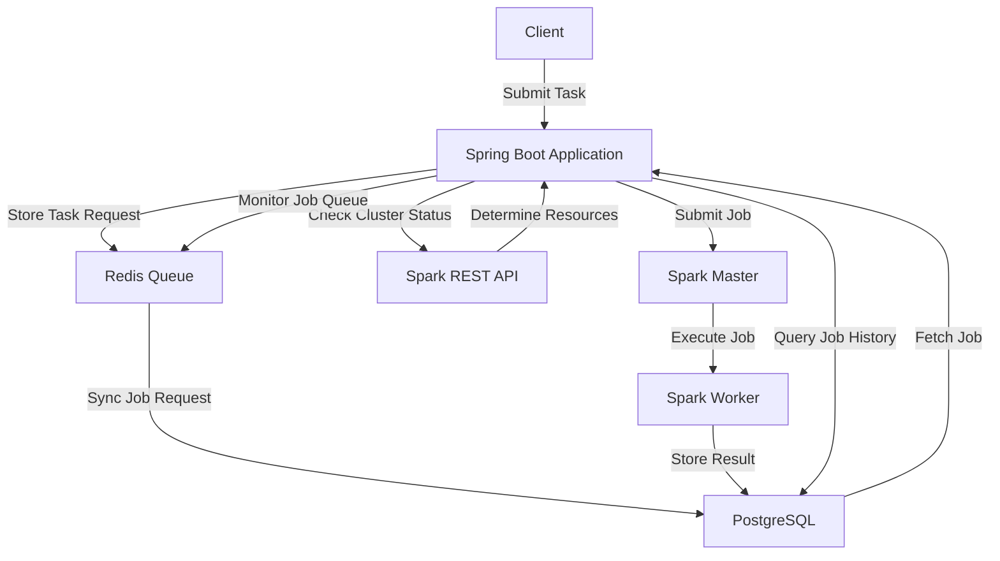
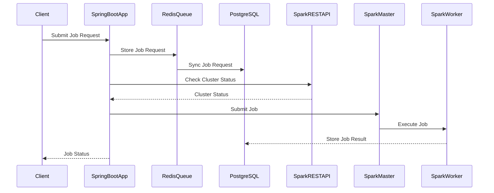
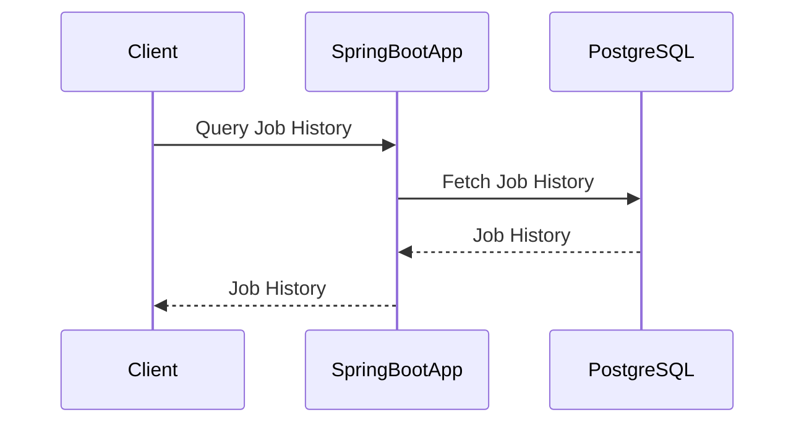

1. [Tech Stack and Target Environment](#tech-stack-and-environment)
2. [Architecture Design](#architecture-design)
3. [Flow Descriptions](#flow-description)
   - [Spark Job Submission Flow](#spark-job-submission-flow)
4. [Sequence Diagrams](#sequence-diagrams)
5. [Components Design](#components-design)
6. [Configuration and Code](#configuration-and-code)
7. [Job Queue Management](#job-queue-management)
8. [Spark Job Submission](#spark-job-submission)
9. [Test Cases](#test-cases)
10. [Global Exception Handler](#global-exception-handler)
11. [Project Structure](#project-structure)


In this article, we will explore the development of a stateless Spring Boot application using Spring WebFlux 3.3.5 and Apache Spark 3.5.4. This application will serve as a Spark-as-a-Service, designed to run in a Kubernetes (K8s) environment with multiple replicas. The application will use a centralized queue in Redis to manage Spark job requests, with a copy of the job queue also maintained in PostgreSQL for job history and tracking. The application will ensure that each job is executed only once, manage job states and statuses correctly, and provide RESTful endpoints for client interaction and monitoring.

<a name="tech-stack-and-environment"></a>
## Tech Stack and Target Environment

### Spark Cluster
- **Version**: 3.5.4
- **Deployment**: Kubernetes namespace `whereq-saas-spark`
- **Configuration**: Default Bitnami Helm chart (1 master, 2 workers)

### Spring Boot WebFlux Application
- **Version**: 3.3.5
- **Deployment**: Kubernetes namespace `whereq-saas-web`
- **Replicas**: 2
- **Ingress**: Exposed for frontend access

### Queue and Database
- **Queue**: Redis (for job queue management)
- **Database**: PostgreSQL with R2DBC driver
- **Container Orchestration**: Kubernetes

---

<a name="architecture-design"></a>
## Architecture Design
The application is structured to be stateless and scalable. It integrates with Redis to queue job submissions, PostgreSQL for persistent storage, and the Spark REST API for job submission and tracking.

### High-Level Architecture


### Components
- **Job Controller**: Accepts job submissions via HTTP POST and returns a task ID.
- **Job Queue Service**: Handles job insertion into Redis and PostgreSQL.
- **Job Monitor Service**: Monitors Redis, submits jobs to Spark, and tracks job status.
- **Spark Service**: Interfaces with the Spark REST API for job submission and status updates.
- **State Machine**: Manages job state transitions (e.g., ready, running, completed) and status updates (success, failed).

### Architecture Diagram
```plaintext
+---------------+       +---------------------+        +----------------+
| Job Controller| ----> | Job Queue Service   | -----> | Redis Queue    |
+---------------+       +---------------------+        +----------------+
                                                            |
   +--------------------------------------------------------+
   |
+-------------------+        +------------------+         +------------------+
| Job Monitor       | -----> | Spark Service    | <-----> | Spark Master Pod |
| (Background Task) |        +------------------+         +------------------+
+-------------------+             |
                                  |
                     +-------------------------------+
                     |  PostgreSQL (Sync Job State)  |
                     +-------------------------------+
```

### Detailed Architecture

1. **Client**: Submits Spark job requests via RESTful endpoints.
2. **Spring Boot Application**:
   - Receives job requests.
   - Stores job requests in the Redis queue.
   - Syncs job requests with PostgreSQL.
   - Checks cluster status via Spark REST API.
   - Submits jobs to Spark Master based on available resources.
   - Manages job states and statuses.
   - Provides RESTful endpoints for job history queries and monitoring.
3. **Redis Queue**: Stores job requests.
4. **PostgreSQL**: Stores job requests and history.
5. **Spark REST API**: Provides cluster status information.
6. **Spark Master**: Receives job submissions.
7. **Spark Worker**: Executes Spark jobs.
8. **PostgreSQL**: Stores job results and history.

<a name="flow-descriptions"></a>
## Flow Descriptions


<a name="task-submission-flow"></a>
### Task Submission Flow
1. **Task Controller** receives task requests via HTTP POST.
2. **Task Queue Service** validates the request, assigns a task ID, stores it in Redis with a `READY` state, and syncs it to PostgreSQL.
3. The service returns a task ID to the client.

<a name="spark-job-submission-flow"></a>
### Spark Job Submission Flow

1. **Job Monitor Service** picks up jobs in the `READY` state from the Redis queue using FIFO.
2. The job is submitted to the Spark master via the **Spark Service**, and the job state is updated to `SUBMITTED`.
3. The state is synced to PostgreSQL.
4. The **Job Monitor Service** starts tracking the job status until completion or failure.
5. The final state (`COMPLETED` or `FAILED`) is updated in both Redis and PostgreSQL.

---



### Job History Query



## <a name="components-design"></a>
## Components Design

### 1. Job Request Model

```java
public class JobRequest {
    private String id;
    private String jobName;
    private String jobConfig;
    private JobState state;
    private JobStatus status;
    // Getters and Setters
}
```

### 2. Job State and Status Enums

```java
public enum JobState {
    READY, PENDING, RUNNING, COMPLETED
}

public enum JobStatus {
    SUCCESS, FAILED
}
```

### 3. Redis Queue Service

```java
@Service
public class RedisQueueService {
    private final ReactiveRedisTemplate<String, JobRequest> redisTemplate;

    public RedisQueueService(ReactiveRedisTemplate<String, JobRequest> redisTemplate) {
        this.redisTemplate = redisTemplate;
    }

    public Mono<Boolean> enqueueJob(JobRequest jobRequest) {
        return redisTemplate.opsForList().rightPush("jobQueue", jobRequest);
    }

    public Mono<JobRequest> dequeueJob() {
        return redisTemplate.opsForList().leftPop("jobQueue");
    }

    public Mono<Boolean> updateJobStatusInQueue(String jobId, JobState state, JobStatus status) {
        return redisTemplate.opsForList().indexOf("jobQueue", jobId)
                .flatMap(index -> redisTemplate.opsForList().set(index, new JobRequest(jobId, state, status)));
    }
}
```

### 4. PostgreSQL Service

```java
@Service
public class PostgresService {
    private final R2dbcEntityTemplate r2dbcEntityTemplate;

    public PostgresService(R2dbcEntityTemplate r2dbcEntityTemplate) {
        this.r2dbcEntityTemplate = r2dbcEntityTemplate;
    }

    public Mono<JobRequest> saveJobRequest(JobRequest jobRequest) {
        return r2dbcEntityTemplate.insert(jobRequest);
    }

    public Mono<JobRequest> getJobById(String jobId) {
        return r2dbcEntityTemplate.selectOne(Query.query(Criteria.where("id").is(jobId)), JobRequest.class);
    }

    public Mono<Integer> updateJobStatus(String jobId, JobState state, JobStatus status) {
        return r2dbcEntityTemplate.update(JobRequest.class)
                .matching(Query.query(Criteria.where("id").is(jobId)))
                .apply(Update.update("state", state).set("status", status));
    }

    public Flux<JobRequest> getJobHistory(Map<String, String> queryParams) {
        // Fetch job history from PostgreSQL
        return r2dbcEntityTemplate.select(JobRequest.class).all();
    }
}
```

### 5. Spark REST API Service

```java
@Service
public class SparkRestApiService {
    private final WebClient webClient;

    public SparkRestApiService(WebClient.Builder webClientBuilder) {
        this.webClient = webClientBuilder.baseUrl("http://spark-master:8080").build();
    }

    public Mono<ClusterStatus> getClusterStatus() {
        return webClient.get()
                .uri("/api/v1/applications")
                .retrieve()
                .bodyToMono(String.class)
                .map(response -> {
                    // Parse response and return ClusterStatus
                    return new ClusterStatus();
                });
    }

    public Mono<JobStatus> monitorJobStatus(String jobId) {
        return webClient.get()
                .uri("/api/v1/submissions/status/{jobId}", jobId)
                .retrieve()
                .bodyToMono(String.class)
                .map(response -> {
                    // Parse response and return JobStatus
                    return JobStatus.SUCCESS; // Example
                });
    }
}
```

### 6. Job Executor Service

```java
@Service
public class JobExecutorService {
    private final RedisQueueService redisQueueService;
    private final PostgresService postgresService;
    private final SparkRestApiService sparkRestApiService;
    private final WebClient webClient;

    public JobExecutorService(RedisQueueService redisQueueService, PostgresService postgresService, SparkRestApiService sparkRestApiService, WebClient.Builder webClientBuilder) {
        this.redisQueueService = redisQueueService;
        this.postgresService = postgresService;
        this.sparkRestApiService = sparkRestApiService;
        this.webClient = webClientBuilder.baseUrl("http://spark-master:8080").build();
    }

    public Mono<Void> executeNextJob() {
        return redisQueueService.dequeueJob()
                .flatMap(jobRequest -> {
                    jobRequest.setState(JobState.PENDING);
                    return postgresService.updateJobStatus(jobRequest.getId(), JobState.PENDING, JobStatus.SUCCESS)
                            .then(sparkRestApiService.getClusterStatus())
                            .flatMap(clusterStatus -> {
                                if (clusterStatus.hasAvailableResources()) {
                                    return submitJobToSpark(jobRequest);
                                } else {
                                    return redisQueueService.enqueueJob(jobRequest).then();
                                }
                            });
                });
    }

    private Mono<Void> submitJobToSpark(JobRequest jobRequest) {
        return webClient.post()
                .uri("/v1/submissions/create")
                .bodyValue(jobRequest)
                .retrieve()
                .toBodilessEntity()
                .flatMap(response -> {
                    if (response.getStatusCode().is2xxSuccessful()) {
                        jobRequest.setState(JobState.RUNNING);
                        return postgresService.updateJobStatus(jobRequest.getId(), JobState.RUNNING, JobStatus.SUCCESS)
                                .then(monitorJobResult(jobRequest));
                    } else {
                        jobRequest.setState(JobState.COMPLETED);
                        jobRequest.setStatus(JobStatus.FAILED);
                        return updateJobStatus(jobRequest);
                    }
                });
    }

    private Mono<Void> monitorJobResult(JobRequest jobRequest) {
        return sparkRestApiService.monitorJobStatus(jobRequest.getId())
                .flatMap(jobStatus -> {
                    jobRequest.setState(JobState.COMPLETED);
                    jobRequest.setStatus(jobStatus);
                    return updateJobStatus(jobRequest);
                });
    }

    private Mono<Void> updateJobStatus(JobRequest jobRequest) {
        return redisQueueService.updateJobStatusInQueue(jobRequest.getId(), jobRequest.getState(), jobRequest.getStatus())
                .then(postgresService.updateJobStatus(jobRequest.getId(), jobRequest.getState(), jobRequest.getStatus()))
                .then();
    }
}
```

### 7. RESTful Endpoints

```java
@RestController
@RequestMapping("/api/jobs")
public class JobController {
    private final JobExecutorService jobExecutorService;
    private final PostgresService postgresService;

    public JobController(JobExecutorService jobExecutorService, PostgresService postgresService) {
        this.jobExecutorService = jobExecutorService;
        this.postgresService = postgresService;
    }

    @PostMapping
    public Mono<ResponseEntity<String>> submitJob(@RequestBody JobRequest jobRequest) {
        return jobExecutorService.submitJob(jobRequest)
                .thenReturn(ResponseEntity.ok("Job submitted successfully"));
    }

    @GetMapping("/history")
    public Flux<JobRequest> getJobHistory(@RequestParam Map<String, String> queryParams) {
        return postgresService.getJobHistory(queryParams);
    }

    @GetMapping("/status")
    public Mono<ResponseEntity<String>> getJobStatus(@RequestParam String jobId) {
        return postgresService.getJobById(jobId)
                .map(jobRequest -> ResponseEntity.ok(jobRequest.getStatus().name()));
    }
}
```

## <a name="configuration-and-code"></a>
## Configuration and Code

### 1. Spring Boot Application Configuration

```yaml
spring:
  redis:
    host: localhost
    port: 6379
  r2dbc:
    url: r2dbc:postgresql://localhost:5432/spark_jobs
    username: postgres
    password: postgres
  webclient:
    baseUrl: http://spark-master:8080
```

### 2. Spark REST API Configuration

```java
@Configuration
public class SparkRestApiConfig {
    @Bean
    public WebClient.Builder webClientBuilder() {
        return WebClient.builder();
    }
}
```

### 3. Redis Configuration

```java
@Configuration
public class RedisConfig {
    @Bean
    public ReactiveRedisTemplate<String, JobRequest> reactiveRedisTemplate(ReactiveRedisConnectionFactory factory) {
        RedisSerializationContext<String, JobRequest> serializationContext = RedisSerializationContext
                .newSerializationContext(new StringRedisSerializer())
                .value(new Jackson2JsonRedisSerializer<>(JobRequest.class))
                .build();
        return new ReactiveRedisTemplate<>(factory, serializationContext);
    }
}
```

### 4. R2DBC Configuration

```java
@Configuration
public class R2dbcConfig {
    @Bean
    public ConnectionFactory connectionFactory(R2dbcProperties properties) {
        return ConnectionFactories.get(properties.getUrl());
    }

    @Bean
    public R2dbcEntityTemplate r2dbcEntityTemplate(ConnectionFactory connectionFactory) {
        DatabaseClient databaseClient = DatabaseClient.create(connectionFactory);
        return new R2dbcEntityTemplate(databaseClient);
    }
}
```

### 5. Swagger Configuration

```java
@Configuration
@EnableSwagger2WebFlux
public class SwaggerConfig {
    @Bean
    public Docket api() {
        return new Docket(DocumentationType.SWAGGER_2)
                .select()
                .apis(RequestHandlerSelectors.basePackage("com.example.sparkasaservice.controller"))
                .paths(PathSelectors.any())
                .build();
    }
}
```

## <a name="job-queue-management"></a>
## Job Queue Management

### 1. Job Queue Service

The `RedisQueueService` class is responsible for managing the job queue in Redis.

```java
@Service
public class RedisQueueService {
    private final ReactiveRedisTemplate<String, JobRequest> redisTemplate;

    public RedisQueueService(ReactiveRedisTemplate<String, JobRequest> redisTemplate) {
        this.redisTemplate = redisTemplate;
    }

    public Mono<Boolean> enqueueJob(JobRequest jobRequest) {
        return redisTemplate.opsForList().rightPush("jobQueue", jobRequest);
    }

    public Mono<JobRequest> dequeueJob() {
        return redisTemplate.opsForList().leftPop("jobQueue");
    }

    public Mono<Boolean> updateJobStatusInQueue(String jobId, JobState state, JobStatus status) {
        return redisTemplate.opsForList().indexOf("jobQueue", jobId)
                .flatMap(index -> redisTemplate.opsForList().set(index, new JobRequest(jobId, state, status)));
    }
}
```

### 2. Job State Management

The `JobRequest` class includes fields for `JobState` and `JobStatus` to manage the state and status of each job.

```java
public class JobRequest {
    private String id;
    private String jobName;
    private String jobConfig;
    private JobState state;
    private JobStatus status;
    // Getters and Setters
}
```

### 3. Job Execution

The `JobExecutorService` class is responsible for executing jobs from the queue. It ensures that each job is executed only once and updates the job state and status accordingly.

```java
@Service
public class JobExecutorService {
    private final RedisQueueService redisQueueService;
    private final PostgresService postgresService;
    private final SparkRestApiService sparkRestApiService;
    private final WebClient webClient;

    public JobExecutorService(RedisQueueService redisQueueService, PostgresService postgresService, SparkRestApiService sparkRestApiService, WebClient.Builder webClientBuilder) {
        this.redisQueueService = redisQueueService;
        this.postgresService = postgresService;
        this.sparkRestApiService = sparkRestApiService;
        this.webClient = webClientBuilder.baseUrl("http://spark-master:8080").build();
    }

    public Mono<Void> executeNextJob() {
        return redisQueueService.dequeueJob()
                .flatMap(jobRequest -> {
                    jobRequest.setState(JobState.PENDING);
                    return postgresService.updateJobStatus(jobRequest.getId(), JobState.PENDING, JobStatus.SUCCESS)
                            .then(sparkRestApiService.getClusterStatus())
                            .flatMap(clusterStatus -> {
                                if (clusterStatus.hasAvailableResources()) {
                                    return submitJobToSpark(jobRequest);
                                } else {
                                    return redisQueueService.enqueueJob(jobRequest).then();
                                }
                            });
                });
    }

    private Mono<Void> submitJobToSpark(JobRequest jobRequest) {
        return webClient.post()
                .uri("/v1/submissions/create")
                .bodyValue(jobRequest)
                .retrieve()
                .toBodilessEntity()
                .flatMap(response -> {
                    if (response.getStatusCode().is2xxSuccessful()) {
                        jobRequest.setState(JobState.RUNNING);
                        return postgresService.updateJobStatus(jobRequest.getId(), JobState.RUNNING, JobStatus.SUCCESS)
                                .then(monitorJobResult(jobRequest));
                    } else {
                        jobRequest.setState(JobState.COMPLETED);
                        jobRequest.setStatus(JobStatus.FAILED);
                        return updateJobStatus(jobRequest);
                    }
                });
    }

    private Mono<Void> monitorJobResult(JobRequest jobRequest) {
        return sparkRestApiService.monitorJobStatus(jobRequest.getId())
                .flatMap(jobStatus -> {
                    jobRequest.setState(JobState.COMPLETED);
                    jobRequest.setStatus(jobStatus);
                    return updateJobStatus(jobRequest);
                });
    }

    private Mono<Void> updateJobStatus(JobRequest jobRequest) {
        return redisQueueService.updateJobStatusInQueue(jobRequest.getId(), jobRequest.getState(), jobRequest.getStatus())
                .then(postgresService.updateJobStatus(jobRequest.getId(), jobRequest.getState(), jobRequest.getStatus()))
                .then();
    }
}
```

## <a name="spark-job-submission"></a>
## Spark Job Submission

### 1. Job Submission Endpoint

The `JobController` class provides an endpoint for submitting jobs. It uses the `JobExecutorService` to handle job submission.

```java
@RestController
@RequestMapping("/api/jobs")
public class JobController {
    private final JobExecutorService jobExecutorService;
    private final PostgresService postgresService;

    public JobController(JobExecutorService jobExecutorService, PostgresService postgresService) {
        this.jobExecutorService = jobExecutorService;
        this.postgresService = postgresService;
    }

    @PostMapping
    public Mono<ResponseEntity<String>> submitJob(@RequestBody JobRequest jobRequest) {
        return jobExecutorService.submitJob(jobRequest)
                .thenReturn(ResponseEntity.ok("Job submitted successfully"));
    }

    @GetMapping("/history")
    public Flux<JobRequest> getJobHistory(@RequestParam Map<String, String> queryParams) {
        return postgresService.getJobHistory(queryParams);
    }

    @GetMapping("/status")
    public Mono<ResponseEntity<String>> getJobStatus(@RequestParam String jobId) {
        return postgresService.getJobById(jobId)
                .map(jobRequest -> ResponseEntity.ok(jobRequest.getStatus().name()));
    }
}
```

### 2. Job Execution

The `JobExecutorService` class is responsible for executing jobs from the queue. It ensures that each job is executed only once and updates the job state and status accordingly.

```java
@Service
public class JobExecutorService {
    private final RedisQueueService redisQueueService;
    private final PostgresService postgresService;
    private final SparkRestApiService sparkRestApiService;
    private final WebClient webClient;

    public JobExecutorService(RedisQueueService redisQueueService, PostgresService postgresService, SparkRestApiService sparkRestApiService, WebClient.Builder webClientBuilder) {
        this.redisQueueService = redisQueueService;
        this.postgresService = postgresService;
        this.sparkRestApiService = sparkRestApiService;
        this.webClient = webClientBuilder.baseUrl("http://spark-master:8080").build();
    }

    public Mono<Void> executeNextJob() {
        return redisQueueService.dequeueJob()
                .flatMap(jobRequest -> {
                    jobRequest.setState(JobState.PENDING);
                    return postgresService.updateJobStatus(jobRequest.getId(), JobState.PENDING, JobStatus.SUCCESS)
                            .then(sparkRestApiService.getClusterStatus())
                            .flatMap(clusterStatus -> {
                                if (clusterStatus.hasAvailableResources()) {
                                    return submitJobToSpark(jobRequest);
                                } else {
                                    return redisQueueService.enqueueJob(jobRequest).then();
                                }
                            });
                });
    }

    private Mono<Void> submitJobToSpark(JobRequest jobRequest) {
        return webClient.post()
                .uri("/v1/submissions/create")
                .bodyValue(jobRequest)
                .retrieve()
                .toBodilessEntity()
                .flatMap(response -> {
                    if (response.getStatusCode().is2xxSuccessful()) {
                        jobRequest.setState(JobState.RUNNING);
                        return postgresService.updateJobStatus(jobRequest.getId(), JobState.RUNNING, JobStatus.SUCCESS)
                                .then(monitorJobResult(jobRequest));
                    } else {
                        jobRequest.setState(JobState.COMPLETED);
                        jobRequest.setStatus(JobStatus.FAILED);
                        return updateJobStatus(jobRequest);
                    }
                });
    }

    private Mono<Void> monitorJobResult(JobRequest jobRequest) {
        return sparkRestApiService.monitorJobStatus(jobRequest.getId())
                .flatMap(jobStatus -> {
                    jobRequest.setState(JobState.COMPLETED);
                    jobRequest.setStatus(jobStatus);
                    return updateJobStatus(jobRequest);
                });
    }

    private Mono<Void> updateJobStatus(JobRequest jobRequest) {
        return redisQueueService.updateJobStatusInQueue(jobRequest.getId(), jobRequest.getState(), jobRequest.getStatus())
                .then(postgresService.updateJobStatus(jobRequest.getId(), jobRequest.getState(), jobRequest.getStatus()))
                .then();
    }
}
```

## <a name="test-cases"></a>
## Test Cases

### 1. Job Submission Test

```java
@SpringBootTest
@AutoConfigureWebTestClient
public class JobControllerTest {

    @Autowired
    private WebTestClient webTestClient;

    @Test
    public void testJobSubmission() {
        JobRequest jobRequest = new JobRequest();
        jobRequest.setId("1");
        jobRequest.setJobName("TestJob");
        jobRequest.setJobConfig("SELECT * FROM test_table");

        webTestClient.post().uri("/api/jobs")
                .contentType(MediaType.APPLICATION_JSON)
                .bodyValue(jobRequest)
                .exchange()
                .expectStatus().isOk()
                .expectBody(String.class).isEqualTo("Job submitted successfully");
    }
}
```

### 2. Job Execution Test

```java
@SpringBootTest
public class JobExecutorServiceTest {

    @Autowired
    private JobExecutorService jobExecutorService;

    @Autowired
    private RedisQueueService redisQueueService;

    @Autowired
    private PostgresService postgresService;

    @Test
    public void testJobExecution() {
        JobRequest jobRequest = new JobRequest();
        jobRequest.setId("1");
        jobRequest.setJobName("TestJob");
        jobRequest.setJobConfig("SELECT * FROM test_table");

        StepVerifier.create(redisQueueService.enqueueJob(jobRequest)
                .then(jobExecutorService.executeNextJob())
                .then(postgresService.getJobById("1")))
                .expectNextMatches(executedJob -> {
                    assertNotNull(executedJob);
                    assertEquals(JobState.COMPLETED, executedJob.getState());
                    assertEquals(JobStatus.SUCCESS, executedJob.getStatus());
                    return true;
                })
                .verifyComplete();
    }
}
```

### 3. Job History Query Test

```java
@SpringBootTest
@AutoConfigureWebTestClient
public class JobControllerTest {

    @Autowired
    private WebTestClient webTestClient;

    @Test
    public void testJobHistoryQuery() {
        webTestClient.get().uri(uriBuilder -> uriBuilder
                .path("/api/jobs/history")
                .queryParam("jobName", "TestJob")
                .build())
                .exchange()
                .expectStatus().isOk()
                .expectBodyList(JobRequest.class)
                .value(jobRequests -> {
                    assertNotNull(jobRequests);
                    assertTrue(jobRequests.stream().anyMatch(jobRequest -> "TestJob".equals(jobRequest.getJobName())));
                });
    }
}
```

### 4. Job Status Query Test

```java
@SpringBootTest
@AutoConfigureWebTestClient
public class JobControllerTest {

    @Autowired
    private WebTestClient webTestClient;

    @Test
    public void testJobStatusQuery() {
        webTestClient.get().uri("/api/jobs/status?jobId=1")
                .exchange()
                .expectStatus().isOk()
                .expectBody(String.class).isEqualTo("SUCCESS");
    }
}
```

## <a name="global-exception-handler"></a>
## Global Exception Handler

### 1. Global Exception Handler Configuration

```java
@ControllerAdvice
public class GlobalExceptionHandler {

    @ExceptionHandler(Exception.class)
    public ResponseEntity<String> handleException(Exception ex) {
        return ResponseEntity.status(HttpStatus.INTERNAL_SERVER_ERROR).body("An error occurred: " + ex.getMessage());
    }

    @ExceptionHandler(WebClientResponseException.class)
    public ResponseEntity<String> handleWebClientResponseException(WebClientResponseException ex) {
        return ResponseEntity.status(ex.getStatusCode()).body("WebClient error: " + ex.getResponseBodyAsString());
    }

    @ExceptionHandler(R2dbcDataIntegrityViolationException.class)
    public ResponseEntity<String> handleDataIntegrityViolationException(R2dbcDataIntegrityViolationException ex) {
        return ResponseEntity.status(HttpStatus.BAD_REQUEST).body("Data integrity violation: " + ex.getMessage());
    }
}
```

## <a name="project-structure"></a>
## Project Structure

### Project Structure Diagram

```
spark-as-a-service/
├── src/
│   ├── main/
│   │   ├── java/
│   │   │   └── com/
│   │   │       └── example/
│   │   │           └── sparkasaservice/
│   │   │               ├── config/
│   │   │               │   ├── RedisConfig.java
│   │   │               │   ├── SparkRestApiConfig.java
│   │   │               │   ├── R2dbcConfig.java
│   │   │               │   └── SwaggerConfig.java
│   │   │               ├── controller/
│   │   │               │   └── JobController.java
│   │   │               ├── exception/
│   │   │               │   └── GlobalExceptionHandler.java
│   │   │               ├── model/
│   │   │               │   ├── JobRequest.java
│   │   │               │   ├── JobState.java
│   │   │               │   └── JobStatus.java
│   │   │               ├── repository/
│   │   │               │   └── JobRepository.java
│   │   │               ├── service/
│   │   │               │   ├── JobExecutorService.java
│   │   │               │   ├── PostgresService.java
│   │   │               │   ├── RedisQueueService.java
│   │   │               │   └── SparkRestApiService.java
│   │   │               └── SparkAsAServiceApplication.java
│   │   └── resources/
│   │       ├── application.yml
│   │       └── schema.sql
│   └── test/
│       ├── java/
│       │   └── com/
│       │       └── example/
│       │           └── sparkasaservice/
│       │               ├── controller/
│       │               │   └── JobControllerTest.java
│       │               ├── service/
│       │               │   └── JobExecutorServiceTest.java
│       │               └── SparkAsAServiceApplicationTests.java
│       └── resources/
│           └── application-test.yml
└── pom.xml
```

## Listening to Redis Queue

### 1. Redis Queue Listener Configuration

To listen to the Redis queue and trigger the `executeNextJob` method, we can use Spring Data Redis's reactive support with Lettuce as the Redis client.

### 2. Redis Queue Listener Service

```java
@Service
public class RedisQueueListenerService {
    private final JobExecutorService jobExecutorService;
    private final ReactiveRedisTemplate<String, JobRequest> redisTemplate;

    public RedisQueueListenerService(JobExecutorService jobExecutorService, ReactiveRedisTemplate<String, JobRequest> redisTemplate) {
        this.jobExecutorService = jobExecutorService;
        this.redisTemplate = redisTemplate;
    }

    @PostConstruct
    public void startListening() {
        redisTemplate.listenToPattern("__keyevent@*__:rpush")
                .doOnNext(message -> {
                    if (message.getChannel().equals("__keyevent@0__:rpush") && message.getMessage().equals("jobQueue")) {
                        jobExecutorService.executeNextJob().subscribe();
                    }
                })
                .subscribe();
    }
}
```

### 3. Redis Configuration for Pub/Sub

```java
@Configuration
public class RedisConfig {
    @Bean
    public ReactiveRedisTemplate<String, JobRequest> reactiveRedisTemplate(ReactiveRedisConnectionFactory factory) {
        RedisSerializationContext<String, JobRequest> serializationContext = RedisSerializationContext
                .newSerializationContext(new StringRedisSerializer())
                .value(new Jackson2JsonRedisSerializer<>(JobRequest.class))
                .build();
        return new ReactiveRedisTemplate<>(factory, serializationContext);
    }

    @Bean
    public ReactiveRedisConnectionFactory reactiveRedisConnectionFactory(RedisProperties redisProperties) {
        return new LettuceConnectionFactory(redisProperties.getHost(), redisProperties.getPort());
    }
}
```

This article provides a comprehensive guide to developing a stateless Spring Boot application for Spark as a Service, along with detailed explanations of job queue management, Spark job submission, and test cases. Each section is designed to be detailed and actionable, ensuring that readers can implement the concepts effectively.