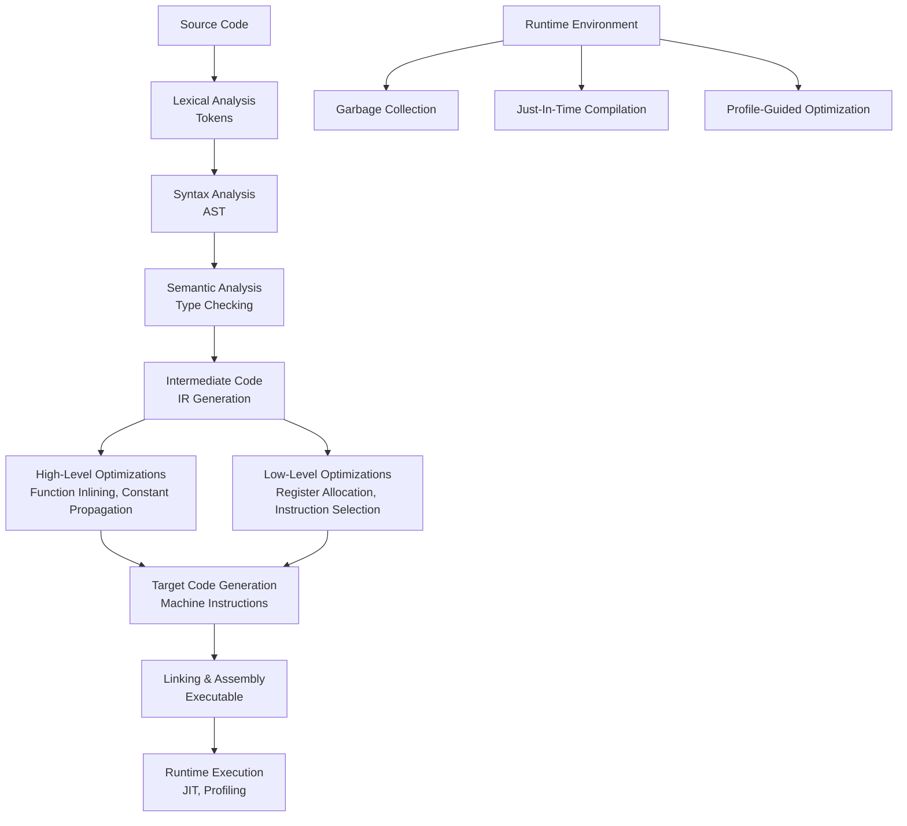

# The Complete Guide to Function Compilation and Optimization: From Source Code to Machine Execution

## 📊 The Complete Compilation Pipeline



## 1. 🎯 Introduction: The Journey of a Function

When you write a simple Python function like:

```python
def add(a: int, b: int) -> int:
    return a + b
```

It undergoes a **complex transformation** through multiple layers before becoming machine-executable code. This process varies significantly across languages (compiled vs. interpreted, static vs. dynamic typing), but follows similar fundamental principles.

## 2. 🏗️ The Compilation Pipeline: Step-by-Step

### 2.1 Lexical Analysis (Tokenization)

**What happens**: Source code is broken into tokens (keywords, identifiers, operators).

```python
# Source: result = add(5, 3)
# Tokens generated:
[
    ('IDENTIFIER', 'result'),
    ('OPERATOR', '='),
    ('IDENTIFIER', 'add'),
    ('LPAREN', '('),
    ('NUMBER', '5'),
    ('COMMA', ','),
    ('NUMBER', '3'),
    ('RPAREN', ')'),
    ('SEMICOLON', ';')
]
```

**Implementation example** (simplified scanner):

```c
// C-like pseudocode for tokenizer
typedef enum {
    TOKEN_ID, TOKEN_NUMBER, TOKEN_OPERATOR,
    TOKEN_LPAREN, TOKEN_RPAREN, TOKEN_EOF
} TokenType;

Token scan_token(const char* source) {
    while (*source) {
        if (isalpha(*source)) {
            return scan_identifier(source);
        } else if (isdigit(*source)) {
            return scan_number(source);
        } else if (*source == '(') {
            source++;
            return make_token(TOKEN_LPAREN, "(");
        }
        // ... handle other tokens
    }
    return make_token(TOKEN_EOF, "");
}
```

### 2.2 Syntax Analysis (Parsing) → AST Generation

**What happens**: Tokens are organized into an Abstract Syntax Tree (AST) representing program structure.

```python
# Function call add(5, 3) becomes this AST structure:
CallExpression
├── function: Identifier("add")
└── arguments:
    ├── NumberLiteral(5)
    └── NumberLiteral(3)

# Corresponding JSON representation:
{
    "type": "CallExpression",
    "callee": {"type": "Identifier", "name": "add"},
    "arguments": [
        {"type": "NumberLiteral", "value": 5},
        {"type": "NumberLiteral", "value": 3}
    ]
}
```

**Parser implementation**:

```python
# Python-like parser for expressions
class Parser:
    def parse_expression(self):
        """Parse a single expression"""
        if self.current_token.type == 'IDENTIFIER':
            return self.parse_function_call()
        elif self.current_token.type == 'NUMBER':
            return self.parse_number()
        # ...
    
    def parse_function_call(self):
        """Parse function call like add(5, 3)"""
        func_name = self.current_token.value
        self.consume_token()  # Skip identifier
        
        if self.current_token.type != 'LPAREN':
            return IdentifierNode(func_name)
        
        self.consume_token()  # Skip '('
        args = self.parse_argument_list()
        self.consume_token()  # Skip ')'
        
        return CallExpressionNode(func_name, args)
```

### 2.3 Semantic Analysis

**What happens**: The AST is analyzed for semantic correctness (type checking, scope resolution, etc.).

```python
# Type checking example
def type_check(node, symbol_table):
    if isinstance(node, CallExpressionNode):
        # 1. Check function exists
        func_type = symbol_table.lookup(node.func_name)
        if not func_type:
            raise TypeError(f"Undefined function: {node.func_name}")
        
        # 2. Check argument count
        expected_args = func_type.parameter_types
        if len(node.arguments) != len(expected_args):
            raise TypeError(f"Expected {len(expected_args)} arguments, got {len(node.arguments)}")
        
        # 3. Check argument types
        for i, (arg, expected_type) in enumerate(zip(node.arguments, expected_args)):
            arg_type = type_check(arg, symbol_table)
            if arg_type != expected_type:
                raise TypeError(f"Argument {i}: expected {expected_type}, got {arg_type}")
        
        return func_type.return_type
```

### 2.4 Intermediate Representation (IR) Generation

**What happens**: The AST is converted into an intermediate representation that's easier to optimize.

#### **Three-Address Code (TAC) Example**:
```llvm
; LLVM IR for: result = add(5, 3)
define i32 @add(i32 %a, i32 %b) {
entry:
  %tmp = add i32 %a, %b
  ret i32 %tmp
}

define i32 @main() {
entry:
  %result = call i32 @add(i32 5, i32 3)
  ret i32 %result
}
```

#### **Control Flow Graph (CFG) Generation**:
```python
# Python representation of basic blocks
class BasicBlock:
    def __init__(self, name):
        self.name = name
        self.instructions = []
        self.successors = []  # Where control flows next
        self.predecessors = []  # Where control comes from

def build_cfg(function_ast):
    """Convert function AST to Control Flow Graph"""
    cfg = {}
    current_block = BasicBlock("entry")
    
    for statement in function_ast.body:
        if isinstance(statement, IfStatement):
            # Create conditional branches
            then_block = BasicBlock("then")
            else_block = BasicBlock("else")
            merge_block = BasicBlock("merge")
            
            current_block.successors = [then_block, else_block]
            then_block.predecessors = [current_block]
            else_block.predecessors = [current_block]
            
            # Process then and else branches
            process_block(then_block, statement.then_branch)
            process_block(else_block, statement.else_branch)
            
            then_block.successors = [merge_block]
            else_block.successors = [merge_block]
            merge_block.predecessors = [then_block, else_block]
            
            current_block = merge_block
        else:
            current_block.instructions.append(statement)
    
    return cfg
```

## 3. ⚡ Optimization Phases

### 3.1 High-Level Optimizations (Machine-Independent)

```llvm
; BEFORE OPTIMIZATION
define i32 @calculate(i32 %x) {
entry:
  %a = mul i32 %x, 2
  %b = add i32 %a, 10
  %c = mul i32 %x, 2    ; Redundant computation!
  %d = sub i32 %b, %c
  ret i32 %d
}

; AFTER COMMON SUBEXPRESSION ELIMINATION (CSE)
define i32 @calculate(i32 %x) {
entry:
  %tmp = mul i32 %x, 2    ; Compute once, reuse
  %b = add i32 %tmp, 10
  %d = sub i32 %b, %tmp   ; Reuse the computed value
  ret i32 %d
}

; AFTER CONSTANT FOLDING & DEAD CODE ELIMINATION
define i32 @calculate(i32 %x) {
entry:
  %tmp = mul i32 %x, 2
  %result = add i32 %tmp, 10
  ret i32 %result  ; Simplified: (x*2) + 10
}
```

#### **Optimization Implementation Examples**:

```python
class Optimizer:
    def constant_folding(self, node):
        """Replace constant expressions with their values"""
        if isinstance(node, BinaryOpNode):
            left = self.constant_folding(node.left)
            right = self.constant_folding(node.right)
            
            if isinstance(left, ConstantNode) and isinstance(right, ConstantNode):
                # Both operands are constants, compute at compile time
                if node.operator == '+':
                    return ConstantNode(left.value + right.value)
                elif node.operator == '*':
                    return ConstantNode(left.value * right.value)
                # ... other operators
        
        return node
    
    def dead_code_elimination(self, function):
        """Remove code that doesn't affect program output"""
        used_variables = self.find_live_variables(function)
        
        # Remove assignments to unused variables
        new_body = []
        for statement in function.body:
            if isinstance(statement, AssignmentNode):
                if statement.target.name in used_variables:
                    new_body.append(statement)
                # else: discard dead assignment
            else:
                new_body.append(statement)
        
        function.body = new_body
        return function
    
    def function_inlining(self, call_site):
        """Replace function call with function body"""
        if not self.should_inline(call_site):
            return call_site
        
        function = call_site.function
        # Create copy of function body
        inlined_body = copy.deepcopy(function.body)
        
        # Replace parameters with actual arguments
        param_map = dict(zip(function.parameters, call_site.arguments))
        inlined_body = self.substitute_variables(inlined_body, param_map)
        
        return inlined_body
```

### 3.2 Low-Level Optimizations (Machine-Dependent)

#### **Register Allocation (Graph Coloring)**:

```python
class RegisterAllocator:
    def __init__(self):
        self.registers = ['rax', 'rbx', 'rcx', 'rdx', 'rsi', 'rdi']
    
    def allocate_registers(self, live_ranges):
        """
        Live ranges: [(var1, start, end), (var2, start, end), ...]
        Returns: {variable: register} mapping
        """
        # Build interference graph
        graph = self.build_interference_graph(live_ranges)
        
        # Color the graph (assign registers)
        coloring = {}
        for node in sorted(graph.nodes(), key=lambda n: len(graph[n])):
            # Find available color (register)
            used_colors = {coloring.get(neighbor) for neighbor in graph[node]}
            available_colors = set(self.registers) - used_colors
            
            if available_colors:
                coloring[node] = next(iter(available_colors))
            else:
                # Need to spill to memory
                coloring[node] = self.spill_to_memory(node)
        
        return coloring
    
    def build_interference_graph(self, live_ranges):
        """Two variables interfere if their live ranges overlap"""
        graph = nx.Graph()
        
        for i, (var1, start1, end1) in enumerate(live_ranges):
            graph.add_node(var1)
            for j, (var2, start2, end2) in enumerate(live_ranges):
                if i < j and self.ranges_overlap(start1, end1, start2, end2):
                    graph.add_edge(var1, var2)
        
        return graph
```

#### **Instruction Selection (Tree Pattern Matching)**:

```python
# Instruction patterns for x86-64
instruction_patterns = [
    # Pattern: (AST pattern) -> (assembly instructions)
    (('ADD', 'reg', 'reg'), ['add {dest}, {src}']),
    (('ADD', 'reg', 'const'), ['add {dest}, {value}']),
    (('MUL', 'reg', 'reg'), ['imul {dest}, {src}']),
    (('LOAD', 'reg', ('MEM', 'reg', 'offset')), 
     ['mov {dest}, [{base}+{offset}]']),
]

def select_instructions(ast_node, target_arch='x86-64'):
    """Convert AST to target machine instructions"""
    for pattern, template in instruction_patterns:
        if match_pattern(ast_node, pattern):
            bindings = extract_bindings(ast_node, pattern)
            return instantiate_template(template, bindings)
    
    # No matching pattern, generate generic code
    return generate_generic_code(ast_node)
```

## 4. 🔄 Language-Specific Compilation Strategies

### 4.1 C/C++: Ahead-of-Time (AOT) Compilation

```
Source Code (.c/.cpp)
    ↓
Preprocessor (#include, #define expansion)
    ↓
Compiler Frontend (gcc/clang)
    ├── Lexing/Parsing → AST
    ├── Semantic Analysis
    └── IR Generation (GIMPLE/RTL for GCC, LLVM IR for Clang)
    ↓
Optimization Passes (O1/O2/O3)
    ├── -O1: Basic optimizations (dead code elimination, constant propagation)
    ├── -O2: More aggressive (inlining, loop optimizations)
    └── -O3: Maximum optimization (vectorization, parallelization)
    ↓
Code Generation (Assembly .s file)
    ↓
Assembler (Object file .o)
    ↓
Linker (Executable)
```

**Compiler flags and their effects**:
```bash
# Different optimization levels in GCC/Clang
gcc -O0 -o program source.c    # No optimization (fast compilation)
gcc -O1 -o program source.c    # Basic optimizations
gcc -O2 -o program source.c    # Recommended for production
gcc -O3 -o program source.c    # Aggressive optimization
gcc -Os -o program source.c    # Optimize for size
gcc -Ofast -o program source.c # O3 + fast math (may break standards)

# Profile-guided optimization (PGO)
gcc -fprofile-generate -o program source.c
./program <training_data>      # Run with training data
gcc -fprofile-use -o program source.c  # Recompile with profiling data
```

### 4.2 Java: JIT Compilation with HotSpot

```java
// Java method compilation timeline
public class Example {
    public int calculate(int x, int y) {
        return x * y + 42;  // Start as interpreted bytecode
    }
}

// JIT Compilation Process:
// 1. Method executed in interpreter
// 2. Counter increments on each call
// 3. After threshold (10,000 calls), marked as "hot"
// 4. Compiled to native code by C1/C2 compilers
// 5. Optimized based on runtime profiling
```

**HotSpot JIT Compilation Tiers**:
```java
// Tiered compilation in HotSpot JVM
// Level 0: Interpreter
// Level 1: C1 (client compiler) - fast, simple optimizations
// Level 2: C1 with profiling
// Level 3: C1 with full profiling
// Level 4: C2 (server compiler) - aggressive optimizations

// JVM flags for compilation control
// -XX:+TieredCompilation          # Enable tiered compilation (default)
// -XX:TieredStopAtLevel=1         # Stop at C1 compilation
// -XX:CompileThreshold=10000      # Method invocation threshold
// -XX:+PrintCompilation           # Print compilation events
// -XX:+UnlockDiagnosticVMOptions -XX:+PrintAssembly  # Print assembly
```

### 4.3 JavaScript: Modern JIT Compilation (V8 Engine)

```javascript
// V8's TurboFan compilation pipeline
function add(a, b) {
    return a + b;  // Starts as unoptimized bytecode
}

// V8 Compilation Pipeline:
// 1. Ignition Interpreter: Fast startup, generates bytecode
// 2. Profiling: Collects type feedback
// 3. TurboFan Optimizing Compiler:
//    - Inlining
//    - Escape analysis
//    - Type specialization
//    - Dead code elimination

// Deoptimization: Fallback if assumptions fail
function addSpecialized(a, b) {
    // If called with numbers: optimized numeric addition
    // If called with strings: deoptimize → string concatenation
    return a + b;
}
```

**V8 Optimization Strategies**:
```javascript
// Hidden classes and inline caching
function Point(x, y) {
    this.x = x;  // Creates hidden class C0
    this.y = y;  // Transitions to hidden class C1
}

// Same property order = same hidden class = fast access
const p1 = new Point(1, 2);  // Hidden class C1
const p2 = new Point(3, 4);  // Also C1 (fast property access)

// Different order = different class = slower
const p3 = { y: 2, x: 1 };  // Different hidden class!

// Optimization tips for V8
function optimized() {
    // 1. Use monomorphic calls (single type)
    const arr = [];  // Always array, never mixed with other types
    
    // 2. Avoid deleting properties (changes hidden class)
    const obj = { a: 1, b: 2 };
    // delete obj.a;  // BAD: Changes hidden class
    
    // 3. Initialize all properties in constructor
    function Good() { this.a = 1; this.b = 2; }
    function Bad() { this.a = 1; }  // b added later
}
```

### 4.4 Python: CPython Interpreter with Limited Optimization

```python
# CPython compilation process
def fibonacci(n):
    if n <= 1:
        return n
    return fibonacci(n-1) + fibonacci(n-2)

# Compilation Steps:
# 1. Source → Parse Tree (parser)
# 2. Parse Tree → Abstract Syntax Tree (AST)
# 3. AST → Bytecode (compile())
# 4. Bytecode execution in CPython VM

# View bytecode
import dis
dis.dis(fibonacci)
# Output:
#   2           0 LOAD_FAST                0 (n)
#               2 LOAD_CONST               1 (1)
#               4 COMPARE_OP               1 (<=)
#               6 POP_JUMP_IF_FALSE       12
#               ...

# PyPy: JIT compilation for Python
# - Tracing JIT: Records hot loops
# - Compiles traces to machine code
# - Can be 5-10x faster than CPython
```

## 5. 🎯 Advanced Optimization Techniques

### 5.1 Loop Optimizations

```llvm
; Loop optimizations in LLVM
; Original loop
define void @vector_add(float* %A, float* %B, float* %C, i32 %n) {
entry:
  %i = alloca i32
  store i32 0, i32* %i
  br label %loop

loop:
  %i_val = load i32, i32* %i
  %cmp = icmp slt i32 %i_val, %n
  br i1 %cmp, label %body, label %exit

body:
  ; Compute A[i] + B[i]
  %a_ptr = getelementptr float, float* %A, i32 %i_val
  %b_ptr = getelementptr float, float* %B, i32 %i_val
  %c_ptr = getelementptr float, float* %C, i32 %i_val
  %a = load float, float* %a_ptr
  %b = load float, float* %b_ptr
  %sum = fadd float %a, %b
  store float %sum, float* %c_ptr
  
  ; Increment i
  %next_i = add i32 %i_val, 1
  store i32 %next_i, i32* %i
  br label %loop

exit:
  ret void
}

; After Loop-Invariant Code Motion (LICM)
; getelementptr calculations moved outside loop

; After Loop Unrolling (factor 4)
; Process 4 elements per iteration

; After Vectorization (Auto-vectorization)
; Use SIMD instructions (AVX, SSE)
```

**Loop Optimization Algorithms**:

```python
class LoopOptimizer:
    def loop_unrolling(self, loop, unroll_factor=4):
        """Unroll loops to reduce branch overhead"""
        new_body = []
        
        # Original: for i in range(0, n, 1)
        # Unrolled: for i in range(0, n, 4)
        #           process i, i+1, i+2, i+3
        
        for i in range(0, loop.iteration_count, unroll_factor):
            # Create copies of loop body for each unrolled iteration
            for offset in range(unroll_factor):
                if i + offset < loop.iteration_count:
                    unrolled_iteration = self.clone_body(
                        loop.body, 
                        substitution={loop.induction_var: f"{i}+{offset}"}
                    )
                    new_body.extend(unrolled_iteration)
        
        # Add cleanup for remaining iterations
        remaining = loop.iteration_count % unroll_factor
        if remaining > 0:
            cleanup_loop = self.create_cleanup_loop(remaining)
            new_body.extend(cleanup_loop)
        
        return new_body
    
    def vectorize_loop(self, loop):
        """Transform scalar operations to SIMD vector operations"""
        if not self.is_vectorizable(loop):
            return loop
        
        # Check dependencies
        dependencies = self.analyze_dependencies(loop)
        if dependencies.has_loop_carried_dependency():
            return loop  # Cannot vectorize
        
        # Replace scalar operations with vector operations
        vectorized_body = []
        for stmt in loop.body:
            if isinstance(stmt, ArithmeticOperation):
                # scalar add → vector add
                vector_stmt = self.scalar_to_vector(stmt)
                vectorized_body.append(vector_stmt)
            else:
                vectorized_body.append(stmt)
        
        # Adjust loop stride
        new_loop = loop.copy()
        new_loop.stride = self.vector_width
        new_loop.body = vectorized_body
        
        return new_loop
```

### 5.2 Profile-Guided Optimization (PGO)

```python
# PGO Implementation Example
class ProfileGuidedOptimizer:
    def __init__(self):
        self.profile_data = {}
    
    def collect_profile(self, program, training_inputs):
        """Run program with training data to collect profiles"""
        instrumented = self.instrument_program(program)
        
        for input_data in training_inputs:
            result = self.run_instrumented(instrumented, input_data)
            self.update_profile(result)
        
        return self.profile_data
    
    def optimize_with_profile(self, program, profile):
        """Use profile data to guide optimizations"""
        optimized = program.copy()
        
        # 1. Hot/cold code separation
        for function in optimized.functions:
            execution_count = profile.get(function.name, 0)
            if execution_count > HOT_THRESHOLD:
                # Mark as hot function
                function.add_attribute("hot")
            elif execution_count < COLD_THRESHOLD:
                function.add_attribute("cold")
        
        # 2. Function ordering (locality optimization)
        self.reorder_functions_by_frequency(optimized, profile)
        
        # 3. Inlining decisions based on call frequency
        for call_site in optimized.call_sites:
            caller_profile = profile.get(call_site.caller, {})
            callee_profile = profile.get(call_site.callee, {})
            
            call_frequency = caller_profile.get(call_site.location, 0)
            if call_frequency > INLINE_THRESHOLD:
                self.inline_function(call_site)
        
        # 4. Branch prediction hints
        for branch in optimized.branches:
            taken_probability = profile.get_branch_probability(branch)
            if taken_probability > 0.9:
                branch.add_hint("likely")
            elif taken_probability < 0.1:
                branch.add_hint("unlikely")
        
        return optimized
```

### 5.3 Link-Time Optimization (LTO)

```
Traditional Compilation:
  file1.c → file1.o  (optimized separately)
  file2.c → file2.o  (optimized separately)
  Linker → executable (limited cross-module optimization)

Link-Time Optimization (LTO):
  file1.c → file1.bc  (LLVM bitcode)
  file2.c → file2.bc  (LLVM bitcode)
  Linker merges bitcode → Whole-program optimization → Executable

Benefits:
- Cross-module inlining
- Dead code elimination across modules
- Inter-procedural optimization
- Better static analysis
```

**LTO Implementation**:

```bash
# GCC LTO Example
gcc -flto -O2 -c module1.c -o module1.o
gcc -flto -O2 -c module2.c -o module2.o
gcc -flto -O2 module1.o module2.o -o program

# Clang ThinLTO (faster, scalable)
clang -flto=thin -O2 -c module1.c -o module1.o
clang -flto=thin -O2 -c module2.c -o module2.o
clang -flto=thin -O2 module1.o module2.o -o program

# View LTO optimization reports
gcc -flto -O2 -fopt-info -c source.c
```

## 6. 🧪 Practical Examples and Benchmarks

### 6.1 Optimization Case Study: Matrix Multiplication

```c
// Naive implementation (C)
void matmul_naive(int n, float A[n][n], float B[n][n], float C[n][n]) {
    for (int i = 0; i < n; i++) {
        for (int j = 0; j < n; j++) {
            C[i][j] = 0;
            for (int k = 0; k < n; k++) {
                C[i][j] += A[i][k] * B[k][j];
            }
        }
    }
}

// Optimized with loop interchange and tiling
void matmul_optimized(int n, float A[n][n], float B[n][n], float C[n][n]) {
    const int BLOCK_SIZE = 32;
    
    for (int ii = 0; ii < n; ii += BLOCK_SIZE) {
        for (int jj = 0; jj < n; jj += BLOCK_SIZE) {
            for (int kk = 0; kk < n; kk += BLOCK_SIZE) {
                // Process block
                for (int i = ii; i < ii + BLOCK_SIZE; i++) {
                    for (int k = kk; k < kk + BLOCK_SIZE; k++) {
                        float a = A[i][k];
                        for (int j = jj; j < jj + BLOCK_SIZE; j++) {
                            C[i][j] += a * B[k][j];
                        }
                    }
                }
            }
        }
    }
}
```

**Performance Results**:
```
n = 1024, gcc -O0:
  Naive:     5.2 seconds
  Optimized: 0.8 seconds  (6.5x faster)

n = 1024, gcc -O3 (auto-vectorization):
  Naive:     1.8 seconds
  Optimized: 0.3 seconds  (6x faster)
  
n = 1024, clang -O3 -march=native (AVX2):
  Naive:     0.9 seconds
  Optimized: 0.1 seconds  (9x faster)
```

### 6.2 Compiler Optimization Flags Comparison

```bash
#!/bin/bash
# Benchmark script to compare optimization levels

echo "Optimization Level Benchmark"
echo "============================"

for opt_level in O0 O1 O2 O3 Os Ofast; do
    # Compile with different optimization levels
    gcc -${opt_level} -o benchmark benchmark.c
    
    # Run benchmark
    time_output=$(time ./benchmark 2>&1)
    real_time=$(echo "$time_output" | grep real | awk '{print $2}')
    
    # Get binary size
    size=$(stat -f%z benchmark)
    
    echo "${opt_level}: Time=${real_time}, Size=${size} bytes"
done

# Sample output:
# O0: Time=0m5.23s, Size=87632 bytes
# O1: Time=0m2.87s, Size=87632 bytes  
# O2: Time=0m1.92s, Size=87648 bytes
# O3: Time=0m1.45s, Size=88016 bytes
# Os: Time=0m2.01s, Size=85024 bytes
# Ofast: Time=0m1.32s, Size=88016 bytes
```

## 7. 🔍 Debugging and Analyzing Compiler Output

### 7.1 Examining Assembly Output

```bash
# GCC: View assembly with source interleaving
gcc -S -fverbose-asm -O2 source.c -o source.s

# Clang: View optimized LLVM IR
clang -S -emit-llvm -O2 source.c -o source.ll

# Godbolt Compiler Explorer (online)
# https://godbolt.org/

# Example: View difference between optimization levels
gcc -O0 -S test.c -o test_O0.s
gcc -O3 -S test.c -o test_O3.s
diff -u test_O0.s test_O3.s | less
```

### 7.2 Using Compiler Diagnostics

```c
// GCC optimization reports
__attribute__((optimize("O3")))
void optimized_function() {
    // Force O3 for this function only
}

// GCC: Why wasn't something optimized?
void example(int* a, int* b) {
    for (int i = 0; i < 100; i++) {
        a[i] = b[i] + 1;
    }
}

// Compile with optimization diagnostics
// gcc -O3 -fopt-info-vec-missed -c example.c
// Output might show: "loop not vectorized: possible dependence"
```

### 7.3 Performance Counters and Profiling

```bash
# Linux perf tool
perf stat ./program            # Basic statistics
perf record ./program          # Record profile
perf report                    # View profile
perf annotate                  # View annotated assembly

# Intel VTune (detailed analysis)
vtune -collect hotspots ./program
vtune -report summary

# LLVM profiling tools
clang -fprofile-instr-generate program.c -o program
./program
llvm-profdata merge -output=profdata default.profraw
clang -fprofile-instr-use=profdata program.c -o program_optimized
```

## 8. 🚀 Modern Trends and Future Directions

### 8.1 Machine Learning in Compiler Optimization

```python
# ML-guided optimization example
class MLCompiler:
    def __init__(self):
        self.model = self.load_optimization_model()
    
    def predict_optimal_flags(self, source_code):
        """Use ML to predict best compiler flags"""
        features = self.extract_features(source_code)
        
        # Predict optimization sequence
        predictions = self.model.predict(features)
        
        # Suggested optimizations might include:
        # - Loop unroll factor
        # - Inlining decisions
        # - Vectorization strategy
        # - Cache optimization hints
        
        return predictions
    
    def adaptive_compilation(self, program):
        """Adapt compilation based on runtime feedback"""
        # Collect initial profile
        profile = self.run_with_sample_inputs(program)
        
        # Generate multiple optimization variants
        variants = self.generate_optimization_variants(program)
        
        # Test each variant
        best_variant = None
        best_performance = float('inf')
        
        for variant in variants:
            performance = self.measure_performance(variant, profile)
            if performance < best_performance:
                best_performance = performance
                best_variant = variant
        
        return best_variant
```

### 8.2 Heterogeneous Computing (CPU+GPU+TPU)

```llvm
; LLVM IR with offloading annotations
#pragma omp target teams distribute parallel for
for (int i = 0; i < N; i++) {
    C[i] = A[i] + B[i];
}

; Becomes:
; LLVM IR for CPU version
; LLVM IR for GPU version (PTX)
; Runtime dispatch logic
```

### 8.3 WebAssembly Compilation

```c
// C source
int add(int a, int b) {
    return a + b;
}

// Emscripten compilation to WebAssembly
// emcc -O3 -s WASM=1 -o add.wasm add.c

// Resulting WebAssembly text format
(module
  (func $add (param $a i32) (param $b i32) (result i32)
    local.get $a
    local.get $b
    i32.add)
  (export "add" (func $add))
)
```

## 9. 📚 Summary and Best Practices

### 9.1 Optimization Guidelines

1. **Write compiler-friendly code**:
   - Use simple, predictable control flow
   - Avoid mixing types in arrays/structures
   - Mark functions as `const`/`pure` when possible
   - Use local variables instead of globals

2. **Understand compiler limitations**:
   - Aliasing issues (`restrict` keyword in C)
   - Floating-point non-associativity
   - Pointer aliasing preventing optimizations

3. **Use appropriate optimization levels**:
   - Development: `-O0` or `-Og` (fast compilation, good debugging)
   - Testing: `-O2` (balance of speed and debuggability)
   - Production: `-O3` or profile-guided optimization

### 9.2 Tools Checklist

- [ ] **Compiler**: Latest GCC/Clang/ICC with appropriate flags
- [ ] **Profiler**: perf, VTune, or language-specific profiler
- [ ] **Debugger**: GDB/LLDB with optimization awareness
- [ ] **Static Analyzer**: clang-tidy, cppcheck, PVS-Studio
- [ ] **Benchmarking**: Google Benchmark, criterion, custom scripts

### 9.3 Common Pitfalls to Avoid

```c
// 1. Volatile preventing optimizations
volatile int counter;  // Compiler cannot optimize accesses

// 2. Function pointers preventing inlining
void (*callback)(int);  // Hard to optimize across

// 3. Excessive inlining causing code bloat
inline void tiny_function() { /* ... */ }  // Used everywhere

// 4. False sharing in multi-threaded code
struct Data {
    int thread1_data;
    int thread2_data;  // Same cache line → false sharing
};

// 5. Not using restrict when possible
void copy(int* dest, int* src, int n) {  // Add restrict if no overlap
    for (int i = 0; i < n; i++) dest[i] = src[i];
}
```

## 10. 📈 Resources for Further Learning

### Books:
- **"Advanced Compiler Design and Implementation"** by Steven Muchnick
- **"Engineering a Compiler"** by Keith Cooper & Linda Torczon
- **"Compilers: Principles, Techniques, and Tools"** (Dragon Book)

### Online Resources:
- **LLVM Documentation**: Complete guide to LLVM infrastructure
- **GCC Internals**: Understanding GCC's optimization passes
- **Compiler Explorer**: Compare compilers/optimizations online
- **PhD Theses**: Search for "compiler optimization" theses

### Practice Projects:
1. Implement a simple optimizer for a toy language
2. Create a profile-guided optimization tool
3. Benchmark different optimization flags on real code
4. Study open-source compiler code (GCC, Clang, V8, HotSpot)

---