# The Complete Guide to Function Types in Programming: From Zero to Variadic

## 📊 Function Classification Overview


## 1. 📚 Introduction to Function Types

A **function type** is classified primarily by its **arity** (number of parameters), but also by its behavior, usage patterns, and language-specific characteristics. Understanding these types is crucial for writing clean, efficient, and maintainable code.

## 2. 🎯 Classification by Arity (Number of Parameters)

### 2.1 Nullary Functions (0 Parameters)

**Nullary functions** take **zero arguments** and typically return a constant value or perform an action without inputs.

```python
# Python Examples
import random
from datetime import datetime

def get_current_time():
    """Nullary: Returns current time, no parameters needed"""
    return datetime.now()

def roll_dice():
    """Nullary: Returns random dice roll"""
    return random.randint(1, 6)

def pi():
    """Nullary: Mathematical constant"""
    return 3.141592653589793

# Real-world usage
print(get_current_time())  # 2024-01-15 14:30:00
print(roll_dice())         # Random: 4
print(pi())                # 3.141592653589793
```

**Common Use Cases:**
- Configuration getters
- Random value generators  
- Constant values
- System state queries

### 2.2 Unary Functions (1 Parameter)

**Unary functions** operate on a **single input**, transforming or querying it.

```python
# Python Examples
def square(x):
    """Unary: Mathematical transformation"""
    return x ** 2

def is_even(n):
    """Unary: Predicate (returns boolean)"""
    return n % 2 == 0

def format_name(name):
    """Unary: String transformation"""
    return name.strip().title()

def calculate_tax(income):
    """Unary: Business logic on single input"""
    if income <= 50000:
        return income * 0.10
    elif income <= 100000:
        return income * 0.20
    else:
        return income * 0.30

# Real-world usage
numbers = [1, 2, 3, 4, 5]
squared = list(map(square, numbers))  # [1, 4, 9, 16, 25]
evens = list(filter(is_even, numbers))  # [2, 4]
```

**Mathematical Unary Operations:**
```
┌─────────────────┬─────────────────────────────┐
│  Operation      │  Example                    │
├─────────────────┼─────────────────────────────┤
│ Negation        │  f(x) = -x                  │
│ Square          │  f(x) = x²                  │
│ Square Root     │  f(x) = √x                  │
│ Absolute Value  │  f(x) = |x|                 │
│ Factorial       │  f(x) = x!                  │
│ Logarithm       │  f(x) = log(x)              │
│ Trigonometric   │  f(x) = sin(x), cos(x), etc.│
└─────────────────┴─────────────────────────────┘
```

### 2.3 Binary Functions (2 Parameters)

**Binary functions** take **two arguments** and are the most common type for operations that combine or compare values.

```python
# Python Examples
def add(a, b):
    """Binary: Basic arithmetic"""
    return a + b

def max_of_two(x, y):
    """Binary: Comparison"""
    return x if x > y else y

def merge_dicts(dict1, dict2):
    """Binary: Data structure combination"""
    return {**dict1, **dict2}

def calculate_distance(x1, y1, x2, y2):
    """Binary when considered as point pairs, but actually takes 4 params"""
    import math
    return math.sqrt((x2 - x1)**2 + (y2 - y1)**2)

# Real-world patterns
# 1. Mathematical operations
result = add(5, 3)  # 8

# 2. String operations
full_name = "John" + " " + "Doe"  # String concatenation (binary operator)

# 3. Comparison operations
comparison = 10 > 5  # True (binary comparison)
```

**Binary Function Categories:**

```mermaid
graph TD
    B[Binary Functions] --> BA[Commutative<br>Order doesn't matter]
    B --> BB[Non-Commutative<br>Order matters]
    B --> BC[Associative<br>Grouping doesn't matter]
    
    BA --> BAA[Addition: a+b = b+a]
    BA --> BAB[Multiplication: a×b = b×a]
    BA --> BAC[Equality: a==b = b==a]
    
    BB --> BBA[Subtraction: a-b ≠ b-a]
    BB --> BBB[Division: a/b ≠ b/a]
    BB --> BBC[Power: a^b ≠ b^a]
    
    BC --> BCA[(a+b)+c = a+(b+c)]
    BC --> BCB[(a×b)×c = a×(b×c)]
```

### 2.4 Ternary Functions (3 Parameters)

**Ternary functions** accept **three arguments**, often used for conditional logic or 3D operations.

```python
# Python Examples
def if_else(condition, true_value, false_value):
    """Ternary: Conditional logic"""
    return true_value if condition else false_value

def clamp(value, minimum, maximum):
    """Ternary: Constrain value between bounds"""
    if value < minimum:
        return minimum
    elif value > maximum:
        return maximum
    return value

def rgb_to_hex(r, g, b):
    """Ternary: Color conversion (3 color components)"""
    return f"#{r:02x}{g:02x}{b:02x}"

def interpolate(start, end, t):
    """Ternary: Linear interpolation"""
    return start + (end - start) * t

# Real-world usage
# 1. Conditional assignment
status = "active" if user_logged_in else "inactive"  # Python ternary operator

# 2. Color manipulation
color = rgb_to_hex(255, 0, 128)  # #ff0080

# 3. Game development: Vector operations
def lerp_vector(v1, v2, t):
    """Interpolate between two 3D vectors"""
    return (
        v1[0] + (v2[0] - v1[0]) * t,
        v1[1] + (v2[1] - v1[1]) * t,
        v1[2] + (v2[2] - v1[2]) * t
    )
```

**The Famous Ternary Operator Pattern:**
```python
# Available in many languages
# C/C++/Java/JavaScript: condition ? true_value : false_value
# Python: true_value if condition else false_value
# Ruby: condition ? true_value : false_value

# Example across languages
x = 10
y = 20

# Python
max_value = x if x > y else y

# Equivalent in JavaScript
# let maxValue = x > y ? x : y;
```

### 2.5 N-ary and Variadic Functions (Variable Parameters)

**N-ary functions** accept a **fixed number** of arguments (n > 3), while **variadic functions** accept **any number** of arguments.

```python
# Python Examples
# N-ary (fixed but many parameters)
def create_user(name, email, age, country, city, zip_code, phone):
    """N-ary: Many parameters, but fixed"""
    return {
        "name": name,
        "email": email,
        "age": age,
        "location": f"{city}, {country}",
        "contact": {"phone": phone, "zip": zip_code}
    }

# Variadic (variable number of parameters)
def sum_numbers(*args):
    """Variadic: Sum any number of numbers"""
    total = 0
    for num in args:
        total += num
    return total

def format_string(template, *values):
    """Variadic: Format with variable arguments"""
    return template.format(*values)

def log_message(level, message, *args, **kwargs):
    """Variadic with keyword arguments"""
    timestamp = kwargs.get('timestamp', datetime.now())
    user = kwargs.get('user', 'anonymous')
    print(f"[{timestamp}] [{level}] {user}: {message}", *args)

# Real-world usage
# 1. Mathematical operations
print(sum_numbers(1, 2, 3, 4, 5))  # 15
print(sum_numbers(10, 20))         # 30

# 2. String formatting
result = format_string("Hello {}, you have {} messages", "Alice", 5)

# 3. Configuration with defaults
def connect_to_db(host, port=5432, *args, **kwargs):
    """Connect with many optional parameters"""
    timeout = kwargs.get('timeout', 30)
    ssl = kwargs.get('ssl', False)
    # Connection logic...
```

**Variadic Function Patterns Across Languages:**

| Language | Syntax | Example |
|----------|--------|---------|
| Python | `*args`, `**kwargs` | `def func(*args, **kwargs)` |
| JavaScript | `...args` | `function func(...args)` |
| Java | `Type... args` | `void func(String... args)` |
| C | `va_list` | `void func(int n, ...)` |
| C# | `params Type[]` | `void Func(params int[] args)` |

## 3. 🏗️ Classification by Behavior and Usage

### 3.1 Pure Functions vs Impure Functions

```python
# Pure Function: Same input → Same output, No side effects
def pure_multiply(a, b):
    """Pure: Deterministic, no side effects"""
    return a * b

# Impure Function: May have side effects or non-deterministic
impure_counter = 0
def impure_increment():
    """Impure: Modifies external state"""
    global impure_counter
    impure_counter += 1
    return impure_counter

def get_random_number():
    """Impure: Non-deterministic output"""
    import random
    return random.randint(1, 100)

def write_to_file(filename, content):
    """Impure: Has side effect (file I/O)"""
    with open(filename, 'w') as f:
        f.write(content)
    return f"Wrote to {filename}"
```

**Pure Function Characteristics:**


### 3.2 Higher-Order Functions

**Higher-order functions** either **take functions as parameters** or **return functions as results**.

```python
# 1. Functions that take functions as arguments
def apply_twice(func, value):
    """Higher-order: Takes a function as argument"""
    return func(func(value))

def filter_data(predicate, data):
    """Higher-order: Uses function to filter"""
    return [item for item in data if predicate(item)]

# 2. Functions that return functions
def make_multiplier(factor):
    """Higher-order: Returns a new function"""
    def multiplier(x):
        return x * factor
    return multiplier

def create_logger(log_level):
    """Higher-order: Returns configured function"""
    def logger(message):
        print(f"[{log_level.upper()}] {message}")
    return logger

# 3. Real-world examples
# Map (built-in higher-order function)
numbers = [1, 2, 3, 4]
squared = list(map(lambda x: x**2, numbers))  # [1, 4, 9, 16]

# Decorators (higher-order functions that modify functions)
def timing_decorator(func):
    """Higher-order: Decorator that times function execution"""
    import time
    def wrapper(*args, **kwargs):
        start = time.time()
        result = func(*args, **kwargs)
        end = time.time()
        print(f"{func.__name__} took {end-start:.4f} seconds")
        return result
    return wrapper

@timing_decorator
def expensive_computation(n):
    """Function that will be timed by decorator"""
    return sum(i**2 for i in range(n))
```

### 3.3 First-Class Functions

In languages with **first-class functions**, functions can be:
1. Assigned to variables
2. Passed as arguments
3. Returned from other functions
4. Stored in data structures

```python
# 1. Assign function to variable
add = lambda x, y: x + y
operation = add  # Function is a value
result = operation(5, 3)  # 8

# 2. Store functions in data structures
math_operations = {
    'add': lambda x, y: x + y,
    'subtract': lambda x, y: x - y,
    'multiply': lambda x, y: x * y,
    'divide': lambda x, y: x / y if y != 0 else None
}

# Use from dictionary
operation = math_operations['multiply']
print(operation(4, 5))  # 20

# 3. Pass functions in lists
processing_pipeline = [
    lambda x: x * 2,      # Step 1: Double
    lambda x: x + 10,     # Step 2: Add 10
    lambda x: x ** 0.5,   # Step 3: Square root
]

# Apply pipeline
value = 16
for func in processing_pipeline:
    value = func(value)
print(value)  # √( (16*2) + 10 ) = √42 ≈ 6.48
```

### 3.4 Anonymous Functions (Lambdas)

**Anonymous functions** are functions without a name, typically defined inline.

```python
# Python lambda syntax: lambda arguments: expression
add = lambda x, y: x + y
square = lambda x: x ** 2

# JavaScript arrow functions: (args) => expression
# const add = (x, y) => x + y;

# Java lambda: (args) -> expression
# BinaryOperator<Integer> add = (x, y) -> x + y;

# Real-world usage patterns
# 1. Sorting with custom key
users = [
    {'name': 'Alice', 'age': 30},
    {'name': 'Bob', 'age': 25},
    {'name': 'Charlie', 'age': 35}
]

# Sort by age using lambda
users.sort(key=lambda user: user['age'])

# 2. Filtering with lambda
adults = list(filter(lambda user: user['age'] >= 18, users))

# 3. Immediate invocation
result = (lambda x, y: x * y)(5, 3)  # 15

# 4. Inline with map
numbers = [1, 2, 3, 4]
squares = list(map(lambda x: x**2, numbers))
```

### 3.5 Recursive Functions

**Recursive functions** call themselves to solve smaller instances of the same problem.

```python
def factorial(n):
    """Classic recursive example"""
    if n <= 1:
        return 1
    return n * factorial(n - 1)

def fibonacci(n):
    """Recursive with multiple base cases"""
    if n <= 0:
        return 0
    elif n == 1:
        return 1
    else:
        return fibonacci(n-1) + fibonacci(n-2)

def find_files(dir_path, pattern="*"):
    """Practical recursive directory traversal"""
    import os, glob
    files = []
    # Get files in current directory
    files.extend(glob.glob(os.path.join(dir_path, pattern)))
    
    # Recursively process subdirectories
    for item in os.listdir(dir_path):
        item_path = os.path.join(dir_path, item)
        if os.path.isdir(item_path):
            files.extend(find_files(item_path, pattern))
    
    return files

# Tail recursion optimization (Python doesn't optimize, but concept exists)
def factorial_tail(n, accumulator=1):
    """Tail-recursive factorial"""
    if n <= 1:
        return accumulator
    return factorial_tail(n-1, n * accumulator)
```

**Recursion Visualization:**
```
factorial(4)
├── 4 * factorial(3)
│   ├── 3 * factorial(2)
│   │   ├── 2 * factorial(1)
│   │   │   └── 1  (base case)
│   │   └── 2 * 1 = 2
│   └── 3 * 2 = 6
└── 4 * 6 = 24
```

## 4. 🔄 Function Types in Different Programming Paradigms

### 4.1 Object-Oriented Programming (OOP)

```python
class Calculator:
    # Instance method (implicit self parameter)
    def add(self, a, b):  # Binary from user perspective (a, b)
        return a + b
    
    # Class method (implicit cls parameter)
    @classmethod
    def from_string(cls, string_rep):  # Unary
        # Parse string and create instance
        return cls()
    
    # Static method (no implicit parameter)
    @staticmethod
    def multiply(a, b):  # Pure binary function
        return a * b
    
    # Property (looks like attribute, acts like nullary method)
    @property
    def version(self):  # Nullary from user perspective
        return "1.0.0"

# Usage
calc = Calculator()
print(calc.add(5, 3))        # Instance method: 8
print(Calculator.multiply(4, 5))  # Static method: 20
print(calc.version)          # Property: "1.0.0"
```

### 4.2 Functional Programming (FP)

```python
from functools import reduce, partial
from operator import add, mul

# 1. Function composition
def compose(f, g):
    """Higher-order: Compose two functions"""
    return lambda x: f(g(x))

# 2. Currying (transforming multi-parameter to series of unary)
def curry(func):
    """Convert function to curried form"""
    def curried(*args):
        if len(args) >= func.__code__.co_argcount:
            return func(*args)
        return lambda *more_args: curried(*(args + more_args))
    return curried

# Curry a binary function
@curry
def curried_add(a, b):
    return a + b

# Now we can partially apply
add_five = curried_add(5)  # Returns unary function
result = add_five(3)       # 8

# 3. Point-free style
numbers = [1, 2, 3, 4, 5]

# Traditional
sum_of_squares = sum(map(lambda x: x**2, numbers))

# More functional/point-free
from toolz import compose, pipe

process = compose(sum, partial(map, lambda x: x**2))
result = process(numbers)
```

### 4.3 Procedural Programming

```python
# Procedural style focuses on sequences of function calls
def process_order(order_data):
    """Procedural function coordinating multiple steps"""
    validated = validate_order(order_data)      # Unary
    if not validated:
        return {"status": "error", "message": "Invalid order"}
    
    priced = calculate_price(validated)         # Unary
    taxed = apply_tax(priced, tax_rate=0.08)    # Binary
    confirmed = confirm_payment(taxed)          # Unary
    
    return {
        "status": "success",
        "order_id": generate_order_id(),        # Nullary
        "total": confirmed["total"]
    }

# Each function does one specific task
def validate_order(order): ...          # Unary: Validation logic
def calculate_price(order): ...         # Unary: Price calculation
def apply_tax(order, tax_rate): ...     # Binary: Apply tax rate
def confirm_payment(order): ...         # Unary: Payment processing
def generate_order_id(): ...            # Nullary: Generate ID
```

## 5. 📈 Real-World System Architecture Examples

### 5.1 Web API Layer

```python
# REST API endpoints demonstrate different function types
from flask import Flask, request, jsonify

app = Flask(__name__)

# Nullary: Health check endpoint
@app.route('/health', methods=['GET'])
def health_check():  # Nullary - no parameters from HTTP perspective
    return jsonify({"status": "healthy", "timestamp": datetime.now()})

# Unary: Get user by ID
@app.route('/users/<user_id>', methods=['GET'])
def get_user(user_id):  # Unary - single path parameter
    user = database.get_user_by_id(user_id)
    return jsonify(user.serialize())

# Binary: Update user (ID + data)
@app.route('/users/<user_id>', methods=['PUT'])
def update_user(user_id):  # Binary - path param + request body
    data = request.get_json()
    updated = database.update_user(user_id, data)
    return jsonify(updated.serialize())

# Variadic: Search with multiple filters
@app.route('/search', methods=['GET'])
def search_users():  # Variadic - multiple query parameters
    name = request.args.get('name')
    age = request.args.get('age')
    country = request.args.get('country')
    # ... many optional parameters
    results = database.search_users(name=name, age=age, country=country)
    return jsonify([user.serialize() for user in results])

# Higher-order: Authentication middleware
def require_auth(role="user"):
    """Higher-order: Returns decorator function"""
    def decorator(func):
        def wrapper(*args, **kwargs):
            token = request.headers.get('Authorization')
            if not validate_token(token, role):
                return jsonify({"error": "Unauthorized"}), 401
            return func(*args, **kwargs)
        return wrapper
    return decorator

# Use the higher-order function as decorator
@app.route('/admin/dashboard')
@require_auth(role="admin")  # Binary conceptually (function + role)
def admin_dashboard():
    return jsonify({"message": "Admin dashboard"})
```

### 5.2 Data Processing Pipeline

```python
# Data pipeline with different function types
class DataPipeline:
    def __init__(self):
        self.steps = []
    
    # Higher-order: Add processing step
    def add_step(self, processor):
        """Higher-order: Accepts processing function"""
        self.steps.append(processor)
        return self  # For method chaining
    
    # Variadic: Process data through all steps
    def process(self, data, *args, **kwargs):
        """Variadic: Passes through multiple steps"""
        result = data
        for step in self.steps:
            if callable(step):
                result = step(result, *args, **kwargs)
            else:
                result = step.process(result, *args, **kwargs)
        return result

# Different processor function types
# Unary processor
def clean_text(text):
    """Unary: Clean text data"""
    return text.strip().lower()

# Binary processor
def filter_by_keyword(data, keyword):
    """Binary: Filter data containing keyword"""
    return [item for item in data if keyword in item]

# N-ary processor
def validate_record(record, required_fields, max_lengths, validators):
    """N-ary: Multiple validation parameters"""
    errors = []
    for field in required_fields:
        if field not in record:
            errors.append(f"Missing required field: {field}")
    
    for field, max_len in max_lengths.items():
        if field in record and len(str(record[field])) > max_len:
            errors.append(f"Field {field} exceeds max length {max_len}")
    
    for field, validator in validators.items():
        if field in record and not validator(record[field]):
            errors.append(f"Field {field} failed validation")
    
    return len(errors) == 0, errors

# Create and use pipeline
pipeline = DataPipeline()
pipeline.add_step(clean_text) \
        .add_step(lambda x: filter_by_keyword(x, "python")) \
        .add_step(lambda x: sorted(x, key=len))

data = ["  Python is great  ", "Java", "Python vs Java", "C++"]
result = pipeline.process(data)
print(result)  # ['python vs java', 'python is great']
```

### 5.3 Game Development Example

```python
# Game engine with different function types
class GameEngine:
    def __init__(self):
        self.entities = []
        self.event_handlers = {}  # Map event type to list of handlers
    
    # Nullary: Game initialization
    def initialize(self):
        """Nullary: Setup game state"""
        self.score = 0
        self.level = 1
        self.is_running = True
    
    # Unary: Add entity to game
    def add_entity(self, entity):
        """Unary: Add single entity"""
        self.entities.append(entity)
    
    # Binary: Handle collision between two entities
    def check_collision(self, entity1, entity2):
        """Binary: Check if two entities collide"""
        # Simplified collision detection
        return (abs(entity1.x - entity2.x) < 10 and 
                abs(entity1.y - entity2.y) < 10)
    
    # Variadic: Add multiple entities at once
    def add_entities(self, *entities):
        """Variadic: Add multiple entities"""
        self.entities.extend(entities)
    
    # Higher-order: Register event handler
    def on_event(self, event_type, handler):
        """Higher-order: Register callback function"""
        if event_type not in self.event_handlers:
            self.event_handlers[event_type] = []
        self.event_handlers[event_type].append(handler)
    
    # Recursive: Find entity by predicate
    def find_entity(self, predicate, entities=None):
        """Recursive search through entity tree"""
        if entities is None:
            entities = self.entities
        
        for entity in entities:
            if predicate(entity):
                return entity
            # Recursively check children
            if hasattr(entity, 'children'):
                found = self.find_entity(predicate, entity.children)
                if found:
                    return found
        return None

# Usage example
engine = GameEngine()
engine.initialize()

# Add entities (variadic)
engine.add_entities(
    {"type": "player", "x": 100, "y": 100, "health": 100},
    {"type": "enemy", "x": 200, "y": 200, "health": 50},
    {"type": "item", "x": 150, "y": 150, "name": "health_pack"}
)

# Register event handler (higher-order usage)
def handle_collision(entity1, entity2):
    print(f"Collision between {entity1['type']} and {entity2['type']}")

engine.on_event("collision", handle_collision)

# Find entity using lambda (anonymous function)
player = engine.find_entity(lambda e: e["type"] == "player")
print(f"Found player: {player}")
```

## 6. 📊 Comparative Analysis Across Languages

### 6.1 Function Type Support Matrix

| Language | Nullary | Unary | Binary | Ternary | Variadic | Higher-Order | Anonymous |
|----------|---------|-------|--------|---------|----------|--------------|-----------|
| **Python** | ✓ | ✓ | ✓ | ✓ | ✓ (`*args`) | ✓ | ✓ (`lambda`) |
| **JavaScript** | ✓ | ✓ | ✓ | ✓ | ✓ (`...args`) | ✓ | ✓ (`=>`) |
| **Java** | ✓ | ✓ | ✓ | ✓ | ✓ (`varargs`) | ✓ (8+) | ✓ (8+) |
| **C** | ✓ | ✓ | ✓ | ✓ | ✓ (`va_list`) | ✓ (pointers) | ✗ |
| **C++** | ✓ | ✓ | ✓ | ✓ | ✓ (`...`) | ✓ | ✓ (11+) |
| **Ruby** | ✓ | ✓ | ✓ | ✓ | ✓ (`*args`) | ✓ | ✓ (`->` or `{}`) |
| **Go** | ✓ | ✓ | ✓ | ✓ | ✓ (`...`) | ✓ | ✗ |

### 6.2 Syntax Comparison

```python
# Python
def add(a, b): return a + b
add = lambda a, b: a + b

# JavaScript
function add(a, b) { return a + b; }
const add = (a, b) => a + b;

# Java
public int add(int a, int b) { return a + b; }
BinaryOperator<Integer> add = (a, b) -> a + b;

# C
int add(int a, int b) { return a + b; }

# C++
auto add = [](int a, int b) { return a + b; };

# Ruby
def add(a, b) a + b end
add = ->(a, b) { a + b }

# Go
func add(a int, b int) int { return a + b }
```

## 7. 🏆 Best Practices and Design Patterns

### 7.1 Choosing the Right Function Type

```mermaid
flowchart TD
    Start[Choosing Function Type] --> Q1{How many inputs?}
    
    Q1 -->|0| Nullary[Use Nullary<br>For constants/state]
    Q1 -->|1| Unary[Use Unary<br>For transformations]
    Q1 -->|2| Binary[Use Binary<br>For operations on pairs]
    Q1 -->|3| Ternary[Use Ternary<br>For conditional/3D ops]
    Q1 -->|Variable| Variadic[Use Variadic<br>For flexible APIs]
    
    Nullary --> Check1{Has side effects?}
    Check1 -->|Yes| Impure[Mark as impure<br>Add documentation]
    Check1 -->|No| Pure[Keep pure<br>Easy to test]
    
    Unary --> Check2{Returns boolean?}
    Check2 -->|Yes| Predicate[Name as is_* or has_*]
    Check2 -->|No| Transformer[Clear input→output]
    
    Binary --> Check3{Order matters?}
    Check3 -->|No| Commutative[Note in docstring]
    Check3 -->|Yes| Ordered[Parameter order important]
    
    Variadic --> Check4{Related parameters?}
    Check4 -->|Yes| Options[Consider options object]
    Check4 -->|No| Flexible[Good for utility functions]
```



### 7.2 Function Signature Guidelines

```python
# GOOD: Clear, specific, single responsibility
def calculate_area(width: float, height: float) -> float:
    """Binary function with clear parameter names"""
    return width * height

# BAD: Unclear, does too much
def process(a, b, c=False, d=None, e=0):
    """Too many parameters, unclear purpose"""
    pass

# BETTER: Refactored version
def process_data(data, options=None):
    """Clear main parameter with options object"""
    options = options or {}
    validate = options.get('validate', True)
    log_level = options.get('log_level', 'INFO')
    # Process with options...

# GOOD: Using type hints
from typing import Callable, List, Optional

def transform_items(
    items: List[str],
    transformer: Callable[[str], str],
    max_items: Optional[int] = None
) -> List[str]:
    """Clear types and purposes"""
    if max_items:
        items = items[:max_items]
    return [transformer(item) for item in items]
```

### 7.3 Common Anti-Patterns to Avoid

```python
# ANTI-PATTERN 1: Boolean parameters for behavior changes
def process_order(order, send_email=True, update_inventory=True, 
                  charge_customer=True, log_metrics=True):
    """Too many boolean flags - what does process_order(False, True, False, True) mean?"""
    pass

# BETTER: Use options object or split into specialized functions
def process_order_basic(order):
    """Core processing"""
    pass

def process_order_with_email(order):
    """Processing with email notification"""
    process_order_basic(order)
    send_order_email(order)

# ANTI-PATTERN 2: Functions that do too much
def handle_user_request(request):
    """Monolithic function - violates single responsibility"""
    # Parse request
    # Validate input
    # Query database
    # Process business logic
    # Format response
    # Send notification
    # Log activity
    pass

# BETTER: Compose smaller functions
def handle_user_request(request):
    """Composed from single-responsibility functions"""
    parsed = parse_request(request)
    validated = validate_input(parsed)
    data = query_database(validated)
    result = apply_business_logic(data)
    response = format_response(result)
    send_notification(response)
    log_activity(response)
    return response
```

## 8. 🔮 Advanced Topics and Future Trends

### 8.1 Function Composition and Pipelines

```python
# Modern function composition patterns
from functools import reduce

def compose(*functions):
    """Compose multiple functions right-to-left"""
    return reduce(lambda f, g: lambda x: f(g(x)), functions)

def pipe(*functions):
    """Pipe multiple functions left-to-right"""
    return reduce(lambda f, g: lambda x: g(f(x)), functions)

# Usage
add_one = lambda x: x + 1
square = lambda x: x ** 2
double = lambda x: x * 2

# Traditional: double(square(add_one(5)))
composed = compose(double, square, add_one)
result = composed(5)  # ((5 + 1)²) * 2 = 72

# Pipeline style
pipeline = pipe(add_one, square, double)
result = pipeline(5)  # Same: ((5 + 1)²) * 2 = 72
```

### 8.2 Async/Await and Async Functions

```python
import asyncio
from typing import Awaitable, Callable

# Async functions can be any arity
async def fetch_data(url: str) -> dict:  # Unary async
    """Async unary function"""
    import aiohttp
    async with aiohttp.ClientSession() as session:
        async with session.get(url) as response:
            return await response.json()

async def process_items(items: list, processor: Callable) -> list:  # Binary async
    """Async binary function"""
    tasks = [processor(item) for item in items]
    return await asyncio.gather(*tasks)

# Async higher-order function
def with_retries(max_retries: int):
    """Decorator for async functions with retry logic"""
    def decorator(func: Callable) -> Callable:
        async def wrapper(*args, **kwargs):
            for attempt in range(max_retries):
                try:
                    return await func(*args, **kwargs)
                except Exception as e:
                    if attempt == max_retries - 1:
                        raise
                    await asyncio.sleep(2 ** attempt)  # Exponential backoff
            return None
        return wrapper
    return decorator

# Usage
@with_retries(max_retries=3)
async def fetch_with_retry(url):
    return await fetch_data(url)
```

## 9. 📝 Summary and Key Takeaways

### 9.1 Quick Reference Table

| Function Type | Parameters | Common Use | Example |
|--------------|------------|------------|---------|
| **Nullary** | 0 | Constants, state getters | `get_time()`, `pi()` |
| **Unary** | 1 | Transformations, predicates | `square(x)`, `is_even(n)` |
| **Binary** | 2 | Operations, comparisons | `add(a, b)`, `max(x, y)` |
| **Ternary** | 3 | Conditionals, 3D ops | `clamp(val, min, max)` |
| **N-ary** | Fixed n | Complex operations | `create_user(name, email, age, ...)` |
| **Variadic** | Variable | Flexible APIs | `sum(*numbers)` |
| **Higher-Order** | Functions | Abstraction, composition | `map(f, items)`, `decorator(func)` |
| **Anonymous** | N/A | Inline operations | `lambda x: x*2` |
| **Recursive** | Self-calling | Tree/graph traversal | `factorial(n)` |

### 9.2 Golden Rules for Function Design

1. **Single Responsibility**: Each function should do one thing well
2. **Clear Naming**: Function name should indicate its purpose
3. **Limited Parameters**: Aim for 3 or fewer parameters when possible
4. **Pure When Possible**: Prefer pure functions for testability
5. **Type Hints**: Use type annotations for clarity
6. **Good Documentation**: Document purpose, parameters, and return values
7. **Consistent Arity**: Similar functions should have similar parameter counts

### 9.3 The Evolution of Your Function Design

```python
# Level 1: Beginner (just making it work)
def do_stuff(a, b, c, d, e):
    result = a + b - c * d / e
    # ... 50 more lines
    return result

# Level 2: Intermediate (better organization)
def calculate_result(a, b, c, d, e):
    """Calculate final result from inputs"""
    intermediate = calculate_intermediate(a, b, c)
    adjusted = adjust_value(intermediate, d)
    final = apply_factor(adjusted, e)
    return final

# Level 3: Advanced (functional composition)
def process_data(data, config):
    """Process data through configurable pipeline"""
    pipeline = create_processing_pipeline(config)
    return pipeline(data)

# Level 4: Expert (domain-specific language)
@datapipeline
def customer_analysis(data):
    """Declarative pipeline definition"""
    return (
        data
        .clean()
        .filter(lambda x: x['active'])
        .groupby('region')
        .aggregate({'sales': 'sum', 'customers': 'count'})
        .sort('sales', descending=True)
    )
```
