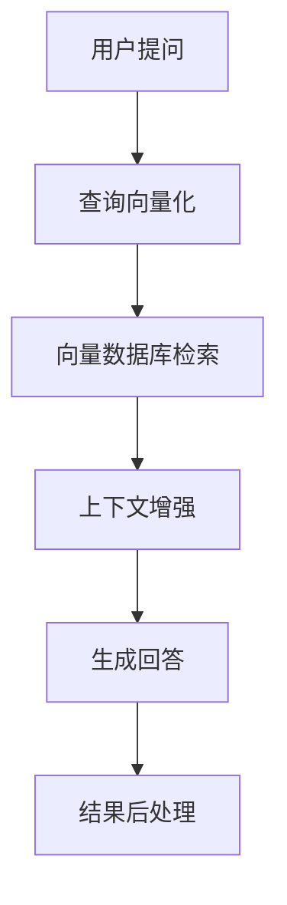
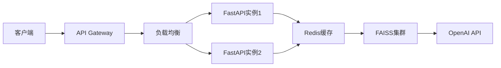

### **一、RAG核心架构**


---

### **二、技术栈选型**

#### 1. **核心组件**
| 组件                | 推荐方案                          | 替代方案                  |
|---------------------|---------------------------------|-------------------------|
| **Embedding模型**   | OpenAI text-embedding-3-large   | Cohere Embed / BGE-M3    |
| **LLM生成器**       | OpenAI GPT-4-turbo             | Anthropic Claude / Llama3|
| **向量数据库**      | FAISS (本地) / Pinecone (云)    | Weaviate / Milvus        |
| **文档处理**        | Unstructured.io                 | Haystack / LlamaIndex    |

#### 2. **辅助工具**
- **缓存**：Redis (存储频繁访问的查询结果)
- **监控**：LangSmith (追踪LLM调用链)
- **部署**：FastAPI + Docker + AWS Lambda

---

### **三、完整实现代码**

#### 1. **环境准备**
```bash
pip install openai faiss-cpu python-dotx unstructured redis fastapi
```

#### 2. **文档处理与向量化**
```python
from unstructured.partition.auto import partition
from openai import OpenAI
import numpy as np

client = OpenAI(api_key="your_key")

def process_documents(file_path):
    # 文档解析
    elements = partition(filename=file_path)
    chunks = [str(el) for el in elements if len(str(el)) > 50]  # 过滤过短文本
    
    # 生成嵌入向量
    embeddings = client.embeddings.create(
        input=chunks,
        model="text-embedding-3-large",
        dimensions=256  # 可选降维
    ).data
    
    # 转换为numpy数组
    vectors = np.array([emb.embedding for emb in embeddings])
    return chunks, vectors
```

#### 3. **FAISS索引构建**
```python
import faiss

def build_faiss_index(vectors):
    d = vectors.shape[1]  # 向量维度
    index = faiss.IndexHNSWFlat(d, 32)  # 32为HNSW参数
    index.add(vectors)
    return index

# 保存/加载索引
faiss.write_index(index, "rag_index.faiss")
```

#### 4. **检索增强生成核心逻辑**
```python
from typing import List

class RAGSystem:
    def __init__(self, index_path, chunks):
        self.index = faiss.read_index(index_path)
        self.chunks = chunks
        self.llm_model = "gpt-4-turbo"
        
    def retrieve(self, query: str, k: int = 3) -> List[str]:
        # 查询向量化
        query_embed = client.embeddings.create(
            input=[query],
            model="text-embedding-3-large"
        ).data[0].embedding
        
        # 相似度搜索
        _, indices = self.index.search(np.array([query_embed]), k)
        return [self.chunks[i] for i in indices[0] if i != -1]
    
    def generate(self, query: str, context: List[str]) -> str:
        prompt = f"""
        基于以下上下文回答问题：
        {''.join(context)}
        
        问题：{query}
        回答：
        """
        
        response = client.chat.completions.create(
            model=self.llm_model,
            messages=[{"role": "user", "content": prompt}],
            temperature=0.3
        )
        return response.choices[0].message.content

# 使用示例
rag = RAGSystem("rag_index.faiss", chunks)
context = rag.retrieve("商品房预售条款有哪些规定?")
answer = rag.generate("商品房预售条款有哪些规定?", context)
```

---

### **四、性能优化实践**

#### 1. **检索阶段优化**
| 技术                  | 实现方式                                                                 |
|-----------------------|-------------------------------------------------------------------------|
| **分级检索**          | 先使用IVFFlat快速筛选，再用FlatL2精确重排                                 |
| **查询扩展**          | 使用SPLADE生成扩展查询词                                                 |
| **缓存机制**          | Redis缓存高频查询的embedding和结果                                       |

```python
# 查询扩展示例
def expand_query(query):
    expansion_prompt = f"生成以下查询的同义词和扩展表达：{query}"
    expansions = client.chat.completions.create(
        model="gpt-3.5-turbo",
        messages=[{"role": "user", "content": expansion_prompt}],
        temperature=0.7,
        max_tokens=50
    )
    return query + " " + expansions.choices[0].message.content
```

#### 2. **生成阶段优化**
| 技术                  | 实现方式                                                                 |
|-----------------------|-------------------------------------------------------------------------|
| **提示工程**          | 使用CoT (Chain-of-Thought) 模板                                         |
| **结果校验**          | 添加FactScore验证                                                       |
| **流式输出**          | 使用OpenAI的stream=True参数                                             |

```python
# 带验证的生成
def verified_generate(query, context):
    prompt = f"""
    请严格基于以下上下文回答，若信息不足请说明：
    上下文：{"".join(context)}
    
    分步骤思考：
    1. 问题核心是什么？
    2. 上下文哪些部分相关？
    3. 回答应包含哪些要素？
    
    最终回答：
    """
    # ...生成逻辑...
    
    # 事实性验证
    verification = client.chat.completions.create(
        model="gpt-4",
        messages=[
            {"role": "system", "content": "验证以下陈述是否与给定上下文一致"},
            {"role": "user", "content": f"陈述：{answer}\n上下文：{context}"}
        ]
    )
    if "不一致" in verification.choices[0].message.content:
        return "抱歉，无法从资料中找到确切答案"
    return answer
```

---

### **五、生产级部署方案**

#### 1. **架构设计**


#### 2. **关键配置**
```python
# FastAPI应用示例
from fastapi import FastAPI
from pydantic import BaseModel

app = FastAPI()

class Query(BaseModel):
    text: str
    top_k: int = 3

@app.post("/query")
async def handle_query(query: Query):
    context = rag.retrieve(query.text, query.top_k)
    answer = rag.generate(query.text, context)
    return {"answer": answer, "sources": context}

# 启动命令
# uvicorn main:app --workers 4 --host 0.0.0.0 --port 8000
```

#### 3. **监控指标**
| 指标                | 监控方式                     | 预警阈值          |
|---------------------|----------------------------|------------------|
| 检索延迟            | Prometheus + Grafana        | >500ms           |
| LLM调用错误率       | LangSmith webhook           | >5%/小时         |
| 缓存命中率          | Redis INFO命令              | <70%             |

---

### **六、安全与合规实践**

#### 1. **数据安全**
- **加密**：使用AWS KMS加密FAISS索引文件
- **脱敏**：在文档处理阶段自动识别并遮盖PII信息
```python
from presidio_analyzer import AnalyzerEngine

analyzer = AnalyzerEngine()
results = analyzer.analyze(text=chunk, language="zh")
for result in results:
    chunk = chunk.replace(chunk[result.start:result.end], "[REDACTED]")
```

#### 2. **API防护**
- **限流**：FastAPI的`slowapi`中间件
- **鉴权**：JWT令牌验证
```python
from fastapi.security import OAuth2PasswordBearer

oauth2_scheme = OAuth2PasswordBearer(tokenUrl="token")

@app.post("/secure_query")
async def secure_query(query: Query, token: str = Depends(oauth2_scheme)):
    # 验证逻辑...
```

---

### **七、成本优化策略**

#### 1. **OpenAI API成本控制**
| 策略                | 节省效果                  | 实现方法                                                                 |
|---------------------|-------------------------|-------------------------------------------------------------------------|
| **小模型优先**      | 减少50%成本              | 先用GPT-3.5生成草稿，GPT-4仅做润色                                       |
| **缓存结果**        | 减少30%重复调用          | Redis存储<query,answer>对，设置TTL=24小时                                |
| **批量处理**        | 降低单位成本             | 累计多个查询后统一发送（适合异步场景）                                     |

#### 2. **计算资源优化**
```python
# FAISS内存优化配置
index = faiss.IndexIVFPQ(
    faiss.IndexFlatL2(d),
    d,
    nlist=100,
    m=8,
    bits=8
)
```

---

### **八、典型问题解决方案**

#### 1. **长上下文丢失重点**
- **解决方案**：添加重要性标注
```python
def mark_important(chunk):
    importance = client.chat.completions.create(
        model="gpt-3.5-turbo",
        messages=[{
            "role": "system", 
            "content": "给文本重要性打分(1-5):\n" + chunk
        }]
    )
    return f"[重要性:{importance}] {chunk}"
```

#### 2. **多文档冲突**
- **解决方案**：基于时间加权
```python
# 在检索结果中给较新文档更高权重
newest_date = max(doc.dates for doc in docs)
for doc in retrieved_docs:
    doc.score *= (0.5 + 0.5*(doc.date - oldest_date)/(newest_date - oldest_date))
```

---

### **九、演进路线建议**
1. **短期（1个月）**：
   - 实现基础RAG流程
   - 建立监控看板
2. **中期（3个月）**：
   - 加入重排序模型（如BAAI/bge-reranker）
   - 实现混合检索（关键词+向量）
3. **长期（6个月+）**：
   - 微调领域专用embedding模型
   - 构建端到端评估体系（RAGAS框架）
