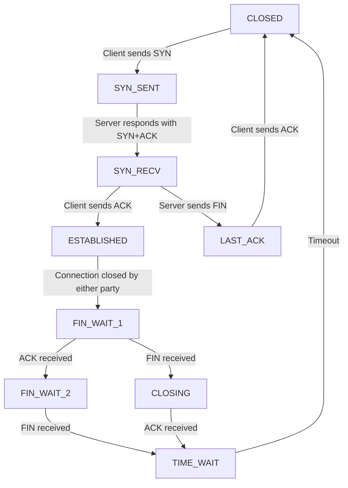

- [Pod Restart `CrashLoopBackOff` Loop Due to High Concurrency](#pod-restart-crashloopbackoff-loop-due-to-high-concurrency)
  - [Introduction](#introduction)
  - [Problem Background](#problem-background)
  - [Analysis Process](#analysis-process)
  - [Investigating the Issue](#investigating-the-issue)
  - [TCP Connection Timeout](#tcp-connection-timeout)
  - [Understanding CPU Load](#understanding-cpu-load)
  - [Kernel Parameter Tuning](#kernel-parameter-tuning)
    - [TCP State Transition Diagram](#tcp-state-transition-diagram)
    - [Adjusting Kernel Parameters](#adjusting-kernel-parameters)
  - [Conclusion](#conclusion)

---

# Pod Restart `CrashLoopBackOff` Loop Due to High Concurrency

---

<a name="introduction"></a>
## Introduction

In a Kubernetes cluster environment, a business operation involving extensive configuration distribution (lasting several hours or more) led to repeated restarts of Calico pods. This article details the troubleshooting process, focusing on identifying the root cause and implementing a solution.

---

<a name="problem-background"></a>
## Problem Background

During a high-concurrency operation, Calico pods in the Kubernetes cluster began to restart repeatedly.

```bash
[root@node02 ~]# kubectl get pod -n kube-system -owide | grep node01
calico-kube-controllers-6f59b8cdd8-8v2qw   1/1     Running            0          4h45m   10.10.119.238    node01   <none>           <none>
calico-node-b8w2b                          1/1     CrashLoopBackOff   43         3d19h   10.10.119.238    node01   <none>           <none>
coredns-795cc9c45c-k7qpb                   1/1     Running            0          4h45m   177.177.237.42    node01   <none>           <none>
...
```

---

<a name="analysis-process"></a>
## Analysis Process

Upon observing the `CrashLoopBackOff` state of the pods, the first step was to use `kubectl describe` to gather more information.

```bash
[root@node02 ~]# kubectl describe pod -n kube-system calico-node-b8w2b
...
Events:
  Type     Reason     Age                      From               Message
  ----     ------     ----                     ----               -------
  Warning  Unhealthy  58m (x111 over 3h12m)    kubelet, node01  (combined from similar events): Liveness probe failed: Get http://localhost:9099/liveness: net/http: request canceled while waiting for connection (Client.Timeout exceeded while awaiting headers)
  Normal   Pulled     43m (x36 over 3d19h)     kubelet, node01  Container image "calico/node:v3.15.1" already present on machine
  Warning  Unhealthy  8m16s (x499 over 3h43m)  kubelet, node01  Liveness probe failed: Get http://localhost:9099/liveness: net/http: request canceled while waiting for connection (Client.Timeout exceeded while awaiting headers)
  Warning  BackOff    3m31s (x437 over 3h3m)   kubelet, node01  Back-off restarting failed container
```

The events indicated that the liveness probe was failing due to a connection timeout.

---

<a name="investigating-the-issue"></a>
## Investigating the Issue

Manual execution of the health check command revealed slow response times, which were significantly higher than the usual millisecond-level response.

```bash
[root@node01 ~]# time curl -i http://localhost:9099/liveness
HTTP/1.1 204 No Content
Date: Tue, 15 Jun 2021 06:24:35 GMT
real    0m1.012s
user    0m0.003s
sys     0m0.005s
```

Logs from Calico's bird, confd, and felix components did not show any apparent errors. Checking the port status indicated that it was listening correctly.

```bash
[root@node02 ~]# netstat -anp | grep 9099
tcp        0      0 127.0.0.1:9099          0.0.0.0:*               LISTEN      1202/calico-node    
tcp        0      0 127.0.0.1:9099          127.0.0.1:56728         TIME_WAIT   -                   
tcp        0      0 127.0.0.1:56546         127.0.0.1:9099          TIME_WAIT   -
```

---

<a name="tcp-connection-timeout"></a>
## TCP Connection Timeout

Given the connection timeout error, the TCP connection state was observed.

```bash
[root@node01 ~]# netstat -na | awk '/^tcp/{s[$6]++}END{for(key in s) print key,s[key]}'
LISTEN 49
ESTABLISHED 284
SYN_SENT 4
TIME_WAIT 176
```

The `top` command showed that the business Java process was consuming high CPU, peaking at over 2000%.

```bash
[root@node01 ~]# top
top - 14:28:57 up 13 days, 27 min,  2 users,  load average: 9.55, 9.93, 9.91
Tasks: 1149 total,   1 running, 1146 sleeping,   0 stopped,   2 zombie
%Cpu(s): 16.0 us,  2.9 sy,  0.0 ni, 80.9 id,  0.0 wa,  0.0 hi,  0.1 si,  0.0 st
KiB Mem : 15249982+total, 21419184 free, 55542588 used, 75538048 buff/cache
KiB Swap:        0 total,        0 free,        0 used. 94226176 avail Mem 

  PID USER      PR  NI    VIRT    RES    SHR S  %CPU %MEM     TIME+ COMMAND                                                                                        
 6754 root      20   0   66.8g  25.1g 290100 S 700.0 17.3   2971:49 java                                                                                           
25214 root      20   0 6309076 179992  37016 S  36.8  0.1 439:06.29 kubelet                                                                                        
20331 root      20   0 3196660 172364  24908 S  21.1  0.1 349:56.64 dockerd
```

---

<a name="understanding-cpu-load"></a>
## Understanding CPU Load

Checking the total number of CPU cores and comparing it with the load average and CPU usage indicated that the load was not excessively high.

```bash
[root@node01 ~]# cat /proc/cpuinfo | grep "physical id" | sort | uniq | wc -l
48
[root@node01 ~]# cat /proc/cpuinfo | grep "cpu cores" | uniq
cpu cores: 1
```

Given the high concurrency, the issue was likely related to the TCP connection setup. Understanding the TCP connection phases helped pinpoint the problem.

---

<a name="kernel-parameter-tuning"></a>
## Kernel Parameter Tuning

The issue was traced to the `SYN_SENT` phase of TCP connections. Adjusting kernel parameters related to TCP connections resolved the problem.

### TCP State Transition Diagram



### Adjusting Kernel Parameters

```bash
[root@node01 ~]# cat /etc/sysctl.conf 
...
net.ipv4.tcp_max_syn_backlog = 32768
net.core.somaxconn = 32768

[root@node01 ~]# sysctl -p
...
net.ipv4.tcp_max_syn_backlog = 32768
net.core.somaxconn = 32768
```

After applying these changes, the health check commands executed without delay, and the pods returned to normal.

```bash
[root@node01 ~]# time curl -i http://localhost:9099/liveness
HTTP/1.1 204 No Content
Date: Tue, 15 Jun 2021 14:48:38 GMT
real    0m0.011s
user    0m0.004s
sys     0m0.004s
```

---

<a name="conclusion"></a>
## Conclusion

This case study highlights the importance of understanding and tuning kernel parameters in high-concurrency scenarios. By adjusting parameters related to TCP connection handling, the issue of repeated pod restarts due to high CPU load and connection timeouts was resolved. This approach can be applied to similar issues in Kubernetes environments to ensure stable and efficient operation.