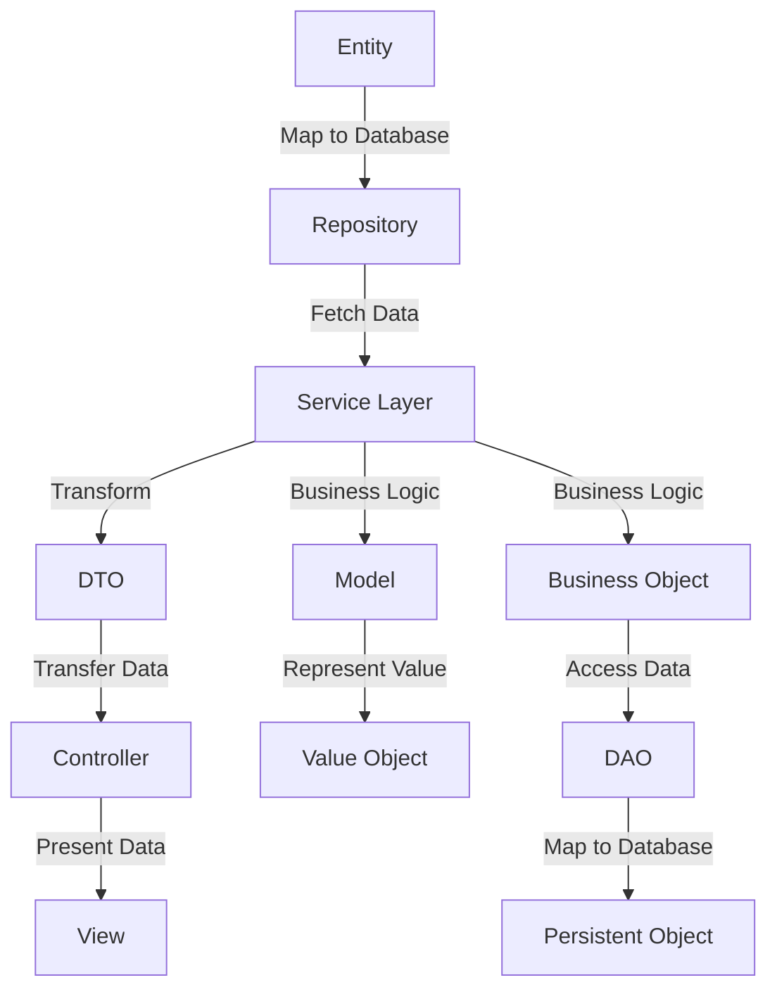

- [Introduction](#introduction)
- [Object Types](#object-types)
  - [Value Object (VO)](#value-object-vo)
  - [Plain Old Java Object (POJO)](#plain-old-java-object-pojo)
  - [Data Transfer Object (DTO)](#data-transfer-object-dto)
  - [Entity](#entity)
  - [Model](#model)
  - [Persistent Object (PO)](#persistent-object-po)
  - [Business Object (BO)](#business-object-bo)
  - [Data Access Object (DAO)](#data-access-object-dao)
- [Transition Diagram](#transition-diagram)
  - [Explanation](#explanation)
- [Scenarios](#scenarios)
  - [Value Object (VO)](#value-object-vo-1)
  - [Plain Old Java Object (POJO)](#plain-old-java-object-pojo-1)
  - [Data Transfer Object (DTO)](#data-transfer-object-dto-1)
  - [Entity](#entity-1)
  - [Model](#model-1)
  - [Persistent Object (PO)](#persistent-object-po-1)
  - [Business Object (BO)](#business-object-bo-1)
  - [Data Access Object (DAO)](#data-access-object-dao-1)
- [Sample Code](#sample-code)
  - [Value Object (VO)](#value-object-vo-2)
  - [Plain Old Java Object (POJO)](#plain-old-java-object-pojo-2)
  - [Data Transfer Object (DTO)](#data-transfer-object-dto-2)
  - [Entity](#entity-2)
  - [Model](#model-2)
  - [Persistent Object (PO)](#persistent-object-po-2)
  - [Business Object (BO)](#business-object-bo-2)
  - [Data Access Object (DAO)](#data-access-object-dao-2)
  - [Transition Example](#transition-example)
- [Conclusion](#conclusion)

---

<a name="introduction"></a>
## Introduction

In application development, different types of objects serve various purposes. Understanding these objects and their roles is crucial for designing scalable and maintainable systems. This article will explain common object types such as Value Object (VO), Plain Old Java Object (POJO), Data Transfer Object (DTO), Entity, Model, Persistent Object (PO), Business Object (BO), and Data Access Object (DAO). We will also provide a textual diagram to illustrate the transition between these objects and sample code to demonstrate their usage.

---

<a name="object-types"></a>
## Object Types

### <a name="value-object-vo"></a>Value Object (VO)

A Value Object is an object that represents a simple entity whose equality is not based on identity but on the value of its properties. VOs are immutable and typically used to represent concepts that are naturally comparable by value.

### <a name="plain-old-java-object-pojo"></a>Plain Old Java Object (POJO)

A POJO is a simple Java object that does not require any specific framework or library. It is a plain Java object that follows basic Java conventions and does not extend or implement any special classes or interfaces.

### <a name="data-transfer-object-dto"></a>Data Transfer Object (DTO)

A DTO is an object used to transfer data between different layers of an application, such as between the service layer and the presentation layer. DTOs are typically simple objects that contain data but do not contain any business logic.

### <a name="entity"></a>Entity

An Entity is an object that represents a persistent domain object, typically mapped to a database table. Entities have a unique identity and are often used to represent business concepts.

### <a name="model"></a>Model

A Model represents the data and business logic of an application. It encapsulates the state and behavior of the application's domain. Models are often used in the service layer to perform business operations.

### <a name="persistent-object-po"></a>Persistent Object (PO)

A Persistent Object is an object that is mapped to a database table. It is similar to an Entity but is often used in older or specific frameworks where the term Entity is not used.

### <a name="business-object-bo"></a>Business Object (BO)

A Business Object encapsulates the business logic of an application. It is responsible for performing business operations and often interacts with DAOs to persist data.

### <a name="data-access-object-dao"></a>Data Access Object (DAO)

A DAO is an object that provides an abstract interface to some type of database or other persistence mechanism. It allows the application to access and manipulate data without exposing the underlying data source.

---

<a name="transition-diagram"></a>
## Transition Diagram



### Explanation

1. **Entity**: Represents a persistent domain object.
2. **Repository**: Manages the persistence of entities.
3. **Service Layer**: Contains business logic and transforms entities into DTOs.
4. **DTO**: Transfers data between layers.
5. **Controller**: Handles HTTP requests and responses.
6. **View**: Presents data to the user.
7. **Model**: Contains business logic and encapsulates state.
8. **Value Object**: Represents a simple, immutable value.
9. **Business Object**: Encapsulates business logic.
10. **DAO**: Provides an abstract interface to the database.
11. **Persistent Object**: Mapped to a database table.

---

<a name="scenarios"></a>
## Scenarios

### Value Object (VO)
- **Scenario**: Representing a monetary value or a date range.
- **Usage**: Used in business logic to ensure immutability and value-based equality.

### Plain Old Java Object (POJO)
- **Scenario**: Simple data structures without any framework dependencies.
- **Usage**: Used in any layer of the application where a simple data structure is needed.

### Data Transfer Object (DTO)
- **Scenario**: Transferring data between different layers of the application.
- **Usage**: Used in the service layer to transfer data to the presentation layer.

### Entity
- **Scenario**: Representing a persistent domain object.
- **Usage**: Used in the persistence layer to map to database tables.

### Model
- **Scenario**: Representing the business logic and state of the application.
- **Usage**: Used in the service layer to perform business operations.

### Persistent Object (PO)
- **Scenario**: Mapping to a database table in older or specific frameworks.
- **Usage**: Used in the persistence layer to represent database records.

### Business Object (BO)
- **Scenario**: Encapsulating business logic.
- **Usage**: Used in the service layer to perform business operations.

### Data Access Object (DAO)
- **Scenario**: Providing an abstract interface to the database.
- **Usage**: Used in the persistence layer to access and manipulate data.

---

<a name="sample-code"></a>
## Sample Code

### Value Object (VO)
```java
public final class Money {
    private final double amount;
    private final String currency;

    public Money(double amount, String currency) {
        this.amount = amount;
        this.currency = currency;
    }

    public double getAmount() {
        return amount;
    }

    public String getCurrency() {
        return currency;
    }

    @Override
    public boolean equals(Object o) {
        if (this == o) return true;
        if (o == null || getClass() != o.getClass()) return false;
        Money money = (Money) o;
        return Double.compare(money.amount, amount) == 0 &&
                currency.equals(money.currency);
    }

    @Override
    public int hashCode() {
        return Objects.hash(amount, currency);
    }
}
```

### Plain Old Java Object (POJO)
```java
public class User {
    private String name;
    private int age;

    public String getName() {
        return name;
    }

    public void setName(String name) {
        this.name = name;
    }

    public int getAge() {
        return age;
    }

    public void setAge(int age) {
        this.age = age;
    }
}
```

### Data Transfer Object (DTO)
```java
public class UserDTO {
    private String name;
    private int age;

    public String getName() {
        return name;
    }

    public void setName(String name) {
        this.name = name;
    }

    public int getAge() {
        return age;
    }

    public void setAge(int age) {
        this.age = age;
    }
}
```

### Entity
```java
@Entity
public class UserEntity {
    @Id
    @GeneratedValue(strategy = GenerationType.IDENTITY)
    private Long id;
    private String name;
    private int age;

    public Long getId() {
        return id;
    }

    public void setId(Long id) {
        this.id = id;
    }

    public String getName() {
        return name;
    }

    public void setName(String name) {
        this.name = name;
    }

    public int getAge() {
        return age;
    }

    public void setAge(int age) {
        this.age = age;
    }
}
```

### Model
```java
public class UserModel {
    private String name;
    private int age;

    public String getName() {
        return name;
    }

    public void setName(String name) {
        this.name = name;
    }

    public int getAge() {
        return age;
    }

    public void setAge(int age) {
        this.age = age;
    }

    public void validateAge() {
        if (age < 0) {
            throw new IllegalArgumentException("Age cannot be negative");
        }
    }
}
```

### Persistent Object (PO)
```java
public class UserPO {
    private Long id;
    private String name;
    private int age;

    public Long getId() {
        return id;
    }

    public void setId(Long id) {
        this.id = id;
    }

    public String getName() {
        return name;
    }

    public void setName(String name) {
        this.name = name;
    }

    public int getAge() {
        return age;
    }

    public void setAge(int age) {
        this.age = age;
    }
}
```

### Business Object (BO)
```java
public class UserBO {
    private UserDAO userDAO;

    public UserBO(UserDAO userDAO) {
        this.userDAO = userDAO;
    }

    public UserDTO getUserById(Long id) {
        UserPO userPO = userDAO.findById(id);
        UserDTO userDTO = new UserDTO();
        userDTO.setName(userPO.getName());
        userDTO.setAge(userPO.getAge());
        return userDTO;
    }

    public void createUser(UserDTO userDTO) {
        UserPO userPO = new UserPO();
        userPO.setName(userDTO.getName());
        userPO.setAge(userDTO.getAge());
        userDAO.save(userPO);
    }
}
```

### Data Access Object (DAO)
```java
public interface UserDAO {
    UserPO findById(Long id);
    void save(UserPO userPO);
}

public class UserDAOImpl implements UserDAO {
    @Override
    public UserPO findById(Long id) {
        // Implementation to fetch user from database
        return new UserPO();
    }

    @Override
    public void save(UserPO userPO) {
        // Implementation to save user to database
    }
}
```

### Transition Example
```java
public class UserService {
    private UserBO userBO;

    public UserService(UserBO userBO) {
        this.userBO = userBO;
    }

    public UserDTO getUserById(Long id) {
        return userBO.getUserById(id);
    }

    public void createUser(UserDTO userDTO) {
        userBO.createUser(userDTO);
    }
}
```

---

<a name="conclusion"></a>
## Conclusion

Understanding the different types of objects in application development is crucial for designing robust and maintainable systems. Each object type serves a specific purpose and is used in different scenarios. By following best practices and adhering to design principles, developers can create applications that are easier to extend, test, and maintain.