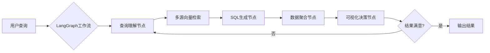

# 基于LangGraph+LangChain构建新一代智能BI平台WhereQ-GPT

## 一、平台架构革命：LangGraph驱动的执行引擎

WhereQ-GPT采用全新的**有状态工作流引擎**设计，通过LangGraph实现复杂BI查询的智能化编排。平台核心技术栈包括：

- **Python 3.12**：利用模式匹配和性能优化
- **LangGraph 0.1**：构建闭环决策工作流
- **LangChain 0.2**：提供AI基础能力组件
- **Weaviate**：多模态向量数据库
- **OpenAI GPT-4o**：最新多模态模型



## 二、LangGraph核心工作流实现

### 1. 状态机定义

```python
from langgraph.graph import StateGraph, END
from typing import TypedDict, List, Annotated
import operator

class QueryState(TypedDict):
    raw_query: str
    parsed_query: dict
    candidate_tables: List[str]
    sql_query: str
    query_results: dict
    visualization_spec: dict

workflow = StateGraph(QueryState)
```

### 2. 节点定义与编排

#### 查询解析节点
```python
from langchain_core.prompts import ChatPromptTemplate
from langchain_openai import ChatOpenAI

def parse_query(state: QueryState):
    parser_prompt = ChatPromptTemplate.from_template("""
    作为BI分析师，请解析查询：
    {query}

    输出JSON结构：
    {{
        "intent": 查询意图,
        "metrics": [指标列表],
        "dimensions": [维度列表],
        "time_range": {{
            "start": "YYYY-MM-DD",
            "end": "YYYY-MM-DD"
        }}
    }}
    """)
    
    chain = parser_prompt | ChatOpenAI(model="gpt-4o")
    return {"parsed_query": chain.invoke({"query": state["raw_query"]})}
```

#### 多源向量检索节点
```python
from langchain_community.vectorstores import Weaviate
from langchain_core.runnables import RunnableLambda

def retrieve_schemas(state: QueryState):
    client = weaviate.Client("http://weaviate:8080")
    vectorstore = Weaviate(client, "BizSchema", "content")
    
    # 多模态检索：结合文本和结构化特征
    retriever = vectorstore.as_retriever(
        search_type="hybrid",
        search_kwargs={
            "text_weight": 0.7,
            "vector_weight": 0.3,
            "k": 5
        }
    )
    
    # 并行检索不同领域schema
    domains = ["retail", "finance", "manufacturing"]
    results = {}
    for domain in domains:
        results[domain] = retriever.invoke(
            f"{state['raw_query']} [DOMAIN:{domain}]"
        )
    
    return {"candidate_tables": results}
```

### 3. 条件边与循环控制

```python
def should_retry(state: QueryState):
    # 基于结果质量决定是否重试
    last_score = state.get("result_score", 0)
    return last_score < 0.8  # 置信度阈值

def finalize_output(state: QueryState):
    # 验证结果完整性
    required_fields = state["parsed_query"]["metrics"]
    return all(field in state["query_results"] for field in required_fields)

# 构建工作流
workflow.add_node("parse", parse_query)
workflow.add_node("retrieve", retrieve_schemas)
workflow.add_node("generate_sql", generate_sql)
workflow.add_node("execute_query", execute_query)
workflow.add_node("visualize", generate_visualization)

# 定义边关系
workflow.add_edge("parse", "retrieve")
workflow.add_edge("retrieve", "generate_sql")
workflow.add_edge("generate_sql", "execute_query")
workflow.add_edge("execute_query", "visualize")

# 条件循环边
workflow.add_conditional_edges(
    "visualize",
    should_retry,
    {"retry": "retrieve", "end": END}
)

# 验证边
workflow.add_edge("visualize", finalize_output)
workflow.set_entry_point("parse")
```

## 三、多领域商业模型支持

### 1. 零售业增强实现

```python
class RetailWorkflow(StateGraph):
    def __init__(self):
        super().__init__(QueryState)
        self.add_node("apply_promo_rules", self._apply_promo_rules)
    
    def _apply_promo_rules(self, state: QueryState):
        # 促销规则引擎集成
        promo_chain = (
            ChatPromptTemplate.from_template("""
            根据促销规则修正查询：
            原始查询：{{query}}
            当前结果：{{results}}
            
            可用促销规则：
            - 买一赠一商品需合并统计
            - 跨店满减需计算实际收入
            """)
            | ChatOpenAI(model="gpt-4", temperature=0)
            | StrOutputParser()
        )
        return {"query_results": promo_chain.invoke(state)}
```

### 2. 制造业KPI计算

```python
manufacturing_kpis = {
    "oee": {
        "formula": "(good_units * ideal_cycle_time) / (production_time * max_speed)",
        "dependencies": ["production_facts", "machine_specs"]
    },
    "throughput": {
        "formula": "total_units / active_hours",
        "vector_path": "manufacturing/kpis/throughput"
    }
}

def calculate_kpi(state: QueryState):
    # 从向量库加载KPI定义
    kpi_def = vectorstore.similarity_search(
        state["parsed_query"]["metrics"][0],
        filter={"domain": "manufacturing"}
    )
    
    # 动态公式计算
    return {"query_results": eval_kpi(kpi_def, state["query_results"])}
```

## 四、LangGraph高级特性应用

### 1. 多工作流编排

```python
from langgraph.graph import Graph

master_graph = Graph()

@master_graph.node
def route_query(state):
    # 领域路由
    if "sales" in state["raw_query"].lower():
        return {"subgraph": "retail"}
    elif "machine" in state["raw_query"].lower():
        return {"subgraph": "manufacturing"}
    
@master_graph.edge("route_query", lambda state: state["subgraph"])
def select_subgraph(state):
    return state["subgraph"]

# 注册子工作流
master_graph.add_subgraph("retail", RetailWorkflow())
master_graph.add_subgraph("manufacturing", ManufacturingWorkflow())
```

### 2. 持久化状态管理

```python
from langgraph.checkpoint import MemorySaver

workflow = StateGraph(
    QueryState,
    checkpoint=MemorySaver()
)

# 从历史状态恢复
def restore_state(query_id):
    return workflow.get_state(query_id)

# 自动保存点
workflow.add_node("savepoint", lambda state: state)
workflow.add_edge("generate_sql", "savepoint")
```

### 3. 分布式执行控制

```python
from langgraph.distributed import RayExecutor

ray_executor = RayExecutor(
    workflow.compile(),
    runtime_env={"pip": ["langchain", "weaviate-client"]}
)

future = ray_executor.submit({
    "raw_query": "Q3季度各区域销售对比",
    "session_id": "user123"
})
result = future.result()
```

## 五、性能优化策略

### 1. 向量检索优化

```python
# Weaviate混合索引配置
class BizSchema(WeaviateClass):
    class_name = "BizSchema"
    vectorizer = "multi2vec-clip"
    properties = [
        {"name": "domain", "dataType": ["text"]},
        {"name": "formula", "dataType": ["text"]},
        {
            "name": "structural_features",
            "dataType": ["number[]"],
            "vectorIndexConfig": {
                "pq": {"enabled": True}
            }
        }
    ]
```

### 2. 工作流缓存

```python
from langgraph.cache import SQLiteCache

workflow = StateGraph(
    QueryState,
    checkpoint=SQLiteCache("whereq_cache.db")
)
```

### 3. 异步并行执行

```python
async def parallel_nodes(state):
    # 并行执行不依赖的节点
    parse_task = asyncio.create_task(parse_query(state))
    retrieve_task = asyncio.create_task(retrieve_schemas(state))
    
    parsed, schemas = await asyncio.gather(parse_task, retrieve_task)
    return {**parsed, **schemas}
```

## 六、典型业务场景实现

### 零售促销分析案例

**用户查询**：  
"对比618和双11大促期间，美妆品类在不同价格带的转化率差异"

**工作流执行轨迹**：
1. 解析出关键要素：
   - 时间范围：618 vs 双11
   - 品类：美妆
   - 维度：价格带
   - 指标：转化率

2. LangGraph触发多路径执行：
   ```mermaid
   graph TB
       A[解析查询] --> B[检索促销规则]
       A --> C[检索产品目录]
       B --> D[生成促销调整SQL]
       C --> D
       D --> E[执行查询]
       E --> F{数据质量检查}
       F -- 不满足 --> B
       F -- 通过 --> G[生成热力图]
   ```

3. 最终输出：
   ```python
   {
       "visualization": {
           "type": "heatmap",
           "data": {
               "x": ["0-100元", "100-300元", "300元以上"],
               "y": ["618", "双11"],
               "z": [[0.15, 0.22, 0.08], [0.18, 0.25, 0.12]]
           },
           "annotations": [
               {
                   "text": "高端产品在双11表现更好",
                   "position": [2, 1]
               }
           ]
       }
   }
   ```

## 七、平台扩展设计

### 1. 插件系统

```python
from langgraph.extensions import Plugin

class CustomKpiPlugin(Plugin):
    def __init__(self):
        super().__init__()
        self.hooks = {
            "pre_visualization": self.add_kpi_trendline
        }
    
    def add_kpi_trendline(self, state):
        # 自动添加趋势线分析
        if "trend" in state["parsed_query"]["intent"]:
            state["visualization_spec"]["config"]["trendline"] = True
        return state
```

### 2. 实时流式响应

```python
from langgraph.streaming import StreamingEventHandler

class WhereQHandler(StreamingEventHandler):
    def on_query_parsed(self, data):
        self.emit("parser", data["parsed_query"])
    
    def on_results_ready(self, data):
        self.emit("data", data["query_results"])
        
    def on_visualization(self, data):
        self.emit("viz", data["visualization_spec"])

workflow = StateGraph(
    QueryState,
    handlers=[WhereQHandler()]
)
```

WhereQ-GPT通过LangGraph实现的工作流引擎，相比传统BI系统具有以下优势：
1. **动态适应性**：根据中间结果自动调整执行路径
2. **领域智能**：内置行业特定处理逻辑
3. **可观测性**：完整记录决策过程
4. **持续进化**：通过检查点机制实现经验积累
